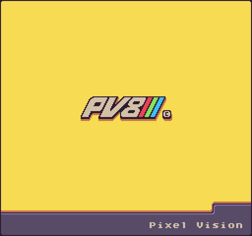

Pixel Vision 8's core philosophy is to teach retro game development with streamlined workflows. 

PV8 is also a platform that standardizes 8-bit fantasy console limitations built on top of a fork of MonoGame, called [MonoVision](https://github.com/PixelVision8/MonoVision). This engine provides a standard set of APIs to create authentic-looking 8-bit games with modern programming languages and workflows. It also allows you to define specific limitations for the resolution, colors, number of sprites on screen, and more. 

There are several different ways to build and run Pixel Vision 8, depending on your choice of language, skill level, and goals. You can always get the latest compiled version on [itch.io](https://pixelvision8.itch.io/pv8) or check out the incremental builds on [github]([https://githu](https://github.com/PixelVision8/PixelVision8/releases/latest)).

The platform is incredibly modular and built on a "chip" system that supports swapping out core functionality with new chips. This allows you to customize it to your own needs. While there are tools and a dedicated OS to help make games, nothing stops you from using your external tools and workflows. In fact, the best way to make Pixel Vision 8 games is with the tools and workflow you are most comfortable with already!

> **Disclaimer**
>
> [I have been working on Pixel Vision 8 for the past 6+ years](https://jessefreeman.hashnode.dev/the-dark-side-of-supporting-an-open-source-project) and it's still a work in process. I'm doing my best to keep [the docs](https://github.com/PixelVision8/PixelVision8/wiki), [code base](https://github.com/PixelVision8/PixelVision8/tree/master), and [examples](https://github.com/PixelVision8/Examples) as up to date as possible, but to help speed up development, consider all the code in this repo experimental. Please join the [Discord](https://discord.gg/pixelvision8) or subscribe to the new [Tutorial Site](https://hashnode.com/@pixelvision8) to learn more about getting started.

This documentation covers how to build Pixel Vision 8 from its source code, manually install Pixel Vision OS, workflows for using Pixel Vision 8 and Visual Studio Code, as well as how to export stand-alone PV8 games for Windows, macOS, and Linux. You’ll also find all the information you need to better understand how things work under the hood as well as the APIs you can use to build Pixel Visoin 8 games.

