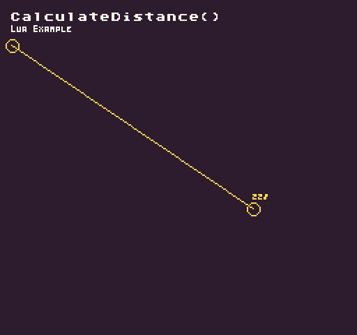

A fast way to calculate the distance between two points.

## Usage

```csharp
CalculateDistance ( x0, y0, x1, y1 )
```

## Arguments

| Name | Value | Description                     |
|------|-------|---------------------------------|
| x0   | int   | The first point’s x position\.  |
| y0   | int   | The first point’s y position\.  |
| x1   | int   | The second point’s x position\. |
| y1   | int   | The second point’s y position\. |


## Returns

| Value | Description                                                  |
|-------|--------------------------------------------------------------|
| int   | Returns an integer for the distance between the two points\. |


## Example

In this example, we will calculate the distance between 2 points and use a canvas to visualize it. Running this code will output the following:



## Lua

```lua
local pointA = NewPoint(8, 32)
local pointB = NewPoint(248, 232)
local canvas = NewCanvas(256, 240)
local distance = 0
local display = Display()

function Init()

  -- Set the canvas stroke to a white 1x1 pixel brush
  canvas:SetStroke(14, 1)

end

function Update(timeDelta)

  -- Update position B with the MousePosition
  pointB = MousePosition()

  if(pointB.X > 0 and pointB.Y < display.X and pointB.Y > 0 and pointB.Y < display.Y) then

    -- Calculate the distance between pointA and pointB
    distance = CalculateDistance(pointA.x, pointA.y, pointB.x, pointB.x)

  end

end

function Draw()

  -- Redraw the display
  RedrawDisplay()

  -- Clear the canvas with the background color
  canvas:Clear(0)

  -- Draw 2 circles around each point 
  canvas:DrawEllipse(pointA.x - 4, pointA.y - 4, 10, 10)
  canvas:DrawEllipse(pointB.x - 4, pointB.y - 4, 10, 10)

  -- Draw a line between the two points
  canvas:DrawLine(pointA.x, pointA.y, pointB.x, pointB.y)

  -- Draw the distance value above pointB
  canvas:DrawText(tostring(distance), pointB.x, pointB.y - 12, "small", 14, - 4)

  -- Draw the canvas to the display
  canvas:DrawPixels()

  --
  DrawText("CalculateDistance()", 8, 8, DrawMode.Sprite, "large", 15)
  DrawText("Lua Example", 8, 16, DrawMode.Sprite, "medium", 15, -4)

end
```


## C#

```csharp
namespace PixelVision8.Player
{
    class CalculateDistanceExample : GameChip
    {
        private Point pointA = new Point(8, 32);
        private Point pointB = new Point(248, 232);
        private Canvas canvas;
        private int distance;

        public override void Init()
        {

            // Create a new canvas and pass this GameChip into the constructor
            canvas = new Canvas(256, 240, this);

            // Set the canvas stroke to a white 1x1 pixel brush
            canvas.SetStroke(14, 1);

        }

        public override void Update(int timeDelta)
        {

            // // Update position B with the MousePosition
            pointB = MousePosition();

            // Calculate the distance between pointA and pointB
            distance = CalculateDistance(pointA.X, pointA.Y, pointB.X, pointB.X);
            
        }

        public override void Draw()
        {

            // Redraw the display
            RedrawDisplay();

            // // Clear the canvas with the background color
            canvas.Clear(0);

            // // Draw 2 circles around each point
            canvas.DrawEllipse(pointA.X - 4, pointA.Y - 4, 10, 10);
            canvas.DrawEllipse(pointB.X - 4, pointB.Y - 4, 10, 10);

            // // Draw a line between the two points
            canvas.DrawLine(pointA.X, pointA.Y, pointB.X, pointB.Y);

            // // Draw the distance value above pointB
            canvas.DrawText(distance.ToString(), pointB.X, pointB.Y - 12, "small", 14, -4);

            // Draw the canvas to the display
            canvas.DrawPixels();

            // Example Title
            DrawText("CalculateDistance()", 8, 8, DrawMode.Sprite, "large", 15);
            DrawText("C Sharp Example", 8, 16, DrawMode.Sprite, "medium", 15, -4);

        }
    }
}
```

