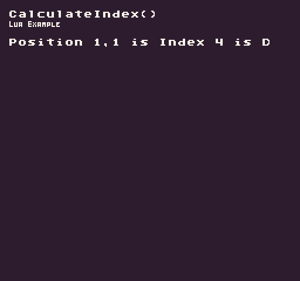

Converts an `X` and `Y` position into an index value. This is useful for finding positions in 1D arrays that represent 2D data.

## Usage

```csharp
CalculateIndex ( x, y, width )
```

## Arguments

| Name  | Value | Description                                                 |
|-------|-------|-------------------------------------------------------------|
| x     | int   | The x position\.                                            |
| y     | int   | The y position\.                                            |
| width | int   | The width of the data if it was represented as a 2D array\. |


## Returns

| Value | Description                                                            |
|-------|------------------------------------------------------------------------|
| int   | Returns an int value representing the X and Y position in a 1D array\. |


## Example

In this example, we will treat a 1D as a 2D array and get a value from it based on an `X`, `Y` position. Running this code will output the following:



## Lua

```lua
-- A 1D array of example values
local exampleGrid = {
  "A", "B", "C",
  "D", "E", "F",
  "G", "H", "I",
}

function Init()

  -- Example Title
  DrawText("CalculateIndex()", 8, 8, DrawMode.TilemapCache, "large", 15)
  DrawText("Lua Example", 8, 16, DrawMode.TilemapCache, "medium", 15, -4)

  -- Calculate the center index based on a grid with 3 columns
  local index = CalculateIndex(1, 1, 3)

  -- Draw the index and value to the display
  DrawText("Position 1,1 is Index " .. index .. " is " .. exampleGrid[index], 1, 4, DrawMode.Tile, "large", 15)

end

function Draw()

  -- Redraw the display
  RedrawDisplay()

end
```


## C#

```csharp
namespace PixelVision8.Player
{
    class CalculateIndexExample : GameChip
    {

        // A 1D array of example values
        private string[] exampleGrid =
        {
            "A", "B", "C",
            "D", "E", "F",
            "G", "H", "I",
        };

        public override void Init()
        {

            // Example Title
            DrawText("CalculateIndex()", 8, 8, DrawMode.TilemapCache, "large", 15);
            DrawText("C Sharp Example", 8, 16, DrawMode.TilemapCache, "medium", 15, -4);

            // Calculate the center index based on a grid with 3 columns
            var index = CalculateIndex(1, 1, 3);

            // Draw the index and value to the display
            DrawText("Position 1,1 is Index " + index + " is " + exampleGrid[index], 1, 4, DrawMode.Tile, "large",
                15);

        }

        public override void Draw()
        {
            // Redraw the display
            RedrawDisplay();
        }

    }
}
```

