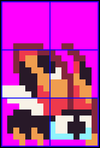
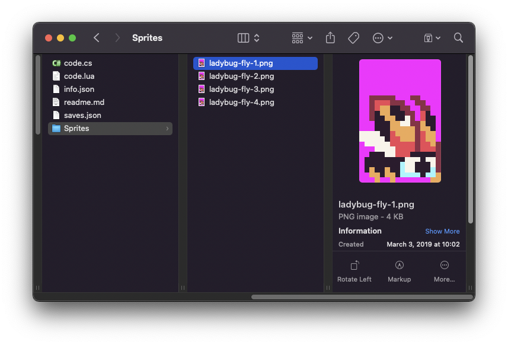

The `DrawMetaSprite()` API allows you to draw multiple sprites to the screen in a single call. This works similar to `DrawSprite(),` except you supply the id of the meta sprite from `SpriteChip`’s memory. Here is a character made up of 6 sprites; 2 across and 3 down.



While you can create Meta Sprites at run-time, it's easier to put your Meta Sprite png files into a `Sprites` folder inside of your game project. Here you can see we have each character's animation as a separate meta sprite.



When PV8 loads images from a game project's `Sprite` folder, each png file is converted into a Meta Sprite automatically when the game runs. You can access a Meta Sprite by its file name like so. 

The `DrawMetaSprite()` API also supports flipping the sprite and color offsets like `DrawMetaSprite()` but adds some additional arguments to help make it easier to work with multiple sprites as a single sprite.

## Usage

```csharp
DrawMetaSprite ( name, x, y, flipH, flipV, drawMode, colorOffset )
```

## Arguments

| Name        | Value    | Description                                                  |
| ----------- | -------- | ------------------------------------------------------------ |
| name        | string   | The unique name or ID of the meta sprite.                    |
| x           | int      | An int value representing the X position to place sprite on the display\. If set to 0, it renders on the far left\-hand side of the screen\. |
| y           | int      | An int value representing the Y position to place the sprite on the display\. If set to 0, it renders on the top of the screen\. |
| flipH       | bool     | This is an optional argument which accepts a bool\. The default value is set to false but passing in true flips the pixel data horizontally\. |
| flipV       | bool     | This is an optional argument which accepts a bool\. The default value is set to false but passing in true flips the pixel data vertically\. |
| drawMode    | DrawMode | This argument accepts the DrawMode enum\. You can use Sprite, SpriteBelow, and TilemapCache to change where the pixel data is drawn to\. By default, this value is DrawMode\.Sprite\. |
| colorOffset | int      | This optional argument accepts an int that offsets all the color IDs in the pixel data array\. This value is added to each int, in the pixel data array, allowing you to simulate palette shifting\. |

## Draw Modes

The `DrawMetaSprite()` API supports the following draw modes:

| DrawMode     | Layer ID | Supported |
| ------------ | -------- | --------- |
| TilemapCache | \-1      | Yes       |
| Background   | 0        | No        |
| SpriteBelow  | 1        | Yes       |
| Tile         | 2        | Yes       |
| Sprite       | 3        | Yes       |
| UI           | 4        | Yes       |
| SpriteAbove  | 5        | Yes       |
| Mouse        | 6        | Yes       |


Attempting to use an unsupported draw mode will cancel the draw request. When using `DrawMode.TilemapCache` or `DrawMode.Tile`, the tilemap’s coordinate space will be used. In the case of `DrawMode.Tile`, the `X` and `Y` values will become `Column` and `Row`. For `DrawMode.TilemapCache` you can use `X` and `Y` to place the sprite on the tilemap itself. That means that wrapping for the sprite’s coordinates will switch from the screen boundaries to the tilemap itself.

## Example

For this example, we are going to render a Meta Sprite to the display. To do this, we need the sprite’s name which you can find in the `Sprites` folder. Running this code will output the following:


## Lua

```lua
-- Use floats to store the subpixel position
local speed = 5
local nextPos = 0

-- Use this point to position the  sprites
local pos = NewPoint()

-- Track the animation frame and the total frames
local frame = 1
local totalFrames = 4

-- Track the delay between frames
local delay = 100
local time = 0

function Init()
  
  -- Example Title
  DrawText("DrawMetaSprite()", 1, 1, DrawMode.Tile, "large", 15)
  DrawText("Lua Example", 8, 16, DrawMode.TilemapCache, "medium", 15, -4)

end

function Update(timeDelta)

  -- Increment the time
  time = time + timeDelta

  -- Check to see if we should change the animation frame
  if(time > delay) then
  
      
      -- Reset the timer
      time = 0

      -- Increment the frame
      frame = frame + 1

      -- reset the frame counter when out of bounds
      if(frame > totalFrames) then
          frame = 1
      end

  end

  -- Calculate the next position
  nextPos = nextPos + (speed * (timeDelta / 100))

  -- Need to convert the nextPoint to an int, so we'll save it in a point
  pos.X = Repeat( nextPos, Display( ).X )

  pos.Y = nextPos

end

function Draw()

  -- Redraw the display
  RedrawDisplay()

  -- Draw sprite group moving horizontally and hide when it goes offscreen
  DrawMetaSprite("ladybug-fly-" .. frame, pos.X, 24)

  -- Draw flipped sprite group moving vertically but render when offscreen
  DrawMetaSprite("ladybug-fly-" .. frame, 36, pos.Y, true, false, DrawMode.Sprite, 0)

  -- Show the total number of sprites
  DrawText("Sprites " .. ReadTotalSprites(), 144 + 24, 224, DrawMode.Sprite, "large", 15)

  -- Draw the x,y position of each sprite
  DrawText("(" .. pos.X .. ",8)", pos.X + 24, 32, DrawMode.Sprite, "large", 15)
  DrawText("(36," .. pos.Y .. ")", 60, pos.Y + 12, DrawMode.Sprite, "large", 15)

end
```


## C#

```csharp
namespace PixelVision8.Player
{
    public class DrawMetaSpriteExample : GameChip
    {
        // Use floats to store the subpixel position
        private float speed = 5;
        private float nextPos;

        // Use this point to position the  sprites
        private Point pos;

        // Track the animation frame and the total frames
        private int frame = 1;
        private int totalFrames = 4;

        // Track the delay between frames
        private int delay = 100;
        private int time = 0;

        public override void Init()
        {

            // Example Title
            DrawText("DrawMetaSprite()", 1, 1, DrawMode.Tile, "large", 15);
            DrawText("C Sharp Example", 8, 16, DrawMode.TilemapCache, "medium", 15, -4);

        }

        public override void Update(int timeDelta)
        {

            // Increment the time
            time += timeDelta;

            // Check to see if we should change the animation frame
            if(time > delay)
            {
                
                // Reset the timer
                time = 0;

                // Increment the frame
                frame ++;

                // reset the frame counter when out of bounds
                if(frame > totalFrames)
                    frame = 1;

            }

            // Calculate the next position
            nextPos = nextPos + (speed * (timeDelta / 100f));

            // Need to convert the nextPoint to an int, so we'll save it in a point
            pos.X = Repeat( (int)nextPos, Display( ).X );

            pos.Y = Repeat( (int)nextPos, Display( ).Y );

        }

        public override void Draw()
        {
            // Redraw the display
            RedrawDisplay();

            // Draw sprite group moving horizontally and hide when it goes offscreen
            DrawMetaSprite("ladybug-fly-" + frame, pos.X, 24);

            // Draw flipped sprite group moving vertically but render when offscreen
            DrawMetaSprite("ladybug-fly-" + frame, 36, pos.Y, true, false, DrawMode.Sprite, 0);

            // Show the total number of sprites
            DrawText("Sprites " + ReadTotalSprites(), 144 + 24, 224, DrawMode.Sprite, "large", 15);

            // Draw the x,y position of each sprite
            DrawText("(" + pos.X + ",8)", pos.X + 24, 32, DrawMode.Sprite, "large", 15);
            DrawText("(36," + pos.Y + ")", 60, pos.Y + 12, DrawMode.Sprite, "large", 15);

        }
    }
}
```

