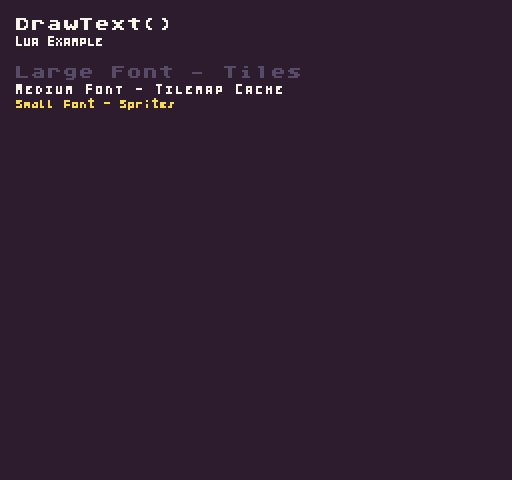

The `DrawText()` API allows you to render text to the display. Files ending with the `.font.png` extension are loaded by the `FontChip `and converted into character sprites. The `FontChip `stores these characters separately from `SpriteChip`’s own sprites. You can access the font by using it’s file name, without an extension, when drawing text to the display. While the `FontChip` stores each character as an 8 x 8 sprite, you can make still make smaller characters as long as each one fits inside of a single sprite. Font’s are laid out in a specific order to match up with each character’s ASCII value, starting at 32 for an empty space.


Like all of the drawing APIs, you can render characters to different layers based on the draw mode. When drawing text as sprites, you have more flexibility over position, but each character counts against the display’s maximum sprite count. When rendering text to the tilemap, you are able to show more characters at one time and is more efficient when it comes to rendering large amounts of text. It’s also important to note that when drawing text as tiles, that `X` and `Y` values become `column` and `row`.

Font’s are parsed independently from their colors. That means that the first color found in a font.png file will map to the first system color ID, the second color to the second color ID, and so on. Any transparent color in the file is ignored. This allows you to use the color offset to change the font’s color easily. 

Finally, the `DrawText()` API supports an optional letter-spacing argument. This value is ignored when drawing text to the tilemap. You can use the letter-spacing value to change the distance between each character. Supplying a positive value will add more space between each character or using a negative value will shrink the space.

## Usage

```csharp
DrawText ( text, x, y, drawMode, font, colorOffset, spacing )
```

## Arguments

| Name        | Value    | Description                                                                                                                                                                                                                                                                                                  |
|-------------|----------|--------------------------------------------------------------------------------------------------------------------------------------------------------------------------------------------------------------------------------------------------------------------------------------------------------------|
| text        | string   | A text string to display on the screen\.                                                                                                                                                                                                                                                                     |
| x           | int      | An int value representing the X position to start the text on the display\. If set to 0, it renders on the far left\-hand side of the screen\.                                                                                                                                                               |
| y           | int      | An int value representing the Y position to place sprite on the display\. If set to 0, it renders on the top of the screen\.                                                                                                                                                                                 |
| drawMode    | DrawMode | This argument accepts the DrawMode enum\. You can use Sprite, SpriteBelow, and TilemapCache to change where the pixel data is drawn to\. By default, this value is DrawMode\.Sprite\.                                                                                                                        |
| font        | string   | The name of the font to use\. You do not need to add the font's file extension\. If the file is called The name of the font to use\. You do not need to add the font's file extension\. If the file is called default\.font\.png, you can simply refer to it as "default" when supplying an argument value\. |
| colorOffset | int      | This optional argument accepts an int that offsets all the color IDs in the pixel data array\. This value is added to each color ID in the font's pixel data, allowing you to simulate palette shifting\.                                                                                                    |
| spacing     | int      | This optional argument sets the number of pixels between each character when rendering text\. This value is ignored when rendering text as tiles\. This value can be positive or negative depending on your needs\. By default, it is 0\.                                                                    |

## Draw Modes

The `DrawPixels()` API supports the following draw modes:

| DrawMode     | Layer ID | Supported | Letter Spacing |
|--------------|----------|-----------|----------------|
| TilemapCache | \-1      | Yes       | Yes            |
| Background   | 0        | No        | No             |
| SpriteBelow  | 1        | Yes       | Yes            |
| Tile         | 2        | No\*      | No             |
| Sprite       | 3        | Yes       | Yes            |
| UI           | 4        | Yes       | Yes            |
| SpriteAbove  | 5        | Yes       | Yes            |


Attempting to use an unsupported draw mode will cancel the draw request.

While `DrawText()` does support `DrawMode.Tile`, font characters are not written to the tilemap. Using `DrawMode.Tile` will convert the coordinates to the tilemap’s columns and rows but the final pixel data goes to the tilemap cache. If you call `RebuildTilemap()` you will lose any text drawn to the tilemap cache layer.

## Example

In this example, we text to the display using different draw modes. Running this code will output the following:



## Lua

```lua
function Init()
  
  -- Example Title
  DrawText("DrawText()", 1, 1, DrawMode.Tile, "large", 15)
  DrawText("Lua Example", 8, 16, DrawMode.TilemapCache, "medium", 15, -4)
  
  -- Draw the large font as tiles
  DrawText("Large Font - Tiles", 1, 4, DrawMode.Tile, "large", 5)

  -- Draw the medium font to the tilemap cache and change the letter spacing
  DrawText("Medium Font - Tilemap Cache", 8, 40, DrawMode.TilemapCache, "medium", 15, -3)

end

function Draw()

  -- Redraw the display
  RedrawDisplay()

  -- Draw the small font as sprites and change the letter spacing
  DrawText("Small Font - Sprites", 8, 48, DrawMode.Sprite, "small", 14, -4)

end
```


## C#

```csharp
namespace PixelVision8.Player
{
    class DrawTextExample : GameChip
    {
        public override void Init()
        {
            // Example Title
            DrawText("DrawText()", 1, 1, DrawMode.Tile, "large", 15);
            DrawText("C Sharp Example", 8, 16, DrawMode.TilemapCache, "medium", 15, -4);
            
            // Draw the large font as tiles
            DrawText("Large Font - Tiles", 1, 4, DrawMode.Tile, "large", 5);

            // Draw the medium font to the tilemap cache and change the letter spacing
            DrawText("Medium Font - Tilemap Cache", 8, 40, DrawMode.TilemapCache, "medium", 15, -3);

        }

        public override void Draw()
        {
            // Redraw the display
            RedrawDisplay();

            // Draw the small font as sprites and change the letter spacing
            DrawText("Small Font - Sprites", 8, 48, DrawMode.Sprite, "small", 14, -4);

        }

    }
}
```
