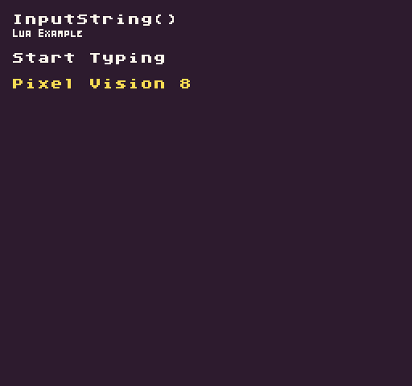

The `InputString()` API returns the keyboard input from the current frame. This API is useful for capturing keyboard text input.

## Usage

```csharp
InputString ( )
```

## Returns
| Value  | Description                                               |
|--------|-----------------------------------------------------------|
| string | A string of characters entered during the current frame\. |

## Example

In this example, we are going to capture any text typed and display it on the screen. Running this code will output the following:



## Lua

```lua
-- Store the text between frames
local inputText = ""

-- Cap on how much text will be displayed
local maxCharacters = 30

function Init()

  -- Example Title
  DrawText("InputString()", 8, 8, DrawMode.TilemapCache, "large", 15)
  DrawText("Lua Example", 8, 16, DrawMode.TilemapCache, "medium", 15, -4)
  
  -- Display the instructions
  DrawText("Start Typing", 1, 4, DrawMode.Tile, "large", 15)

end

function Update(timeDelta)

  -- Check how long the input text is and clear it if when it gets too long
  if(#inputText > maxCharacters) then
    inputText = ""
  end

  -- Add the current frame's input to the previous frame's text
  inputText = inputText .. InputString()

end

function Draw()

  -- Redraw display
  RedrawDisplay()

  -- Display the text that has been entered
  DrawText(inputText, 8, 48, DrawMode.Sprite, "large", 14)

end
```


## C#

```csharp
namespace PixelVision8.Player
{
    class InputStringExample : GameChip
    {
        // Store the text between frames
        private string inputText = "";

        // Cap on how much text will be displayed
        private int maxCharacters = 30;

        public override void Init()
        {

            // Example Title
            DrawText("InputString()", 8, 8, DrawMode.TilemapCache, "large", 15);
            DrawText("C Sharp Example", 8, 16, DrawMode.TilemapCache, "medium", 15, -4);

            // Display the instructions
            DrawText("Start Typing", 1, 4, DrawMode.Tile, "large", 15);

        }

        public override void Update(int timeDelta)
        {
            // Check how long the input text is and clear it if when it gets too long
            if (inputText.Length > maxCharacters)
            {
                inputText = "";
            }

            // Add the current frame's input to the previous frame's text
            inputText = inputText + InputString();

        }

        public override void Draw()
        {
            // Redraw display
            RedrawDisplay();

            // Display the text that has been entered
            DrawText(inputText, 8, 48, DrawMode.Sprite, "large", 14);

        }
    }
}
```

