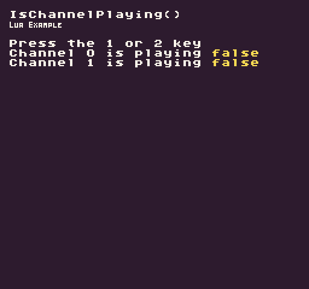

Returns a bool if the specified audio channel is playing a sound. Since channels can only play one sound effect at a time, you may need to test if a channel is currently playing before playing a new sound effect.

## Usage

```csharp
IsChannelPlaying ( channel )
```

## Arguments

| Name    | Value | Description                                                                                                                    |
|---------|-------|--------------------------------------------------------------------------------------------------------------------------------|
| channel | int   | The ID of the channel you want to test\. There are 5 audio channels but each game’s SoundChip can be configured to have less\. |

## Returns

| Value | Description                                                  |
|-------|--------------------------------------------------------------|
| bool  | Returns true if there is a sound playing on the audio chanel |

## Example

In this example, we are going to play two different sound effects on their own channels. The first song will play every time you hit the 1 key and the second sound effect, key 2, will only play when the previous sound has completed. Running this code will output the following:



## Lua

```lua
function Init()

  -- Example Title
  DrawText("IsChannelPlaying()", 8, 8, DrawMode.TilemapCache, "large", 15)
  DrawText("Lua Example", 8, 16, DrawMode.TilemapCache, "medium", 15, -4)
  
  -- Display the instructions
  DrawText("Press the 1 or 2 key", 1, 4, DrawMode.Tile, "large", 15)
  DrawText("Channel 0 is playing ", 1, 5, DrawMode.Tile, "large", 15)
  DrawText("Channel 1 is playing ", 1, 6, DrawMode.Tile, "large", 15)

end

function Update(timeDelta)

  -- Check for the 1 key to be pressed and play sound ID 0 on channel 0
  if(Key(Keys.D1, InputState.Released)) then
    PlaySound(0, 0)
  end

  -- Only play sound 1 if the channel is not currently playing a sound
  if(Key(Keys.D2, InputState.Released) and IsChannelPlaying(1) == false) then
    PlaySound(1, 1)
  end

end

-- The Draw() method is part of the game's life cycle. It is called after Update() and is where
-- all of our draw calls should go. We'll be using this to render sprites to the display.
function Draw()

  -- Redraw the display
  RedrawDisplay()

  -- Draw channel 0 and 1's current playing state to the display
  DrawText(tostring(IsChannelPlaying(0)), 176, 40, DrawMode.Sprite, "large", 14)
  DrawText(tostring(IsChannelPlaying(1)), 176, 48, DrawMode.Sprite, "large", 14)

end
```


## C#

```csharp
using Microsoft.Xna.Framework.Input;

namespace PixelVision8.Player
{
    class IsChannelPlayingExample : GameChip
    {
        public override void Init()
        {

            // Example Title
            DrawText("IsChannelPlaying()", 8, 8, DrawMode.TilemapCache, "large", 15);
            DrawText("C Sharp Example", 8, 16, DrawMode.TilemapCache, "medium", 15, -4);
            
            // Display the instructions
            DrawText("Press the 1 or 2 key", 1, 4, DrawMode.Tile, "large", 15);
            DrawText("Channel 0 is playing ", 1, 5, DrawMode.Tile, "large", 15);
            DrawText("Channel 1 is playing ", 1, 6, DrawMode.Tile, "large", 15);

        }

        public override void Update(int timeDelta)
        {
            // Check for the 1 key to be pressed and play sound ID 0 on channel 0
            if (Key(Keys.D1, InputState.Released))
            {
                PlaySound(0, 0);
            }

            // Only play sound 1 if the channel is not currently playing a sound
            if (Key(Keys.D2, InputState.Released) & IsChannelPlaying(1) == false)
            {
                PlaySound(1, 1);
            }

        }

        // The Draw() method is part of the game's life cycle. It is called after Update() and is where
        // all of our draw calls should go.We'll be using this to render sprites to the display.
        public override void Draw()
        {

            // Redraw the display
            RedrawDisplay();

            // Draw channel 0 and 1's current playing state to the display
            DrawText(IsChannelPlaying(0).ToString(), 176, 40, DrawMode.Sprite, "large", 14);
            DrawText(IsChannelPlaying(1).ToString(), 176, 48, DrawMode.Sprite, "large", 14);

        }
    }
}
```


