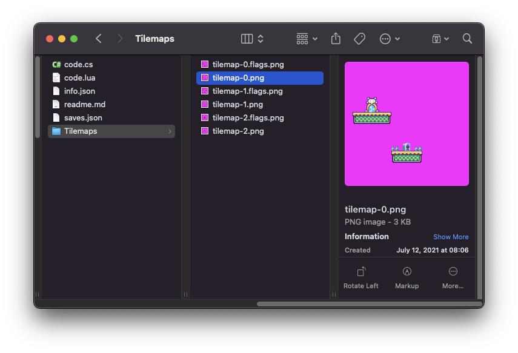
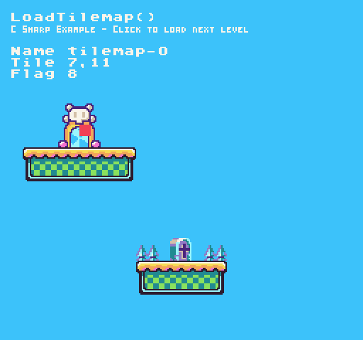

The `LoadTilemap()` API allows you load a new tilemap into the TileChip's memory. You can store tilemap PNG files inside of the `/Game/Tilemaps/` directory. Pixel Vision 8 will automatically parse and PNG files in this folder and load their associated `.flag.png` file. 



By default, the tilemap.png file will be loaded into memory automatically but if no file exists, the tilemap will be cleared and you will need to manually load the tilemap by name when you initialize your game.

## Usage

```csharp
LoadTilemap ( name )
```

## Arguments

| Name | Value  | Description                                     |
| ---- | ------ | ----------------------------------------------- |
| name | string | Name of the tilemap file without the extension. |


## Returns

| Value | Description                                                  |
| ----- | ------------------------------------------------------------ |
| bool  | Returns true if a tilemap was successfully loaded into memory. |


## Example

In this example, we are going to use the mouse position to find a tile and get its flag ID. Running this code will output the following:



## Lua

```lua
-- This point will store the current tile's position
local tilePosition = NewPoint()

-- This will store the current flag ID
local flagID = -1

-- The total number of maps in the Tilemaps folder
local totalMaps = 3;

-- The current map id which starts at -1 since we call next map on Init()
local currentMap = -1;

function Init()
    
    -- Change bg color
    BackgroundColor(2)

    -- Load the first tilemap into memory
    NextTilemap()

end

function Update(timeDelta)

  -- Get the current mouse position
  tilePosition = MousePosition()

  -- Check to see if the mouse is out of bounds
  if(tilePosition.X < 0 or tilePosition.X > Display().X or tilePosition.Y < 0 or tilePosition.Y >= Display().Y) then

      -- Set all of the values to -1
      tilePosition.X = -1;
      tilePosition.Y = -1;
      flagID = -1;

      -- Return before the position and flag are calculated
      return

  end

  -- Convert the mouse position to the tilemap's correct column and row
  tilePosition.x = math.floor(tilePosition.x / 8)
  tilePosition.y = math.floor(tilePosition.y / 8)

  -- Get the flag value of the current tile
  flagID = Flag(tilePosition.x, tilePosition.y)

  -- Look for the left mouse button to be pressed
  if(MouseButton( 0, InputState.Released )) then

    -- Load the next tilemap
    NextTilemap()

  end

end

function NextTilemap()
        

  -- Increment the current tilemap by 1 and loop back to 0 when greater than the total maps
  currentMap = Repeat( currentMap + 1, totalMaps )

  -- Load the new tilemap into memory
  LoadTilemap("tilemap-" .. currentMap)

  -- Example Title
  DrawText("LoadTilemap()", 8, 8, DrawMode.TilemapCache, "large", 15)
  DrawText("C Sharp Example - Click to load next level", 8, 16, DrawMode.TilemapCache, "medium", 15, -4)

end

function Draw()

  -- Redraws the display
  RedrawDisplay()

  -- Display the tile and flag text on the screen
  DrawText("Name tilemap-" .. currentMap, 8, 32, DrawMode.Sprite, "large", 15)
  DrawText("Tile " .. tilePosition.X .. "," .. tilePosition.Y, 8, 40, DrawMode.Sprite, "large", 15)
  DrawText("Flag " .. flagID, 8, 48, DrawMode.Sprite, "large", 15)

  -- Draw a rect to represent which tile the mouse is over and set the color to match the flag ID plus 1
  DrawRect(tilePosition.x * 8, tilePosition.y * 8, 8, 8, flagID + 1, DrawMode.Sprite)

end
```


## C#

```csharp
using System;

namespace PixelVision8.Player
{
    class FlagExampleGame : GameChip
    {
        // This point will store the current tile's position
        private Point tilePosition;

        // This will store the current flag ID
        private int flagID = -1;

        // The total number of maps in the Tilemaps folder
        private int totalMaps = 3;

        // The current map id which starts at -1 since we call next map on Init()
        private int currentMap = -1;

        public override void Init()
        {
            
            // Change bg color
            BackgroundColor(2);

            // Load the first tilemap into memory
            NextTilemap();

        }

        public override void Update(int timeDelta)
        {
            // Get the current mouse position
            tilePosition = MousePosition();

            // Check to see if the mouse is out of bounds
            if(tilePosition.X < 0 || tilePosition.X > Display().X || tilePosition.Y < 0 || tilePosition.Y >= Display().Y)
            {

                // Set all of the values to -1
                tilePosition.X = -1;
                tilePosition.Y = -1;
                flagID = -1;

                // Return before the position and flag are calculated
                return;
            }
                
            // Convert the mouse position to the tilemap's correct column and row
            tilePosition.X = (int)Math.Floor(tilePosition.X / 8f);
            tilePosition.Y = (int)Math.Floor(tilePosition.Y / 8f);

            // Get the flag value of the current tile
            flagID = Flag(tilePosition.X, tilePosition.Y);

            // Look for the left mouse button to be pressed
            if(MouseButton( 0, InputState.Released ))
            {

                // Load the next tilemap
                NextTilemap();

            }

        }

        private void NextTilemap()
        {

            // Increment the current tilemap by 1 and loop back to 0 when greater than the total maps
            currentMap = Repeat( currentMap + 1, totalMaps );

            // Load the new tilemap into memory
            LoadTilemap("tilemap-" + currentMap);

            // Example Title
            DrawText("LoadTilemap()", 8, 8, DrawMode.TilemapCache, "large", 15);
            DrawText("C Sharp Example - Click to load next level", 8, 16, DrawMode.TilemapCache, "medium", 15, -4);
        }

        public override void Draw()
        {

            // Redraws the display
            RedrawDisplay();

            // Display the tile and flag text on the screen
            DrawText("Name tilemap-" + currentMap, 8, 32, DrawMode.Sprite, "large", 15);
            DrawText("Tile " + tilePosition.X + "," + tilePosition.Y, 8, 40, DrawMode.Sprite, "large", 15);
            DrawText("Flag " + flagID, 8, 48, DrawMode.Sprite, "large", 15);

            // Draw a rect to represent which tile the mouse is over and set the color to match the flag ID plus 1
            DrawRect(tilePosition.X * 8, tilePosition.Y * 8, 8, 8, flagID + 1, DrawMode.Sprite);

        }
    }
}
```

