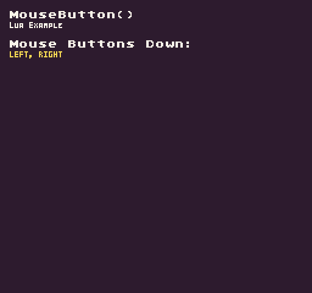

Pixel Vision 8 supports mouse input. You can get the current state of the mouse's left (`0`) and right (`1`) buttons by calling `MouseButton()`API. In addition to supplying a button ID, you can also provide an option `InputState`. 

The `InputState` enum contains options for testing the `Down` and `Released` states of the supplied button ID. By default, `Down` is automatically used which returns true when the key was pressed in the current frame. When using `Released`, the method returns `true `if the key is currently up but was down in the last frame.

## Usage

```csharp
MouseButton ( button, state )
```

## Arguments

| Name   | Value      | Description                                                     |
|--------|------------|-----------------------------------------------------------------|
| button | int        | Accepts an int for the left \(0\) or right \(1\) mouse button\. |
| state  | InputState | An optional InputState enum\. Uses InputState\.Down default\.   |


## Returns

| Value | Description                                       |
|-------|---------------------------------------------------|
| bool  | Returns a bool based on the state of the button\. |


## Mouse Buttons

The mouse has two buttons you can access by their ID.

| Enum  | Value |
|-------|-------|
| Left  | 0     |
| Right | 1     |


## Input State Enums

There are two input states you can use to test a button’s current state:

| Enum                 | Value |
|----------------------|-------|
| InputState\.Down     | 0     |
| InputState\.Released | 1     |

## Example

In this example, we will display if the mouse buttons are down. Running this code will output the following:



## Lua

```lua
-- This array will store any buttons pressed during the current frame
local pressedButtons = {}

-- A list of mouse buttons to check on each frame
local buttons = {"left", "right"}

function Update(timeDelta)

  -- Clear the pressedButtons array on each frame
  pressedButtons = {}

  -- Loop through all the buttons
  for i = 1, #buttons do

    -- Test if the current mouse button ID is down and saves it to the pressedButtons array
    if(MouseButton((i - 1), InputState.Down)) then
      table.insert(pressedButtons, buttons[i])
    end
  end

end

function Draw()

  -- Clear the display
  Clear()

  -- Example Title
  DrawText("MouseButton()", 8, 8, DrawMode.Sprite, "large", 15)
  DrawText("Lua Example", 8, 16, DrawMode.Sprite, "medium", 15, -4)

  -- Convert the pressedButtons into a string and draw to the display
  local message = table.concat(pressedButtons, ", "):upper()
  DrawText("Mouse Buttons Down:", 8, 32, DrawMode.Sprite, "large", 15)
  DrawText(message:sub(0, #message), 8, 40, DrawMode.Sprite, "medium", 14, - 4)

end
```


## C#

```csharp
using System.Collections.Generic;

namespace PixelVision8.Player
{
    class MouseButtonExample : GameChip
    {
        // This array will store any buttons pressed during the current frame
        List<string> pressedButtons = new List<string>();

        // A list of mouse buttons to check on each frame
        private string[] buttons = { "left", "right" };

        public override void Update(int timeDelta)
        {
            // Clear the pressedButtons array on each frame
            pressedButtons.Clear();

            // Loop through all the buttons
            for (int i = 0; i < buttons.Length; i++)
            {
                // Test if the current mouse button ID is down and saves it to the pressedButtons array
                if (MouseButton(i, InputState.Down))
                {
                    pressedButtons.Add(buttons[i]);
                }
            }

        }

        public override void Draw()
        {
            // Clear the display
            Clear();

            // Example Title
            DrawText("MouseButton()", 8, 8, DrawMode.Sprite, "large", 15);
            DrawText("C Sharp Example", 8, 16, DrawMode.Sprite, "medium", 15, -4);

            // Convert the pressedButtons into a string and draw to the display
            var message = string.Join(", ", pressedButtons.ToArray()).ToUpper();
            DrawText("Mouse Buttons Down:", 8, 32, DrawMode.Sprite, "large", 15);
            DrawText(message.Substring(0, message.Length), 8, 40, DrawMode.Sprite, "medium", 14, -4);

        }

    }
}
```

