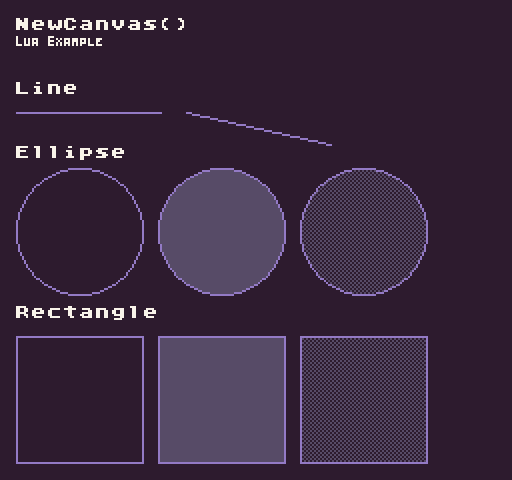

The canvas is a special `TextureData` derivative that supports drawing primitive shapes such as lines, circles, and rectangles. You can also draw sprites and text to it as well. When you are done drawing on the canvas, you can copy the pixel data into the `SpriteChip `or directly to the tilemap cache. While the canvas allows run-time drawing, it’s not part of the core Pixel Vision 8 API. The canvas is used to create the tilemap cache and the additional drawing APIs, which are used by Pixel Vision OS, should be used sparingly since they could impact performance.

In order to draw on the canvas, you first need to set a stroke that represents the size of the brush and color to use. You can also set a pattern that is used to fill primitives such as the circle and rectangle. These patterns could be solid colors or graphics that will repeat within the boundaries of the shape. Each time you change the stroke or pattern, the next primitive that is drawn will reflect the changes.

## Usage

```csharp
NewCanvas ( w, h )
```

## Arguments

| Name | Value | Description                                |
|------|-------|--------------------------------------------|
| w    | int   | The width value of the canvas as an int\.  |
| h    | int   | The height value of the canvas as an int\. |

## Returns

| Value | Description                                                     |
|-------|-----------------------------------------------------------------|
| Rect  | Returns a new instance of a Canvas to be used as a Lua object\. |

## Drawing APIs

The Canvas has its own set of drawing APIs that allow you to draw pixel data to it. These are a few of the more common ones you can use.

| Name                                                         | Description                                                  |
| ------------------------------------------------------------ | ------------------------------------------------------------ |
| Clear\( colorID \)                                           | Clears the canvas with the supplied color\.                  |
| DrawEllipse\( x, y, width, height, fill \)                   | Draws an ellipse between two points with the option to fill it with the current pattern\. If draw centered is set to true, the first point will act as the center of the ellipse and the second point will be the outer radius edge of it\. If the draw center is false, the ellipse will be drawn to fit inside the boundaries of the 2 points\. |
| DrawLine\( x0, y0, x1, y1 \)                                 | Draws a line between two points\.                            |
| DrawPixels\( x, y, drawMode, scale, maskColor, maskColorID \) | Draws the contents of the canvas to the display\. You can also set a scale value, the default is 1, to enlarge the image before rendering it\. By default, the canvas is drawn to the tilemap cache layer\. |
| DrawSprite\( id, x, y, flipH, flipV, colorOffset \)          | Draws a sprite to the canvas\.                               |
| DrawMetaSprite id, x, y, flipH, flipV, colorOffset \)        | Draws a meta sprite to the canvas.                           |
| DrawRectangle\( x, y, width, height, fill \)                 | Draws a square between two points with the option to fill it with the current pattern\. |
| DrawText\( text, x, y, font, colorOffset, spacing \)         | Draw text to the canvas\.                                    |
| FloodFill\( x, y\)                                           | Attempts to perform a flood fill at a point on the canvas\. The color at the x,y position of the flood fill will be used as the source color to replace until it runs out of connecting colors\. This is a very expensive API so try to avoid using it in large or complex areas\. |
| LinePattern\( x, y \)                                        | Changes the spacing between the X and Y pixel of the line\. By default, the X value is set to 1\. |
| ReadPixelAt\( x, y\)                                         | Reads a pixel at a given position and return the color ID\.  |
| SamplePixels\( x, y, width, height\)                         | Returns the pixels, as an array of color ID integers, within the supplied boundaries\. |
| SetPattern\( pixels, width, height \)                        | Changes the fill pattern for shapes such as the circle, square, and ellipses\. The fill pattern is also used by FloodFill\(\)\. |
| SetStroke\( pixels, width, height \)                         | Changes the stroke color and size\. It accepts an array of integers\. The width x height needs to equal the number of pixels in the array\. |
| SetStrokePixel\( x, y \)                                     | Draws a single stroke pixel\. This is used by all of the drawing APIs to create an outline along with a given set of coordinates\. |
| ## Example                                                   |                                                              |

In this example, we are going to look at how to draw a line, a circle, and a square including how to fill them with solid colors or patterns. Running this code will output the following:



## Lua

```lua
-- Create a new canvas the size of the display
local canvas = NewCanvas(Display().x, Display().y)

-- This will be our solid pattern value
local solidPattern = {5}

-- This will be our checkered pattern value
local checkeredPattern = {
  5, 0, 5, 0,
  0, 5, 0, 5,
  5, 0, 5, 0,
  0, 5, 0, 5
}

function Init()

  -- Create a new canvas the size of the display
  canvas = NewCanvas(Display().X, Display().Y)

  -- Set the canvas stroke to a 1x1 pixel brush
  canvas.SetStroke(6, 1)

  -- Draw the line label to the canvas
  canvas.DrawText("Line", 8, 40, "large", 15)

  -- Draw a line between the two points
  canvas.DrawLine(8, 56, 80, 56)

  -- Draw a line between the two points
  canvas.DrawLine(93, 56, 165, 72)

  -- Draw the Ellipse label to the canvas
  canvas.DrawText("Ellipse", 8, 72, "large", 15)

  -- Ellipse 1
  canvas.DrawEllipse(8, 84, 64, 64)

  -- Ellipse 2
  canvas.SetPattern(solidPattern, 1, 1)
  canvas.DrawEllipse(79, 84, 64, 64, true)

  -- Ellipse 3
  canvas.SetPattern(checkeredPattern, 4, 4)
  canvas.DrawEllipse(150, 84, 64, 64, true)

  -- Draw the Rectangle label to the canvas
  canvas.DrawText("Rectangle", 8, 152, "large", 15)

  -- Rectangle 1
  canvas.DrawRectangle(8, 168, 64, 64)

  -- Rectangle 2
  canvas.SetPattern(solidPattern, 1, 1)
  canvas.DrawRectangle(79, 168, 64, 64, true)

  -- Rectangle 3
  canvas.SetPattern(checkeredPattern, 4, 4)
  canvas.DrawRectangle(150, 168, 64, 64, true)

  -- Draw the canvas to the display
  canvas.DrawPixels()

  -- Example Title
  DrawText("NewCanvas()", 8, 8, DrawMode.TilemapCache, "large", 15)
  DrawText("Lua Example", 8, 16, DrawMode.TilemapCache, "medium", 15, -4)

end

function Draw()
  -- Redraw the display
  RedrawDisplay()
end
```


## C#

```csharp
namespace PixelVision8.Player
{
    class NewCanvasExample : GameChip
    {
        // Store a reference to the canvas here
        private Canvas canvas;

        // This will be our solid pattern value
        private int[] solidPattern = { 5 };

        // This will be our checkered pattern value
        private int[] checkeredPattern =
        {
            5, 0, 5, 0,
            0, 5, 0, 5,
            5, 0, 5, 0,
            0, 5, 0, 5
        };

        public override void Init()
        {
            
            // Create a new canvas the size of the display
            canvas = NewCanvas(Display().X, Display().Y);

            // Set the canvas stroke to a 1x1 pixel brush
            canvas.SetStroke(6, 1);

            // Draw the line label to the canvas
            canvas.DrawText("Line", 8, 40, "large", 15);

            // Draw a line between the two points
            canvas.DrawLine(8, 56, 80, 56);

            // Draw a line between the two points
            canvas.DrawLine(93, 56, 165, 72);

            // Draw the Ellipse label to the canvas
            canvas.DrawText("Ellipse", 8, 72, "large", 15);

            // Ellipse 1
            canvas.DrawEllipse(8, 84, 64, 64);

            // Ellipse 2
            canvas.SetPattern(solidPattern, 1, 1);
            canvas.DrawEllipse(79, 84, 64, 64, true);

            // Ellipse 3
            canvas.SetPattern(checkeredPattern, 4, 4);
            canvas.DrawEllipse(150, 84, 64, 64, true);

            // Draw the Rectangle label to the canvas
            canvas.DrawText("Rectangle", 8, 152, "large", 15);

            // Rectangle 1
            canvas.DrawRectangle(8, 168, 64, 64);

            // Rectangle 2
            canvas.SetPattern(solidPattern, 1, 1);
            canvas.DrawRectangle(79, 168, 64, 64, true);

            // Rectangle 3
            canvas.SetPattern(checkeredPattern, 4, 4);
            canvas.DrawRectangle(150, 168, 64, 64, true);

            // Draw the canvas to the display
            canvas.DrawPixels();

            // Example Title
            DrawText("NewCanvas()", 8, 8, DrawMode.TilemapCache, "large", 15);
            DrawText("C Sharp Example", 8, 16, DrawMode.TilemapCache, "medium", 15, -4);

        }

        public override void Draw()
        {
            // Redraw the display
            RedrawDisplay();
        }

    }
}
```


