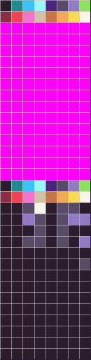
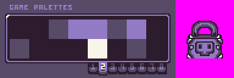
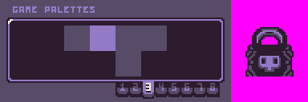
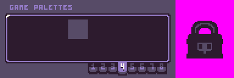
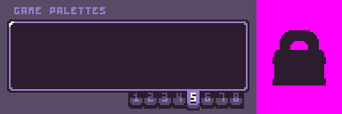

The `PaletteOffset()` API allows you to easily calculate the color ID index when using palette mode in the Pixel Vision OS Color Tool. When switching to palette mode, the `ColorChip`’s memory is split into 128 system colors and 128 palette colors. Palettes start as ID `127`. Each palette can contain a maximum of 16 colors which ends up giving you 8 palettes to work with.



By calling the `PaletteOffset()` API, it will convert a palette ID into the correct color ID for you. When used in the place of any of the drawing API’s `colorOffset` arguments, you can easily shift between any of the 8 palettes during run-time. There is an optional argument to supply a `paletteColorID` which gives you the color ID for a specific position inside of the palette.

## Usage

```csharp
PaletteOffset ( paletteID, paletteColorID)
```

## Arguments

| Name           | Value | Description                                                                               |
|----------------|-------|-------------------------------------------------------------------------------------------|
| paletteID      | int   | A palette number between 0 and 7\.                                                        |
| paletteColorID | int   | An optional color ID inside of a palette between 0 and 15\. This is set to 0 by default\. |

## Returns

| Value | Description                                                       |
|-------|-------------------------------------------------------------------|
| int   | Returns a color ID based on the palette and palette color value\. |

## Example

In this example, we are going to increase and decrease the palette ID value to give the effect that the sprites are fading into the background. To do this, we need to set up several palettes in the Color Tool to create the effect:










With the palettes created, we can shift between them by calling `PaletteOffset()` to calculate the correct color ID to use for the color offset. Running this code will output the following:


## Lua

```lua
-- Set up a time and delay
local time = 0
local delay = 800

-- This will be the direction value for the transition
local dir = 1

-- Total number of palettes for transition
local max = 4

-- Current palette ID
local paletteID = 0

function Init()

  -- Example Title
  DrawText("PaletteOffset()", 8, 8, DrawMode.TilemapCache, "large", 15)
  DrawText("Lua Example", 8, 16, DrawMode.TilemapCache, "medium", 15, -4)
  
  -- Draw the text for the palette and color ID
  DrawText("Palette   (Color ID    )", 1, 4, DrawMode.Tile, "large", 15)

end

function Update(timeDelta)

  -- Increase the time on each frame and test if it is greater than the delay
  time = time + timeDelta
  if(time > delay) then

    -- Update the palette ID based on the direction
    paletteID = paletteID + dir

    -- Test if the palette ID is too small or too large and reverse the direction
    if(paletteID >= max) then
      dir = -1
    elseif(paletteID <= 0) then
      dir = 1
    end

    -- Reset the time value
    time = 0

  end
end

function Draw()

  -- Redraw the display
  RedrawDisplay()

  -- Draw the sprite block using the current palette offset value
  DrawMetaSprite("lock", 8, 48, false, false, DrawMode.Sprite, PaletteOffset(paletteID))

  -- Draw the current palette number and color offset value
  DrawText(paletteID, 72, 32, DrawMode.Sprite, "large", 14)
  DrawText(PaletteOffset(paletteID), 168, 32, DrawMode.Sprite, "large", 14)

end

```


## C#

```csharp
namespace PixelVision8.Player
{
    class PaletteOffsetExample : GameChip
    {
        // Set up a time and delay
        private int time = 0;
        private int delay = 800;

        // This will be the direction value for the transition
        private int dir = 1;

        // Total number of palettes for transition
        private int max = 4;

        // Current palette ID
        private int paletteID = 0;

        public override void Init()
        {

            // Example Title
            DrawText("PaletteOffset()", 8, 8, DrawMode.TilemapCache, "large", 15);
            DrawText("C Sharp Example", 8, 16, DrawMode.TilemapCache, "medium", 15, -4);

            // Draw the text for the palette and color ID
            DrawText("Palette   (Color ID    )", 1, 4, DrawMode.Tile, "large", 15);
  
        }

        public override void Update(int timeDelta)
        {
            // Increase the time on each frame and test if it is greater than the delay
            time = time + timeDelta;
            if (time > delay)
            {

                // Update the palette ID based on the direction
                paletteID = paletteID + dir;

                // Test if the palette ID is too small or too large and reverse the direction
                if (paletteID >= max)
                {
                    dir = -1;
                }
                else if (paletteID <= 0)
                {
                    dir = 1;
                }

                // Reset the time value
                time = 0;

            }
        }

        public override void Draw()
        {
            // Redraw the display
            RedrawDisplay();

            // Draw the sprite block using the current palette offset value
            DrawMetaSprite("lock", 8, 48, false, false, DrawMode.Sprite, PaletteOffset(paletteID));

            // Draw the current palette number and color offset value
            DrawText(paletteID.ToString(), 72, 32, DrawMode.Sprite, "large", 14);
            DrawText(PaletteOffset(paletteID).ToString(), 168, 32, DrawMode.Sprite, "large", 14);

        }
    }
}
```
