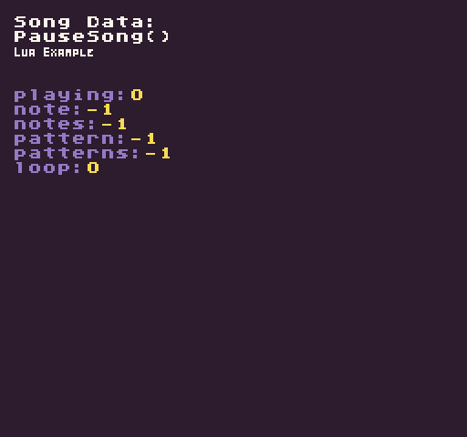

The `PauseSong()` API toggles the current playback state of the sequencer. If the song is playing, it will pause. If the song is paused, it will play

## Usage

```csharp
PauseSong ( )
```

## Example

In this example, we are going to toggle playing and pausing a song by pressing the mouse button. Running this code will output the following:



## Lua

```lua
function Init()

  -- Example Title
  DrawText("PauseSong()", 8, 16, DrawMode.TilemapCache, "large", 15)
  DrawText("Lua Example", 8, 24, DrawMode.TilemapCache, "medium", 15, -4)

  -- Draw the song data label
  DrawText("Song Data:", 1, 1, DrawMode.Tile, "large", 15)

  -- Start playing the song on a loop
  PlaySong(0, true)

end

function Update(timeDelta)

  -- Test if the left mouse button was released to pause the song
  if(MouseButton(0, InputState.Released)) then
    PauseSong()
  end

end

function Draw()

  -- Redraw display
  RedrawDisplay()

  -- Reset the next row value so we know where to draw the first line of text
  local nextRow = 2

  -- Display the song's metadata
  for key, value in next, SongData() do

    -- Draw the key value pair from the song data table
    DrawText(key .. ":", 8, nextRow * 8 + 32, DrawMode.Sprite, "large", 6)
    DrawText(value, 16 + (#key * 8), nextRow * 8 + 32, DrawMode.Sprite, "large", 14)

    -- Increment the row by 1 for the next loop
    nextRow = nextRow + 1

  end

end
```


## C#

```csharp
namespace PixelVision8.Player
{
    class PauseSongExample : GameChip
    {
        public override void Init()
        {

            // Example Title
            DrawText("PauseSong()", 8, 16, DrawMode.TilemapCache, "large", 15);
            DrawText("C Sharp Example", 8, 24, DrawMode.TilemapCache, "medium", 15, -4);

            // Draw the song data label
            DrawText("Song Data:", 1, 5, DrawMode.Tile, "large", 15);

            // Start playing the song on a loop
            PlaySong(0, true);

        }

        public override void Update(int timeDelta)
        {
            // Test if the left mouse button was released to pause the song
            if (MouseButton(0, InputState.Released))
            {
                PauseSong();
            }

        }

        public override void Draw()
        {

            // Redraw display
            RedrawDisplay();

            // Reset the next row value so we know where to draw the first line of text
            var nextRow = 2;

            // Display the song's metadata
            foreach (var data in SongData())
            {

                // Draw the key value pair from the song data table
                DrawText(data.Key + ":", 8, nextRow * 8 + 32, DrawMode.Sprite, "large", 6);
                DrawText(data.Value.ToString(), 16 + (data.Key.Length * 8), nextRow * 8 + 32, DrawMode.Sprite, "large", 14);

                // Increment the row by 1 for the next loop
                nextRow = nextRow + 1;

            }
        }
    }
}
```

