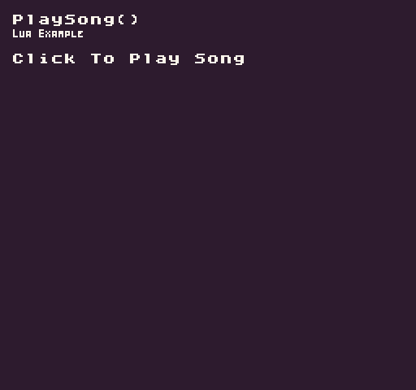

The `PlaySong()` API allows you to activate the `MusicChip`’s tracker to playback any of the songs stored in memory. A song is simply a collection of patterns. You can supply an optional parameter called `startAt` to tell the `MusicChip` which pattern to start the song at. When playing a song, you will need to supply a song ID, which starts at `0`. The total number of songs is defined in the `data.json` file.

## Usage

```csharp
PlaySong ( id, loop, startAt )
```

## Arguments

| Name    | Value | Description                                                                                   |
|---------|-------|-----------------------------------------------------------------------------------------------|
| id      | int   | The ID of the song you want to play\.                                                         |
| loop    | bool  | Tell the MusicChip if it should replay the song once all of the loops have finished playing\. |
| startAt | int   | An optional parameter that tells the MusicChip which pattern to start playing in the song\.   |

## Example

In this example, we are going to play a song when the mouse button is released and display the song data. Running this code will output the following:



## Lua

```lua
local isPlaying = 0

function Init()
    -- Example Title
    DrawText("PlaySong()", 8, 8, DrawMode.TilemapCache, "large", 15)
    DrawText("Lua Example", 8, 16, DrawMode.TilemapCache, "medium", 15, -4)
end

function Update(timeDelta)

  -- Get the playing value
  isPlaying = SongData().playing

  -- Test if the left mouse button was released and if isPlaying equals 0
  if(MouseButton(0, InputState.Released) and isPlaying == 0) then

    -- Play the first song without looping
    PlaySong(0, false)

  end

end

function Draw()

  -- Redraw display
  RedrawDisplay()

  -- Reset the next row value so we know where to draw the first line of text
  local nextRow = 2

  if(isPlaying == 1) then

    -- Draw the song data label
    DrawText("Song Data:", 8, 32, DrawMode.Sprite, "large", 15)

    -- Display the song's meta data
    for key, value in next, SongData() do

      -- Draw the key value pair from the song data table
      DrawText(key .. ":", 8, nextRow * 8 + 24, DrawMode.Sprite, "large", 6)
      DrawText(value, 16 + (#key * 8), nextRow * 8 + 24, DrawMode.Sprite, "large", 14)

      -- Increment the row by 1 for the next loop
      nextRow = nextRow + 1

    end
  else

    -- Draw the instructions label
    DrawText("Click To Play Song", 8, 32, DrawMode.Sprite, "large", 15)

  end

end
```


## C#

```csharp
namespace PixelVision8.Player
{
    class PlaySongExample : GameChip
    {
        private int isPlaying;

        public override void Init()
        {
            // Example Title
            DrawText("PlaySong()", 8, 8, DrawMode.TilemapCache, "large", 15);
            DrawText("C Sharp Example", 8, 16, DrawMode.TilemapCache, "medium", 15, -4);
        }

        public override void Update(int timeDelta)
        {
            // Get the playing value
            isPlaying = SongData()["playing"];

            // Test if the left mouse button was released && if isPlaying equals 0
            if (MouseButton(0, InputState.Released) && isPlaying == 0)
            {

                // Play the first song without looping
                PlaySong(0, false);

            }
        }

        public override void Draw()
        {

            // Redraw display
            RedrawDisplay();

            // Reset the next row value so we know where to draw the first line of text
            var nextRow = 2;

            if (isPlaying == 1)
            {

                // Draw the song data label
                DrawText("Song Data:", 8, 32, DrawMode.Sprite, "large", 15);

                // Display the song's meta data
                foreach (var data in SongData())
                {

                    // Draw the key value pair from the song data table
                    DrawText(data.Key + ":", 8, nextRow * 8 + 24, DrawMode.Sprite, "large", 6);
                    DrawText(data.Value.ToString(), 16 + (data.Key.Length * 8), nextRow * 8 + 24, DrawMode.Sprite, "large", 14);

                    // Increment the row by 1 for the next loop
                    nextRow++;

                }
            }
            else
            {

                // Draw the instructions label
                DrawText("Click To Play Song", 8, 32, DrawMode.Sprite, "large", 15);

            }
        }
    }
}
```
