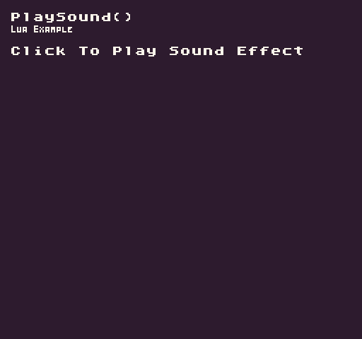

The `PlaySound()` API allows playing a single sound effect on a specific channel. The `SoundChip `has a limited number of active channels, so playing a sound effect on a channel where a sound is already playing will override it. Since the `MusicChip` shares the same audio channels, playing sound effects while a song is playing on a channel will temporarily stop the song playing on that channel and play the sound effect until the next note of the song is triggered which will overwrite the sound effect. 

Finally, each audio channel can be locked to play a single wave type which will override the sound effect’s own wave channel which alters what the effect will sound like. Before playing a sound, you’ll want to make sure you are using an audio channel that supports its wave type. 

## Usage

```csharp
PlaySound ( id, channel )
```

## Arguments

| Name    | Value | Description                                                                       |
|---------|-------|-----------------------------------------------------------------------------------|
| id      | int   | The ID of the sound in the SoundChip\.                                            |
| channel | int   | An optional audio channel ID to play the sound on\. Channel 0 is set by default\. |

## Example

In this example, we’ll play a sound effect on channel 0 when the mouse is pressed. Running this code will output the following:



## Lua

```lua
-- Store the playback state of channel 0
local isPlaying = false

function Init()
  -- Example Title
  DrawText("PlaySound()", 8, 8, DrawMode.TilemapCache, "large", 15)
  DrawText("Lua Example", 8, 16, DrawMode.TilemapCache, "medium", 15, -4)
end

function Update(timeDelta)

  -- See if the channel has audio playing back on it
  isPlaying = IsChannelPlaying(0)

  -- Test if the left mouse button was released and if isPlaying equals false
  if(MouseButton(0, InputState.Released) and isPlaying == false) then

    -- Play the second sound effect
    PlaySound(1)

  end

end

function Draw()

  -- Redraw display
  RedrawDisplay()

  -- Test to see if the sound effect is playing
  if(isPlaying) then

    -- Draw the sound playback label
    DrawText("Playing On Channel 0", 8, 32, DrawMode.Sprite, "large", 14)

  else

    -- Draw the instructions label
    DrawText("Click To Play Sound Effect", 8, 32, DrawMode.Sprite, "large", 15)

  end

end
```


## C#

```csharp
namespace PixelVision8.Player
{
    class PlaySoundExample : GameChip
    {

        // Store the playback state of channel 0
        private bool isPlaying = false;

        public override void Init()
        {
            // Example Title
            DrawText("PlaySound()", 8, 8, DrawMode.TilemapCache, "large", 15);
            DrawText("C Sharp Example", 8, 16, DrawMode.TilemapCache, "medium", 15, -4);
        }

        public override void Update(int timeDelta)
        {
            // See if the channel has audio playing back on it
            isPlaying = IsChannelPlaying(0);

            // Test if the left mouse button was released and if isPlaying equals false
            if (MouseButton(0, InputState.Released) && isPlaying == false)
            {

                // Play the second sound effect
                PlaySound(1);

            }
        }

        public override void Draw()
        {

            // Redraw display
            RedrawDisplay();

            // Test to see if the sound effect is playing
            if (isPlaying)
            {

                // Draw the sound playback label
                DrawText("Playing On Channel 0", 8, 32, DrawMode.Sprite, "large", 14);

            }
            else
            {

                // Draw the instructions label
                DrawText("Click To Play Sound Effect", 8, 32, DrawMode.Sprite, "large", 15);

            }
        }
    }
}
```
