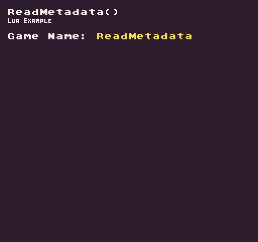

The `ReadMetadata()` API allows you to read the `metadata `that is passed into the game when it loads. This is used by the Pixel Vision 8 Runner to pass data between load sessions. When a game is restarted, it will get a copy of the original `metadata `that was used to launch the game for the first time. The `metadata `is eventually cleared as the Runner loads new games, so it’s important to save any of the `metadata `you need between sessions to the game’s `saves.json` file. Finally, all keys and values are strings. This means if you are reading an integer or boolean, you’ll need to convert it in order to get its native type.

## Usage

```csharp
ReadMetaData ( key, defaultValue )
```

## Arguments

| Name         | Value  | Description                                                          |
|--------------|--------|----------------------------------------------------------------------|
| key          | string | The name of the metadata’s key                                       |
| defaultValue | string | A default value to return if the key doesn’t exist on the metadata\. |

## Returns

| Value  | Description                                                                               |
|--------|-------------------------------------------------------------------------------------------|
| string | The string value from the metadata’s key or the default value if the key does not exist\. |

## Common Keys

The Pixel Vision 8 Runner adds the following metadata keys whenever it loads up a game:

| Name                | Description |
|---------------------|-------------|
| name                |             |
| GameName            |             |
| RootPath            |             |
| Player1UpKey        |             |
| Player1DownKey      |             |
| Player1RightKey     |             |
| Player1LeftKey      |             |
| Player1SelectKey    |             |
| Player1StartKey     |             |
| Player1AKey         |             |
| Player1BKey         |             |
| Player1UpButton     |             |
| Player1DownButton   |             |
| Player1RightButton  |             |
| Player1LeftButton   |             |
| Player1SelectButton |             |
| Player1StartButton  |             |
| Player1AButton      |             |
| Player1BButton      |             |
| Player2UpKey        |             |
| Player2DownKey      |             |
| Player2RightKey     |             |
| Player2LeftKey      |             |
| Player2SelectKey    |             |
| Player2StartKey     |             |
| Player2AKey         |             |
| Player2BKey         |             |
| Player2UpButton     |             |
| Player2DownButton   |             |
| Player2RightButton  |             |
| Player2LeftButton   |             |
| Player2SelectButton |             |
| Player2StartButton  |             |
| Player2AButton      |             |
| Player2BButton      |             |
| reset               |             |
| ShowEjectAnimation  |             |
| errorMessage        |             |
| exceptionMessage    |             |

## Example

In this example, we are going to iterate over all of the game’s metadata keys and output what we can to the display. Running this code will output the following:



## Lua

```lua
function Init()

  -- Example Title
  DrawText("ReadMetadata()", 8, 8, DrawMode.TilemapCache, "large", 15)
  DrawText("Lua Example", 8, 16, DrawMode.TilemapCache, "medium", 15, -4)
  
  -- Display the name of the game from the game's metadata
  DrawText("Game Name:", 1, 4, DrawMode.Tile, "large", 15)
  DrawText(ReadMetadata("GameName", "Untitled"), 12, 4, DrawMode.Tile, "large", 14)

end

function Draw()
  -- Redraw the display
  RedrawDisplay()
end
```


## C#

```csharp
namespace PixelVision8.Player
{
    class ReadMetadataExample : GameChip
    {

        public override void Init()
        {

            // Example Title
            DrawText("ReadMetadata()", 8, 8, DrawMode.TilemapCache, "large", 15);
            DrawText("C Sharp Example", 8, 16, DrawMode.TilemapCache, "medium", 15, -4);

            // Display the name of the game from the game's metadata
            DrawText("Game Name:", 1, 4, DrawMode.Tile, "large", 15);
            DrawText(ReadMetadata("GameName", "Untitled"), 12, 4, DrawMode.Tile, "large", 14);

        }

        public override void Draw()
        {

            // Redraw the display
            RedrawDisplay();

        }
    }
}
```

