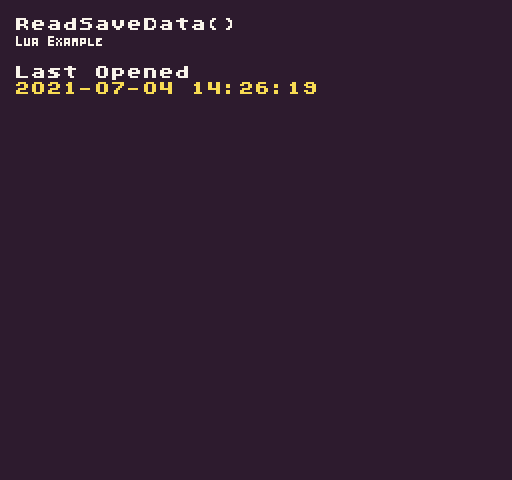

The `ReadSaveData()` API allows you to read saved data by supplying a key. If no matching key exists, "`undefined`" is returned.

## Usage

```csharp
ReadSaveData ( key, defaultValue )
```

## Arguments

| Name         | Value  | Description                                         |
|--------------|--------|-----------------------------------------------------|
| key          | string | The string key used to find the data\.              |
| defaultValue | string | The optional string to use if data does not exist\. |

## Returns

| Value  | Description                                            |
|--------|--------------------------------------------------------|
| string | Returns string data associated with the supplied key\. |

## Example

In this example, we are going to attempt to read the last time the game was loaded. When the game shuts down, it will save a timestamp to be read the next time the game is run. Running this code will output the following:



## Lua

```lua
function Init()

  -- Example Title
  DrawText("ReadSaveData()", 8, 8, DrawMode.TilemapCache, "large", 15)
  DrawText("Lua Example", 8, 16, DrawMode.TilemapCache, "medium", 15, -4)
  
  -- Draw the last opneded text
  DrawText("Last Opened", 1, 4, DrawMode.Tile, "large", 15)

  -- Draw the saved data to the display
  DrawText(ReadSaveData("LastOpened", "Never"), 1, 5, DrawMode.Tile, "large", 14)

end

function Draw()
  -- Redraw the display
  RedrawDisplay()
end

-- When the game shuts down, it will automatically save the timestamp
function Shutdown()

  -- Write timestamp to the saves.json file.
  WriteSaveData("LastOpened", os.date('%Y-%m-%d %H:%M:%S', ts))

end
```


## C#

```csharp
using System;

namespace PixelVision8.Player
{
    class ReadSaveDataExample : GameChip
    {
        public override void Init()
        {

            // Example Title
            DrawText("ReadSaveData()", 8, 8, DrawMode.TilemapCache, "large", 15);
            DrawText("C Sharp Example", 8, 16, DrawMode.TilemapCache, "medium", 15, -4);

            // Draw the last opneded text
            DrawText("Last Opened", 1, 4, DrawMode.Tile, "large", 15);

            // Draw the saved data to the display
            DrawText(ReadSaveData("LastOpened", "Never"), 1, 5, DrawMode.Tile, "large", 14);

        }

        public override void Draw()
        {
            // Redraw the display
            RedrawDisplay();
        }

        // When the game shuts down, it will automatically save the timestamp
        public override void Shutdown()
        {
            // Write timestamp to the saves.json file.
            WriteSaveData("LastOpened", DateTime.Now.ToString());

            //  TODO need a utility to write this to the file system since it's not run in the main engine

        }
    }
}
```


