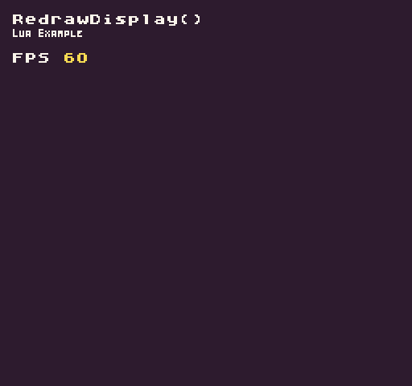

The `RedrawAPI()` allows you to execute both the `Clear()` and `DrawTilemap()` APIs in a single call. This is a simple helper function to make redrawing the display easier. If you need to supply additional arguments to either the `Clear()` or `DrawTilemap(`) APIs then you’ll need to call each one independently without using `RedrawDisplay()`.

## Usage

```csharp
RedrawDisplay ( )
```

## Example

In this example, we’ll be using RedrawDisplay() to clear the screen and draw the FPS, frames per second, to the screen. Running this code will output the following:



## Lua

```lua
function Init()

  -- Example Title
  DrawText("RedrawDisplay()", 8, 8, DrawMode.TilemapCache, "large", 15)
  DrawText("Lua Example", 8, 16, DrawMode.TilemapCache, "medium", 15, -4)

  -- Draw the FPS label to the tilemap
  DrawText("FPS ", 1, 4, DrawMode.Tile, "large", 15)

end

function Draw()

  -- Redraw the display
  RedrawDisplay()

  -- Draw the FPS value to the display on every frame
  DrawText(ReadFPS(), 40, 32, DrawMode.Sprite, "large", 14)

end
```


## C#

```csharp
namespace PixelVision8.Player
{
    class RedrawDisplayExample : GameChip
    {
        public override void Init()
        {

            // Example Title
            DrawText("RedrawDisplay()", 8, 8, DrawMode.TilemapCache, "large", 15);
            DrawText("C Sharp Example", 8, 16, DrawMode.TilemapCache, "medium", 15, -4);

            // Draw the FPS label to the tilemap
            DrawText("FPS ", 1, 4, DrawMode.Tile, "large", 15);

        }

        public override void Draw()
        {
            // Redraw the display
            RedrawDisplay();

            // Draw the FPS value to the display on every frame
            DrawText(ReadFPS().ToString(), 40, 32, DrawMode.Sprite, "large", 14);
        }
    }
}
```
