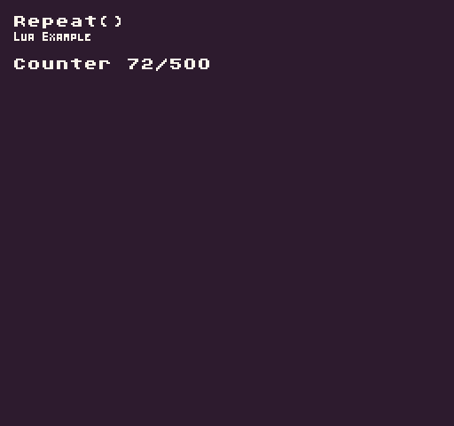

The `Repeat()` API allows you to reset the value of a number if it goes past a maximum value. When counting backward, `Repeat()` will set the value to the maximum when below 0. 

## Usage

```csharp
Repeat ( val, max )
```

## Arguments

| Name | Value | Description                    |
|------|-------|--------------------------------|
| val  | int   | The value to repeat\.          |
| max  | int   | The maximum the value can be\. |

## Returns

| Value | Description                                                        |
|-------|--------------------------------------------------------------------|
| int   | Returns an int that is never less than 0 or greater than the max\. |

## Example

In this example, we will increase a counter by `1` on every frame and use `Repeat()` to have it wrap back to `0` when it goes greater than the max value. Running this code will output the following:



## Lua

```lua
-- Store the counter value and max value
local counter = 0
local counterMax = 500

function Init()

  -- Example Title
  DrawText("Repeat()", 8, 8, DrawMode.TilemapCache, "large", 15)
  DrawText("Lua Example", 8, 16, DrawMode.TilemapCache, "medium", 15, -4)

end

function Update(timeDelta)

  -- Increase the counter by 1 every frame
  counter = Repeat(counter + 1, counterMax)

end

function Draw()

  -- Redraw display
  RedrawDisplay()

  -- Draw the counter value to the display
  DrawText("Counter " .. counter .. "/" .. counterMax, 8, 32, DrawMode.Sprite, "large", 15)

end
```


## C#

```csharp
namespace PixelVision8.Player
{
    class RepeatExample : GameChip
    {
        // Store the counter value and max value
        private int counter;
        private int counterMax = 500;

        public override void Init()
        {
            // Example Title
            DrawText("Repeat()", 8, 8, DrawMode.TilemapCache, "large", 15);
            DrawText("C Sharp Example", 8, 16, DrawMode.TilemapCache, "medium", 15, -4);
        }

        public override void Update(int timeDelta)
        {
            // Increase the counter by 1 every frame
            counter = Repeat(counter + 1, counterMax);

        }

        public override void Draw()
        {
            // Redraw display
            RedrawDisplay();

            // Draw the counter value to the display
            DrawText("Counter " + counter + "/" + counterMax, 8, 32, DrawMode.Sprite, "large", 15);

        }
    }
}
```

