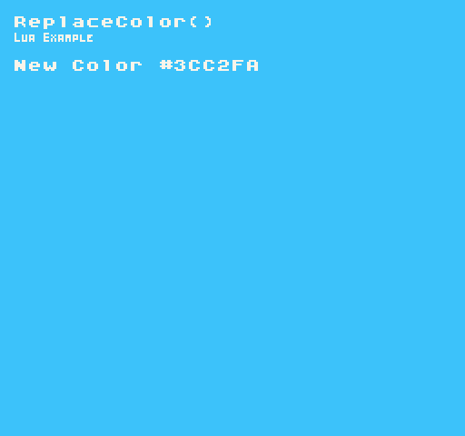

The `ReplaceColor()` API allows you to quickly replace a color with another color ID. This avoids triggering rebuilding the `DisplayChip `color cache which could impact performance. Consider this an alternative to using the `Color()` method. Calling `ReplaceColor()` has little to no performance penalty at run-time but is a one-way operation, meaning you can’t revert the color you replace with the previous value.

## Usage

```csharp
ReplaceColor ( index, id )
```

## Arguments

| Name  | Value | Description                                       |
|-------|-------|---------------------------------------------------|
| index | int   | The ID of the color you want to change\.          |
| id    | int   | The ID of the color you want to replace it with\. |

## Example

In this example, we’ll change the background color after a short delay. To do this, we’ll change the background color ID just outside of the 16 system colors, then after the delay, replace the background color value with an existing system color. Running this code will output the following:



## Lua

```lua
-- Stores the value of the source color
local colorID = 0

-- Get the total colors and ignore any empty ones
local totalColors = TotalColors(true)

-- Set the target color ID to replace on the first empty color
local targetColorID = totalColors + 1

-- Keep track of time and delay
local delay = 800
local time = delay


function Init()

  -- Example Title
  DrawText("ReplaceColor()", 8, 8, DrawMode.TilemapCache, "large", 15)
  DrawText("Lua Example", 8, 16, DrawMode.TilemapCache, "medium", 15, -4)
  
  -- Set the background to the targetColorID
  BackgroundColor(targetColorID)

end

function Update(timeDelta)

  -- Increase the time each frame and test if time is greater than the delay
  time = time + timeDelta
  if(time > delay) then

    -- Increase the color ID by 1 and repeat before reaching the last color
    colorID = Repeat(colorID + 1, totalColors - 1)

    -- Replace the target color with another color
    ReplaceColor(targetColorID, colorID)

    -- Reset time back to 0
    time = 0

  end

end

function Draw()

  -- Redraws the display
  RedrawDisplay()

  -- Draw the color value to the display
  DrawText("New Color " .. Color(targetColorID), 8, 32, DrawMode.Sprite, "large", 15)

end
```


## C#

```csharp
namespace PixelVision8.Player
{
    class ReplaceColorExample : GameChip
    {
        // Stores the value of the source color
        private int colorID;

        // Store the total colors
        private int totalColors;

        // Store the target color ID to replace on the first empty color
        private int targetColorID;

        // Keep track of time and delay
        private int delay = 800;
        private int time;


        public override void Init()
        {

            // Example Title
            DrawText("ReplaceColor()", 8, 8, DrawMode.TilemapCache, "large", 15);
            DrawText("C Sharp Example", 8, 16, DrawMode.TilemapCache, "medium", 15, -4);

            // Set the time equal to the delay to run on the first frame
            time = delay;

            // Get the total colors and ignore any empty ones
            totalColors = TotalColors(true);

            // Set the target color ID
            targetColorID = totalColors + 1;

            // Set the background to the targetColorID
            BackgroundColor(targetColorID);

        }

        public override void Update(int timeDelta)
        {
            // Increase the time each frame and test if time is greater than the delay
            time = time + timeDelta;
            if (time > delay)
            {

                // Increase the color ID by 1 and repeat before reaching the last color
                colorID = Repeat(colorID + 1, totalColors - 1);

                // Replace the target color with another color
                ReplaceColor(targetColorID, colorID);

                // Reset time back to 0
                time = 0;

            }

        }

        public override void Draw()
        {
            // Redraws the display
            RedrawDisplay();

            // Draw the color value to the display
            DrawText("New Color " + Color(targetColorID), 8, 32, DrawMode.Sprite, "large", 15);

        }
    }
}
```

