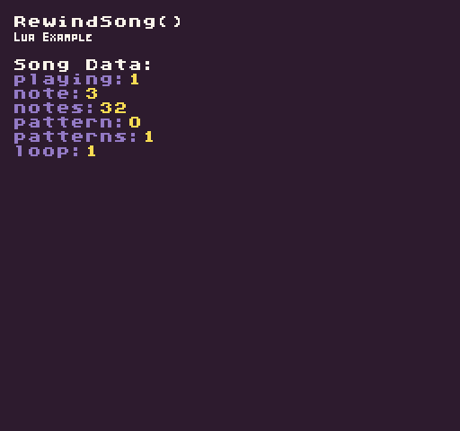

The `RewindSong()` API allows you rewind the currently playing song to a specific position and pattern ID. Calling this API without any arguments will simply rewind the song to the beginning of the first pattern. After rewinding a song, it will stop playing. You will have to call the PlaySong() API to have it continue from the rewound position.

## Usage

```csharp
RewindSong ( position, patternID)
```

## Arguments

| Name      | Value | Description                                |
|-----------|-------|--------------------------------------------|
| position  | int   | Position in the loop to start playing at\. |
| patternID | int   | The loop to rewind too\.                   |

These arguments are currently not supported and will be added in a future release.

## Example

In this example, we’ll play the first song on a loop and when the left mouse button is released, rewind it back to the beginning. Running this code will output the following:



## Lua

```lua
function Init()

  -- Example Title
  DrawText("RewindSong()", 8, 8, DrawMode.TilemapCache, "large", 15)
  DrawText("Lua Example", 8, 16, DrawMode.TilemapCache, "medium", 15, -4)
            
  -- Draw the song data label
  DrawText("Song Data:", 1, 4, DrawMode.Tile, "large", 15)

  -- Start playing the song on a loop
  PlaySong(0, true)

end

function Update(timeDelta)

  -- Test if the left mouse button was released to rewind the song
  if(MouseButton(0, InputState.Released)) then

    -- Rewinds the currently playing song back to the beginning and stops playback
    RewindSong()

    -- After rewinding a song, we'll need to start the playback again
    PlaySong(0, true)

  end

end

function Draw()

  -- Redraw display
  RedrawDisplay()

  -- Reset the next row value so we know where to draw the first line of text
  local nextRow = 2

  -- Display the song's metadata
  for key, value in next, SongData() do

    -- Draw the key value pair from the song data table
    DrawText(key .. ":", 8, nextRow * 8 + 24, DrawMode.Sprite, "large", 6)
    DrawText(value, 16 + (#key * 8), nextRow * 8 + 24, DrawMode.Sprite, "large", 14)

    -- Increment the row by 1 for the next loop
    nextRow = nextRow + 1

  end

end
```


## C#

```csharp
namespace PixelVision8.Player
{
    class RewindSongExample : GameChip
    {
        public override void Init()
        {

            // Example Title
            DrawText("RewindSong()", 8, 8, DrawMode.TilemapCache, "large", 15);
            DrawText("C Sharp Example", 8, 16, DrawMode.TilemapCache, "medium", 15, -4);

            //Draw the song data label
            DrawText("Song Data:", 1, 4, DrawMode.Tile, "large", 15);

            // Start playing the song on a loop
            PlaySong(0, true);

        }

        public override void Update(int timeDelta)
        {

            // Test if the left mouse button was released to rewind the song
            if (MouseButton(0, InputState.Released))
            {

                // Rewinds the currently playing song back to the beginning and stops playback
                RewindSong();

                // After rewinding a song, we'll need to start the playback again
                PlaySong(0, true);

            }
        }

        public override void Draw()
        {
            //Redraw display
            RedrawDisplay();

            // Reset the next row value so we know where to draw the first line of text
            var nextRow = 2;

            // Display the song's metadata
            foreach (var data in SongData())
            {

                //Draw the key value pair from the song data table
                DrawText(data.Key + ":", 8, nextRow * 8 + 24, DrawMode.Sprite, "large", 6);
                DrawText(data.Value.ToString(), 16 + (data.Key.Length * 8), nextRow * 8 + 24, DrawMode.Sprite, "large", 14);

                //Increment the row by 1 for the next loop

                nextRow = nextRow + 1;

            }
        }
    }
}
```
