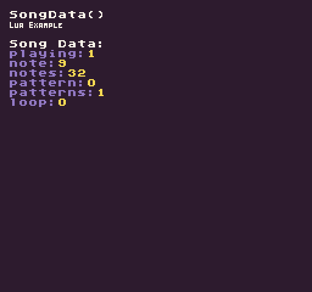

Returns a dictionary with information about the current state of the `MusicChip`. This includes whether or not a song is playing, what not it’s on, how many patterns there are and the total times the song has looped.

## Usage

```csharp
SongData ( )
```

## Returns

| Value      | Description                                                                                                          |
|------------|----------------------------------------------------------------------------------------------------------------------|
| Dictionary | This returns a dictionary with a string key and integer value representing the data for the currently playing song\. |

## Keys

These are the keys to use when reading from the song data dictionary:

| Key      | Description                                                  |
|----------|--------------------------------------------------------------|
| playing  | Returns a 1 for true or 2 for false                          |
| notes    | The currently playing note\.                                 |
| notes    | The total number of notes in the currently playing pattern\. |
| pattern  | The ID of the currently playing pattern\.                    |
| patterns | The total number of patterns in the currently playing song\. |
| loop     | The number of times the song has looped\.                    |

## Example

In this example, we are going to automatically play a song when the game loads up and display the song data for it. Running this code will output the following:



## Lua

```lua
function Init()

  -- Example Title
  DrawText("SongData()", 8, 8, DrawMode.TilemapCache, "large", 15)
  DrawText("Lua Example", 8, 16, DrawMode.TilemapCache, "medium", 15, -4)
  
  -- Play the first song with no repeat
  PlaySong(0, false)

end

function Draw()

  -- Redraw display
  RedrawDisplay()

  -- Reset the next row value so we know where to draw the first line of text
  local nextRow = 2

  -- Draw the song data label
  DrawText("Song Data:", 8, 32, DrawMode.Sprite, "large", 15)

  -- Display the song's meta data
  for key, value in next, SongData() do

    -- Draw the key value pair from the song data table
    DrawText(key .. ":", 8, nextRow * 8 + 24, DrawMode.Sprite, "large", 6)
    DrawText(value, 16 + (#key * 8), nextRow * 8 + 24, DrawMode.Sprite, "large", 14)

    -- Increment the row by 1 for the next loop
    nextRow = nextRow + 1

  end

end
```


## C#

```csharp
namespace PixelVision8.Player
{
    class SongDataExample : GameChip
    {
        public override void Init()
        {

            // Example Title
            DrawText("SongData()", 8, 8, DrawMode.TilemapCache, "large", 15);
            DrawText("C Sharp Example", 8, 16, DrawMode.TilemapCache, "medium", 15, -4);

            // Play the first song with no repeat
            PlaySong(0, false); ;

        }

        public override void Draw()
        {

            // Redraw display
            RedrawDisplay();

            // Reset the next row value so we know where to draw the first line of text
            var nextRow = 2;

            // Draw the song data label
            DrawText("Song Data:", 8, 32, DrawMode.Sprite, "large", 15);

            // Display the song's meta data
            foreach (var data in SongData())
            {

                // Draw the key value pair from the song data table
                DrawText(data.Key + ":", 8, nextRow * 8 + 24, DrawMode.Sprite, "large", 6);
                DrawText(data.Value.ToString(), 16 + (data.Key.Length * 8), nextRow * 8 + 24, DrawMode.Sprite, "large",
                    14);

                // Increment the row by 1 for the next loop
                nextRow++;

            }
        }
    }
}
```

