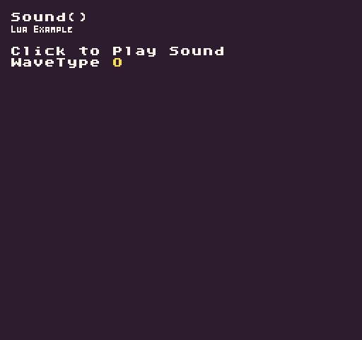

The `Sound()` API allows you to read raw sound data from the `SoundChip`. You need to provide a sound effect ID. If you supply the optional data argument, which is a comma-delimited string of sound effect property values, you’ll be able to update the sound effect.

## Usage

```csharp
Sound ( id, data )
```

## Arguments

| Name | Value  | Description                                                                |
|------|--------|----------------------------------------------------------------------------|
| id   | int    | The sound effect’s ID\.                                                    |
| data | string | An optional sound property string to update the sound at the supplied ID\. |

## Returns

| Value  | Description                                            |
|--------|--------------------------------------------------------|
| string | A string representing all of the sound data properties |

## Sound Effect Properties

Each sound effect is stored as a 24 value comma-delimited string: 

```json
"0,.05,,.2,,.2,.3,.1266,,,,,,,,,,,,,,,,,,1,,,,,,"
```

Here is a mapping of each sound property.

| Order | Property            | Notes                                                                                    |
|-------|---------------------|------------------------------------------------------------------------------------------|
| 1     | waveType            | Supports: Square \(0\), Saw \(1\), Sine \(2\), Noise \(3\), Triangle \(4\), Sample \(5\) |
| 2     | attackTime          | Range 0 to 1                                                                             |
| 3     | sustainTime         | Range 0 to 1                                                                             |
| 4     | sustainPunch        | Range 0 to 1                                                                             |
| 5     | decayTime           | Range 0 to 1                                                                             |
| 6     | startFrequency      | Range 0 to 1                                                                             |
| 7     | minFrequency        | Range 0 to 1                                                                             |
| 8     | slide               | Range \-1 to 1                                                                           |
| 9     | deltaSlide          | Range \-1 to 1                                                                           |
| 10    | vibratoDepth        | Range 0 to 1                                                                             |
| 11    | vibratoSpeed        | Range 0 to 1                                                                             |
| 12    | changeAmount        | Range \-1 to 1                                                                           |
| 13    | changeSpeed         | Range 0 to 1                                                                             |
| 14    | squareDuty          | Range 0 to 1                                                                             |
| 15    | dutySweep           | Range \-1 to 1                                                                           |
| 16    | repeatSpeed         | Range 0 to 1                                                                             |
| 17    | phaserOffset        | Range \-1 to 1                                                                           |
| 18    | phaserSweep         | Range \-1 to 1                                                                           |
| 19    | lpFilterCutoff      | Range 0 to 1                                                                             |
| 20    | lpFilterCutoffSweep | Range \-1 to 1                                                                           |
| 21    | lpFilterResonance   | Range 0 to 1                                                                             |
| 22    | hpFilterCutoff      | Range 0 to 1                                                                             |
| 23    | hpFilterCutoffSweep | Range \-1 to 1                                                                           |
| 24    | masterVolume        | Range 0 to 1                                                                             |

## Example

In this example, we’ll read a sound’s properties, modify the `waveType`, then save it back to the sound chip before playing it. To do this, we’ll also need to parse the sound data string by hand since Lua doesn’t include a built-in way to easily split a string by a delimiter. Running this code will output the following:



## Lua

```lua
-- Stores the current wave type
local waveType = 0

-- Stores all the sound effect properties
local soundProps = {}

function Init()

  -- Example Title
  DrawText("Sound()", 8, 8, DrawMode.TilemapCache, "large", 15)
  DrawText("Lua Example", 8, 16, DrawMode.TilemapCache, "medium", 15, -4)
  
  -- Add label text
  DrawText("Click to Play Sound", 1, 4, DrawMode.Tile, "large", 15)
  DrawText("WaveType", 1, 5, DrawMode.Tile, "large", 15)

  -- Read first sound effect
  local soundData = Sound(0)

  -- Create a temp value for the parser
  local tmpValue = ""

  -- Loop through all the of the characters in the soundData string
  for i = 1, #soundData do

    -- Get a single character from the soundData string
    local c = soundData:sub(i, i)

    -- If the character is a comma
    if(c == ",") then

      -- Add the current string of characters to the next table position
      table.insert(soundProps, tmpValue)

      -- Reset the tmpValue
      tmpValue = ""

    else

      -- Concatenate the current character with the previous ones in the tmpValue
      tmpValue = tmpValue .. c

    end

  end

  -- Always add the last value since it doesn't end in a comma
  table.insert(soundProps, tmpValue)

end

function Update(timeDelta)

  -- Test to see if the mouse button was released and the sound is not playing
  if(MouseButton(0, InputState.Released) and IsChannelPlaying(0) == false) then

    -- Update the waveType value
    waveType = Repeat(waveType + 1, 5)
    soundProps[1] = tostring(waveType)

    -- Save the new sound data
    Sound(0, table.concat(soundProps, ","))

    -- Play the first sound on channel 0
    PlaySound(0)

  end

end

function Draw()

  -- Redraw the display
  RedrawDisplay()

  -- Draw the wavetype ID
  DrawText(waveType, 80, 40, DrawMode.Sprite, "large", 14)

end
```


## C#

```csharp
using System.Collections.Generic;

namespace PixelVision8.Player
{
    class SoundExample : GameChip
    {

        // Stores the current wave type
        private int waveType;

        // Stores all the sound effect properties
        List<string> soundProps = new List<string>();

        public override void Init()
        {

            // Example Title
            DrawText("Sound()", 8, 8, DrawMode.TilemapCache, "large", 15);
            DrawText("C Sharp Example", 8, 16, DrawMode.TilemapCache, "medium", 15, -4);

            // Add label text
            DrawText("Click to Play Sound", 1, 4, DrawMode.Tile, "large", 15);
            DrawText("WaveType", 1, 5, DrawMode.Tile, "large", 15);

            // Read first sound effect
            var soundData = Sound(0);

            // Create a temp value for the parser
            var tmpValue = "";

            // Loop through all the of the characters in the soundData string
            for (int i = 0; i < soundData.Length; i++)
            {

                // Get a single character from the soundData string
                var c = soundData.Substring(i, 1);

                // If the character is a comma
                if (c == ",")
                {

                    // Add the current string of characters to the next table position
                    soundProps.Add(tmpValue);

                    // Reset the tmpValue
                    tmpValue = "";

                }
                else
                {

                    // Concatenate the current character with the previous ones in the tmpValue
                    tmpValue += c;

                }
            }

            // Always add the last value since it doesn't } in a comma
            soundProps.Add(tmpValue);

        }

        public override void Update(int timeDelta)
        {

            // Test to see if the mouse button was released and the sound is not playing
            if (MouseButton(0, InputState.Released) && IsChannelPlaying(0) == false)
            {

                // Update the waveType value
                waveType = Repeat(waveType + 1, 5);
                soundProps[0] = waveType.ToString();

                // Save the new sound data
                Sound(0, string.Join(",", soundProps));

                // Play the first sound on channel 0
                PlaySound(0);

            }
        }

        public override void Draw()
        {
            // Redraw the display
            RedrawDisplay();

            // Draw the wavetype ID
            DrawText(waveType.ToString(), 80, 40, DrawMode.Sprite, "large", 14);

        }
    }
}
```

