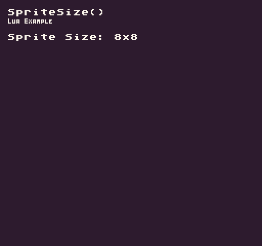

The `SpriteSize()` API returns the default sprite size as a read-only `Point` where `X` and `Y` represent the `Width` and `Height`.

## Usage

```csharp
SpriteSize ( )
```

## Returns

| Value | Description                                                         |
|-------|---------------------------------------------------------------------|
| Point | Returns a Point where the X and Y for the sprite's width and height |

## Example

In this example, we are going to read the `SpriteSize()` API and display it on the screen. Running this code will output the following:



## Lua

```lua
function Init()

  -- Example Title
  DrawText("SpriteSize()", 8, 8, DrawMode.TilemapCache, "large", 15)
  DrawText("Lua Example", 8, 16, DrawMode.TilemapCache, "medium", 15, -4)
  
  -- Get the sprite size
  local spriteSize = SpriteSize()

  -- Draw the sprite size to the display
  DrawText("Sprite Size: ".. spriteSize.x .."x"..spriteSize.y, 1, 4, DrawMode.Tile, "large", 15)

end

function Draw()
  -- Redraw the display
  RedrawDisplay()
end
```


## C#

```csharp
namespace PixelVision8.Player
{
    class SpriteSizeExample : GameChip
    {
        public override void Init()
        {

            // Example Title
            DrawText("SpriteSize()", 8, 8, DrawMode.TilemapCache, "large", 15);
            DrawText("C Sharp Example", 8, 16, DrawMode.TilemapCache, "medium", 15, -4);

            // Get the sprite size
            var spriteSize = SpriteSize();

            // Draw the sprite size to the display
            DrawText("Sprite Size: " + spriteSize.X + "x" + spriteSize.Y, 1, 4, DrawMode.Tile, "large", 15);

        }

        public override void Draw()
        {
            // Redraw the display
            RedrawDisplay();
        }
    }
}
```


