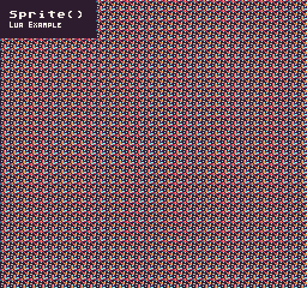

The `Sprite()` API allows you to read and write pixel data directly to the `SpriteChip`’s memory. Sprite pixel data is simply an array of color IDs. When calling the `Sprite()` with only an ID argument, you will get the sprite's pixel data. If you supply data, it will overwrite the sprite. 

It is important to make sure that any new pixel data should be the same length of the existing sprite's pixel data. This can be calculated by multiplying the sprite's `width` and `height`. You can make any pixel transparent by setting the value to `-1`.

## Usage

```csharp
Sprite ( id, data )
```

## Arguments

| Name | Value   | Description                                                   |
|------|---------|---------------------------------------------------------------|
| id   | int     | The sprite to access\.                                        |
| data | int\[\] | Optional data to write over the sprite's current pixel data\. |


## Returns

| Value   | Description                                             |
|---------|---------------------------------------------------------|
| int\[\] | Returns an array of int data that points to color ids\. |

## Example

In this example, we are going to use the `Sprite()` API to read and write new sprite data. To get started, we’ll fill the first sprite in with white, color ID `15`, and then fill the entire tilemap with that sprite. Next, we’ll create a timer to get the first sprite’s pixel data, randomize it, and save it back. Since the tilemap is filled with the first sprite, any changes will instantly be reflected on the display. Running this code will output the following:



## Lua

```lua
local delay = 500
local time = delay

function Update(timeDelta)

  time = time + timeDelta

  if(time > delay) then

    -- Get the first sprite's pixel data
    local pixelData = Sprite(0)

    -- Loop through all of the pixels
    for i = 1, #pixelData do

      -- Set a random pixel color
      pixelData[i] = math.random(0, 15)

    end

    -- Save the pixel data back
    Sprite(0, pixelData)

    time = 0
  end

end

function Draw()
  -- Redraw the display
  RedrawDisplay()

  -- Example Title
  DrawText("Sprite()", 8, 8, DrawMode.Sprite, "large", 15)
  DrawText("Lua Example", 8, 16, DrawMode.Sprite, "medium", 15, -4)

end
```


## C#

```csharp
using System;

namespace PixelVision8.Player
{
    class SpriteExample : GameChip
    {
        private int delay = 500;
        private int time;

        // Create new random instance
        private Random random = new Random();

        public override void Init()
        {

            // Set time to delay so this is triggered on the first frame
            time = delay;

        }

        public override void Update(int timeDelta)
        {
            time += timeDelta;

            if (time > delay)
            {

                // Get the first sprite's pixel data
                var pixelData = Sprite(0);

                // Loop through all of the pixels
                for (int i = 0; i < pixelData.Length; i++)
                {

                    // Set a random pixel color
                    pixelData[i] = random.Next(0, 15);

                }

                // Save the pixel data back
                Sprite(0, pixelData);

                time = 0;
            }

        }

        public override void Draw()
        {
            // Redraw the display
            RedrawDisplay();

            // Example Title
            DrawText("Sprite()", 8, 8, DrawMode.Sprite, "large", 15);
            DrawText("C Sharp Example", 8, 16, DrawMode.Sprite, "medium", 15, -4);
        }
    }
}
```

