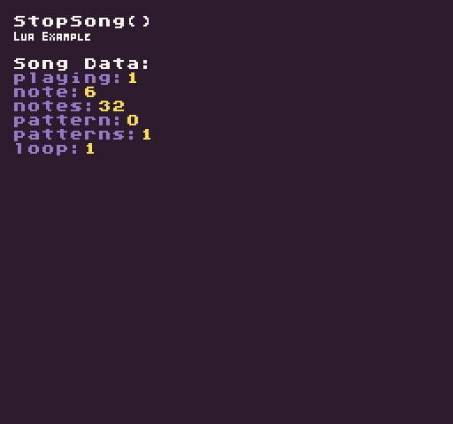

The `StopSong()` API will stop the currently playing song from the `MusicChip`.

## Usage

```csharp
StopSong ( )
```

## Example

In this example, we are going to call the StopSong() API when the mouse button is released. Running this code will output the following:



## Lua

```lua
function Init()

  -- Example Title
  DrawText("StopSong()", 8, 8, DrawMode.TilemapCache, "large", 15)
  DrawText("Lua Example", 8, 16, DrawMode.TilemapCache, "medium", 15, -4)
  
  -- Draw the song data label
  DrawText("Song Data:", 1, 4, DrawMode.Tile, "large", 15)

  -- Start playing the song on a loop
  PlaySong(0, true)

end

function Update(timeDelta)

  -- Test for the left mouse button to be released
  if(MouseButton(0, InputState.Released)) then

    -- Stop the song when the mouse button is released
    StopSong()

  end

end

function Draw()

  -- Redraw display
  RedrawDisplay()

  -- Reset the next row value so we know where to draw the first line of text
  local nextRow = 2

  -- Display the song's metadata
  for key, value in next, SongData() do

    -- Draw the key value pair from the song data table
    DrawText(key .. ":", 8, nextRow * 8 + 24, DrawMode.Sprite, "large", 6)
    DrawText(value, 16 + (#key * 8), nextRow * 8 + 24, DrawMode.Sprite, "large", 14)

    -- Increment the row by 1 for the next loop
    nextRow = nextRow + 1

  end

end
```


## C#

```csharp
namespace PixelVision8.Player
{
    class StopSongExample : GameChip
    {
        public override void Init()
        {

            // Example Title
            DrawText("StopSong()", 8, 8, DrawMode.TilemapCache, "large", 15);
            DrawText("C Sharp Example", 8, 16, DrawMode.TilemapCache, "medium", 15, -4);

            // Draw the song data label
            DrawText("Song Data:", 1, 4, DrawMode.Tile, "large", 15);

            // Start playing the song on a loop
            PlaySong(0, true);

        }

        public override void Update(int timeDelta)
        {

            // Test for the left mouse button to be released
            if (MouseButton(0, InputState.Released))
            {

                // Stop the song when the mouse button is released
                StopSong();

            }

        }

        public override void Draw()
        {

            // Redraw display
            RedrawDisplay();

            // Reset the next row value so we know where to draw the first line of text
            var nextRow = 2;

            // Display the song's metadata
            foreach (var data in SongData())
            {

                //Draw the key value pair from the song data table
                DrawText(data.Key + ":", 8, nextRow * 8 + 24, DrawMode.Sprite, "large", 6);
                DrawText(data.Value.ToString(), 16 + (data.Key.Length * 8), nextRow * 8 + 24, DrawMode.Sprite, "large", 14);

                //Increment the row by 1 for the next loop

                nextRow = nextRow + 1;

            }
        }
    }
}
```
