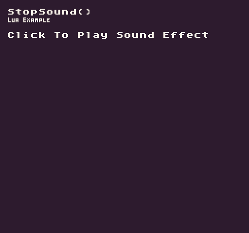

Use `StopSound()` to stop any sound playing on a specific channel.

## Usage

```csharp
StopSound ( channel )
```

## Arguments

| Name    | Value | Description                         |
|---------|-------|-------------------------------------|
| channel | int   | The channel ID to stop a sound on\. |

## Example

In this example, we toggle between playing and stopping a sound effect based on the mouse button being released. Running this code will output the following:



## Lua

```lua
-- Store the playback state of channel 0
local isPlaying = false

function Init()

  -- Example Title
  DrawText("StopSound()", 8, 8, DrawMode.TilemapCache, "large", 15)
  DrawText("Lua Example", 8, 16, DrawMode.TilemapCache, "medium", 15, -4)

end

function Update(timeDelta)

  -- See if the channel has audio playing back on it
  isPlaying = IsChannelPlaying(0)

  -- Test if the left mouse button was released and if isPlaying equals false
  if(MouseButton(0, InputState.Released)) then

    -- Check to see if the channel is playing a sound
    if(isPlaying) then

      -- Stop the sound
      StopSound(0)

    else
      -- Play the second sound effect
      PlaySound(1)

    end

  end

end

function Draw()

  -- Redraw display
  RedrawDisplay()

  -- Test to see if the sound effect is playing
  if(isPlaying) then

    -- Draw the sound playback label
    DrawText("Click To Stop Sound Effect", 8, 32, DrawMode.Sprite, "large", 14)

  else

    -- Draw the instructions label
    DrawText("Click To Play Sound Effect", 8, 32, DrawMode.Sprite, "large", 15)

  end

end
```


## C#

```lua
namespace PixelVision8.Player
{
    class StopSoundExample : GameChip
    {

        // Store the playback state of channel 0
        private bool isPlaying = false;

        public override void Init()
        {

            // Example Title
            DrawText("StopSound()", 8, 8, DrawMode.TilemapCache, "large", 15);
            DrawText("C Sharp Example", 8, 16, DrawMode.TilemapCache, "medium", 15, -4);
            
        }

        public override void Update(int timeDelta)
        {

            // See if the channel has audio playing back on it
            isPlaying = IsChannelPlaying(0);

            // Test if the left mouse button was released and if isPlaying equals false
            if (MouseButton(0, InputState.Released))
            {

                // Check to see if the channel is playing a sound
                if (isPlaying)
                {

                    // Stop the sound
                    StopSound(0);
                }
                else
                {
                    // Play the second sound effect
                    PlaySound(1);

                }
            }
        }

        public override void Draw()
        {
            // Redraw display
            RedrawDisplay();

            // Test to see if the sound effect is playing
            if (isPlaying)
            {

                // Draw the sound playback label
                DrawText("Click To Stop Sound Effect", 8, 32, DrawMode.Sprite, "large", 14);

            }
            else
            {

                // Draw the instructions label
                DrawText("Click To Play Sound Effect", 8, 32, DrawMode.Sprite, "large", 15);

            }
        }
    }
}
```

