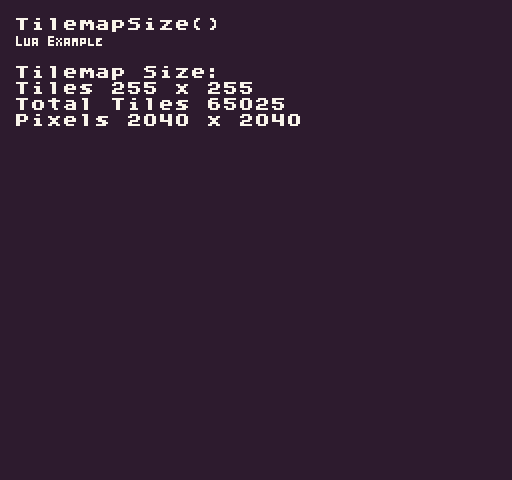

The `TilemapSize()` API returns a `Point `representing the size of the tilemap in `columns `(`X`) and `rows` (`Y`). To find the size in pixels, you will need to multiply the returned `Point`’s `X` and `Y` values by the sprite size's `X` and `Y`. This method also allows you to resize the tilemap by passing in an optional new `Width` and `Height`. Resizing the tilemap is non-destructive, so if you make the tilemap smaller, the remaining tiles will still exist. Making the tilemap larger will add empty tiles. You can supply an optional flag to clear the tilemap when resizing if you want to completely reset all of the tile values.

## Usage

```csharp
TilemapSize ( width, height, clear )
```

## Arguments

| Name   | Value | Description                                                |
|--------|-------|------------------------------------------------------------|
| width  | int   | An optional parameter for the width in tiles of the map\.  |
| height | int   | An optional parameter for the height in tiles of the map\. |
| clear  | bool  | An option flag to clear all of the tiles in the tilemap\.  |

## Returns

| Value | Description                                                                                                      |
|-------|------------------------------------------------------------------------------------------------------------------|
| Point | Returns a Point representing the tilemap’s size in tiles where X and Y are the columns and rows of the tilemap\. |

## Example

In this example, we are going to calculate the size of the tilemap and display it to the screen. Running this code will output the following:



## Lua

```lua
function Init()

  -- Example Title
  DrawText("TilemapSize()", 8, 8, DrawMode.TilemapCache, "large", 15)
  DrawText("Lua Example", 8, 16, DrawMode.TilemapCache, "medium", 15, -4)
  
  -- Get the tilemap size and sprite size
  local mapSize = TilemapSize()
  local tileSize = SpriteSize()

  -- Display the tilemap size in tiels and pixels to the screen
  DrawText("Tilemap Size:", 1, 4, DrawMode.Tile, "large", 15)
  DrawText("Tiles " .. mapSize.x .. " x " .. mapSize.y, 1, 5, DrawMode.Tile, "large", 15)
  DrawText("Total Tiles " .. (mapSize.x * mapSize.y), 1, 6, DrawMode.Tile, "large", 15)
  DrawText("Pixels " .. (mapSize.x * tileSize.x) .. " x " .. (mapSize.y * tileSize.y), 1, 7, DrawMode.Tile, "large", 15)

end

function Draw()
  -- Redraw the display
  RedrawDisplay()
end
```


## C#

```csharp
namespace PixelVision8.Player
{
    class TilemapSizeExample : GameChip
    {
        public override void Init()
        {

            // Example Title
            DrawText("TilemapSize()", 8, 8, DrawMode.TilemapCache, "large", 15);
            DrawText("C Sharp Example", 8, 16, DrawMode.TilemapCache, "medium", 15, -4);

            //Get the tilemap size and sprite size
            var mapSize = TilemapSize();
            var tileSize = SpriteSize();

            // Display the tilemap size in tiels and pixels to the screen
            DrawText("Tilemap Size:", 1, 4, DrawMode.Tile, "large", 15);
            DrawText("Tiles " + mapSize.X + " x " + mapSize.Y, 1, 5, DrawMode.Tile, "large", 15);
            DrawText("Total Tiles " + (mapSize.X * mapSize.Y), 1, 6, DrawMode.Tile, "large", 15);
            DrawText("Pixels " + (mapSize.X * tileSize.X) + " x " + (mapSize.Y * tileSize.Y), 1, 7, DrawMode.Tile, "large", 15);

        }

        public override void Draw()
        { 
                // Redraw the display
                RedrawDisplay();
        }
    }
}
```

