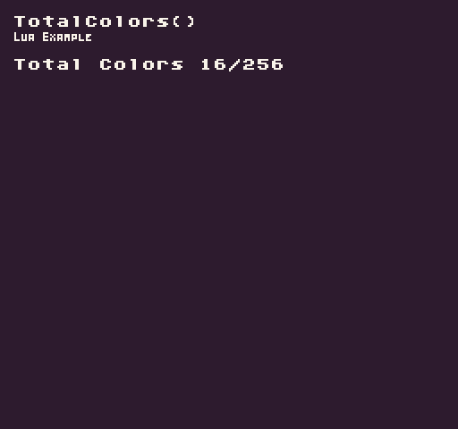

The `TotalColors()` API returns the total number of colors in the `ColorChip`. By default, it returns all of the available colors from the ColorChip. By supplying `true `for the `ignoreEmpty `argument, it returns only colors that are not transparent (`#FF00FF`).

## Usage

```csharp
TotalColors ( ignoreEmpty )
```

## Arguments

| Name        | Value | Description                                                                                                                                                       |
|-------------|-------|-------------------------------------------------------------------------------------------------------------------------------------------------------------------|
| ignoreEmpty | bool  | This is an optional parameter that defaults to false to get all available colors from the ColorChip or supply true for all non\-transparent \(\#FF00FF\) colors\. |

## Returns

| Value | Description                                                                                                  |
|-------|--------------------------------------------------------------------------------------------------------------|
| int   | This method returns the total number of colors in the color chip based on the ignoreEmpty argument's value\. |

## Example

In this example, we are going to display the total color values. Running this code will output the following:



## Lua

```lua
function Init()

  -- Example Title
  DrawText("TotalColors()", 8, 8, DrawMode.TilemapCache, "large", 15)
  DrawText("Lua Example", 8, 16, DrawMode.TilemapCache, "medium", 15, -4)
  
  -- Get total colors values
  local totalColors = TotalColors()
  local usedColors = TotalColors(true)

  -- Display the used vs total colors on the screen
  DrawText("Total Colors " .. usedColors .. "/" .. totalColors, 1, 4, DrawMode.Tile, "large", 15)

end

function Draw()
  -- Redraw the display
  RedrawDisplay()
end
```


## C#

```csharp
namespace PixelVision8.Player
{
    class TotalColorsExample : GameChip
    {
        public override void Init()
        {

            // Example Title
            DrawText("TotalColors()", 8, 8, DrawMode.TilemapCache, "large", 15);
            DrawText("C Sharp Example", 8, 16, DrawMode.TilemapCache, "medium", 15, -4);

            // Get total colors values
            var totalColors = TotalColors();
            var usedColors = TotalColors(true);

            // Display the used vs total colors on the screen
            DrawText("Total Colors " + usedColors + "/" + totalColors, 1, 4, DrawMode.Tile, "large", 15);
        }

        public override void Draw()
        {
            // Redraw the display
            RedrawDisplay();
        }

    }
}
```

