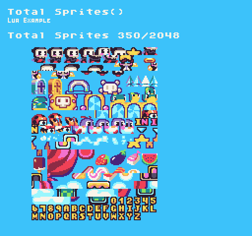
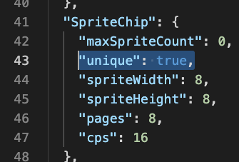

The `TotalSprites()` API returns the total number of sprites in the `SpriteChip`. By supplying `true `for the `ignoreEmpty `parameter, it will only return sprites that contain pixel data. If all of the values of a sprite’s pixel data are set to `-1`, it will be considered empty by the `SpriteChip`.

## Usage

```csharp
TotalSprites ( ignoreEmpty )
```

## Arguments

| Name        | Value | Description                                                                                                                                                                              |
|-------------|-------|------------------------------------------------------------------------------------------------------------------------------------------------------------------------------------------|
| ignoreEmpty | bool  | This is an optional parameter that defaults to false to get all available sprites from the SpriteChip or supply true for non\-empty \(where all the pixel data is set to \-1\) sprites\. |

## Returns

| Value | Description                                                                                                   |
|-------|---------------------------------------------------------------------------------------------------------------|
| int   | This method returns the total number of sprites in the color chip based on the ignoreEmpty argument's value\. |

## Example

In this example, we are going to display the total sprite values. Running this code will output the following:



In order to optimize the sprites and remove empty or duplicate ones, you'll need to set the SpriteChip's unique flag to true by ending the data.json file by hand. 



## Lua

```lua
function Init()

  -- Example Title
  DrawText("Total Sprites()", 8, 8, DrawMode.TilemapCache, "large", 15)
  DrawText("Lua Example", 8, 16, DrawMode.TilemapCache, "medium", 15, -4)

  -- Change the BG color to make the sprites easier to see
  BackgroundColor(2);
  
  -- Get total colors values
  local totalSprites = TotalSprites()
  local usedSprites = TotalSprites(true)

  -- Display the used vs total colors on the screen
  DrawText("Total Sprites " .. usedSprites .. "/" .. totalSprites, 1, 4, DrawMode.Tile, "large", 15)

  -- Loop through all of the sprites in memory and draw them into the tilemap
  for i = 1, usedSprites, 1 do
    local id = i-1
    local pos = CalculatePosition( id, 16 );
    DrawSprite( id, pos.X + 4, pos.Y + 6, false, false, DrawMode.Tile);
  end

end

function Draw()
  -- Redraw the display
  RedrawDisplay()
end
```


## C#

```csharp
namespace PixelVision8.Player
{
    class TotalSpritesExample : GameChip
    {
        public override void Init()
        {

            // Example Title
            DrawText("Total Sprites()", 8, 8, DrawMode.TilemapCache, "large", 15);
            DrawText("C Sharp Example", 8, 16, DrawMode.TilemapCache, "medium", 15, -4);

            // Change the BG color to make the sprites easier to see
            BackgroundColor(2);

            // Get total colors values
            var totalSprites = TotalSprites();
            var usedSprites = TotalSprites(true);

            // Display the used vs total colors on the screen
            DrawText("Total Sprites " + usedSprites + "/" + totalSprites, 1, 4, DrawMode.Tile, "large", 15);

            // Loop through all of the sprites in memory and draw them into the tilemap
            for (int i = 0; i < usedSprites; i++)
            {
                var pos = CalculatePosition( i, 16 );
                DrawSprite( i, pos.X + 4, pos.Y + 6, false, false, DrawMode.Tile);
            }

        }

        public override void Draw()
        {
            // Redraw the display
            RedrawDisplay();
        }
    }
}
```
