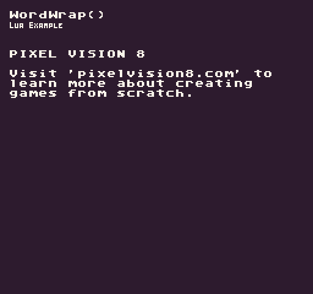

The `WordWrap()` API allows you to wrap a string of text to a specified character width. It will automatically insert new line breaks (`\n`) to keep each line of text within the specified width. This can be used in conjunction with the `SplitLines()` API to render large blocks of text to the display line by line within a specific character width.

## Usage

```csharp
WordWrap ( text, width )
```

## Arguments

| Name  | Value  | Description                                         |
|-------|--------|-----------------------------------------------------|
| text  | string | The string of text to wrap\.                        |
| width | int    | The width of characters to wrap each line of text\. |

## Returns

| Value  | Description                                                                           |
|--------|---------------------------------------------------------------------------------------|
| string | Returns a string of text back with new line breaks as the specified character width\. |

## Example

In this example, we are going to use the `WordWrap()` API to create an array of text to draw to the display. Running this code will output the following:



## Lua

```lua
-- Message to display on the screen
local message = "PIXEL VISION 8\n\nVisit 'pixelvision8.com' to learn more about creating games from scratch."

function Init()

  -- Example Title
  DrawText("WordWrap()", 8, 8, DrawMode.TilemapCache, "large", 15)
  DrawText("Lua Example", 8, 16, DrawMode.TilemapCache, "medium", 15, -4)
  
  -- To convert the message into lines of text we need to wrap it then split it
  local wrap = WordWrap(message, (Display().x / 8) - 2)
  local lines = SplitLines(wrap)

  -- Loop through each line of text and draw it to the display
  for i = 1, #lines do
    DrawText(lines[i], 1, i + 4, DrawMode.Tile, "large", 15)
  end

end

function Draw()
  -- Redraw the display
  RedrawDisplay()
end
```


## C#

```csharp
namespace PixelVision8.Player
{
    class WordWrapExample : GameChip
    {

        // Message to display on the screen
        private string message = "PIXEL VISION 8\n\nVisit 'pixelvision8.com' to learn more about creating games from scratch.";

        public override void Init()
        {

            // Example Title
            DrawText("WordWrap()", 8, 8, DrawMode.TilemapCache, "large", 15);
            DrawText("C Sharp Example", 8, 16, DrawMode.TilemapCache, "medium", 15, -4);

            // To convert the message into lines of text we need to wrap it then split it
            var wrap = WordWrap(message, (Display().X / 8) - 2);
            var lines = SplitLines(wrap);

            // Loop through each line of text and draw it to the display
            for (int i = 0; i < lines.Length; i++)
            {
                DrawText(lines[i], 1, i + 1 + 4, DrawMode.Tile, "large", 15);
            }

        }

        public override void Draw()
        {
            // Redraw the display
            RedrawDisplay();
        }
    }
}
```

