Pixel Vision 8 is fully open source. The [Github repo](http://github.com/PixelVision8/pixelVision8/) contains everything you need to build a bare-bones C# and Lua runner, as well as a C# Runner that supports run-time recompiling via Roslyn. Finally, you can also build the full version of Pixel Vision 8 from scratch. All you need is NodeJS or an IDE capable of compiling the .NET Core framework such as [Visual Studio Code](https://code.visualstudio.com/Download), Visual Studio ([Win](https://visualstudio.microsoft.com/vs/)/[Mac](https://visualstudio.microsoft.com/vs/mac/)), or [Jetbrains’ Rider](https://www.jetbrains.com/rider/).


## Cloning From Github

Before you clone from Github, let’s talk about how the repo is structured, and which branch or tag you should clone. While you can simply check out the master branch, each stable build is tagged based on its version.

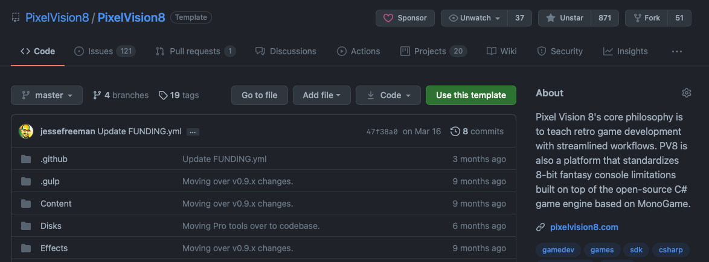

Each tag is considered "stable" and will no longer get updated. The master branch will always represent the lastest stable codebase and is updated after each new version is released. That means you’ll need to do a pull to get updates after each release.

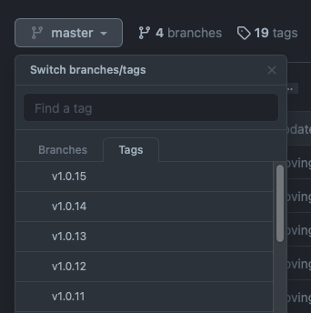

Finally, for those looking for nightly builds or patches to bugs as they are closed, the branches offer the most up-to-date fixes. Simply find the latest version if you are looking for patches to issues recently closed.

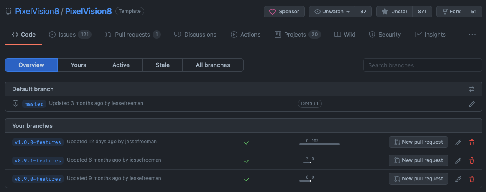

There is an up-to-date list of issues currently being worked on and each issue is tagged to the version they will be fixed. Feel free to log bugs or submit fixes and we’ll figure out how to handle them.

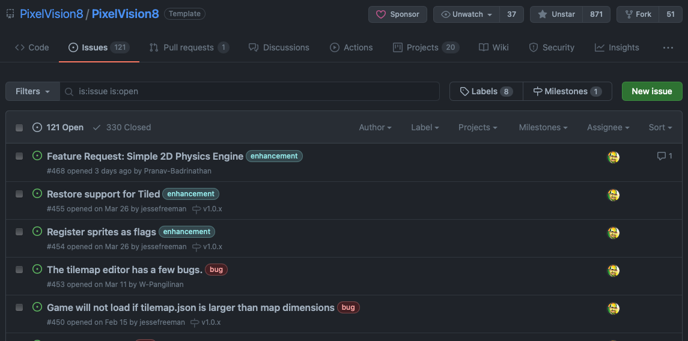


## Runners

A Pixel Vision 8 Runner is any code wrapper that bridges the gap between the core engine and the host OS. The Runner performs the following tasks:

* Facilitates rendering the `DisplayChip`’s pixel data on the screen.

* It provides a native application wrapper so PV8 can run as a self-contained executable.

* Calls the `GameChip`’s `Init()`method on startup as well as the `Update()` and `Draw()` methods during each frame.

* Feeds the engine input data such as the mouse, keyboard and any connected controllers.

* It provides a way to play audio.

* Manages the loading and playing of games plus their associated files.

Pixel Vision 8 Runners solution files can be found inside of the Projects folder. You'll find several different types of runners as well as the Unit Tests and the main Pixel Vision 8 Project.

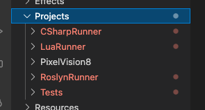

## MonoGame Runners

MonoGame Runners are bare bone wrappers for PV8 games build on top of the MonoGame framework. There are three runners, one for pure C# games, another for Lua games, and a Roslyn Runner. The Roslyn Runner allows you to reload C# games at runtime, similar to how Lua games work in Pixel Vision 8. Each runner helps bridge the gap between the Pixel Vision 8’s C# code and the native operating system. All three runners have the same basic functionality, so you’ll need to figure out the one that best suits your needs base on the programming language you prefer to use.

Each runner has a Game Property you can modify in the .cs project file which points to a path for the game you want to run. By default, they are all set up to load the same background color API example in the Disks/APIExamples/ folder.

```	xml
<PropertyGroup>
	<Game>../../Disks/APIExamples/BackgroundColor</Game>
</PropertyGroup> 
```

You can change the path to any game folder you want the Runner to load.

Whiley you can build the Runner in from the solution in VS Code, Visual Code, or Rider directly. There are build scripts that help make this process easier. In order to use them you'll need to have NodeJS installed on your computer. Once installed, open up VS Code's terminal, or the command line on your computer and run the following:

``` > npm install ```

Node will install all of the dependencies you need to run the build script to your local computer.

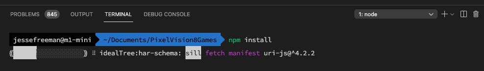

When everythign is installing, you can run any of the following commands based on what Runner you want to launch:

| Runner        | Command           | Notes                                                        |
| ------------- | ----------------- | ------------------------------------------------------------ |
| C# Runner     | `gulp run-csharp` | Launches the default C# Runner for pure C# game development. |
| Lua Runner    | `gulp run-lua`    | Launches the default Lua Runner with support for live reloading Lua code (`Crtl + 4`) |
| Roslyn Runner | `gulp run-roslyn` | Launches the default Roslyn Runner for C# game development with support for live reloading C# code (`Crtl + 4`) |

From here you can start the build and you will end up with the following based on which Runner you launch.

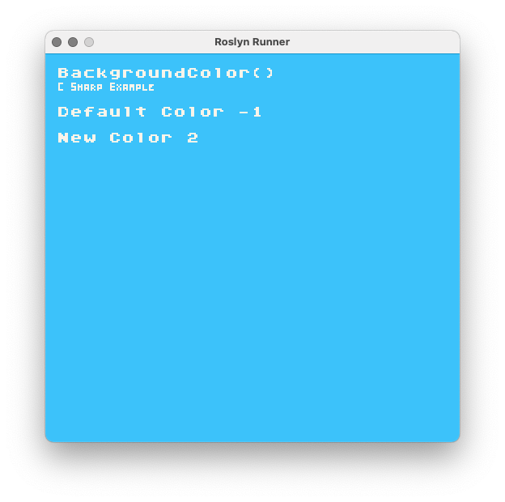

To load another example from the API Example Disk, simply change the `Game` property value in the `.cs` file. The build script will automatically load it for you. Remember that recompiling the Runner will reload the files located in the build’s Contents folder and not found in the solution since they are copied over on each new build.

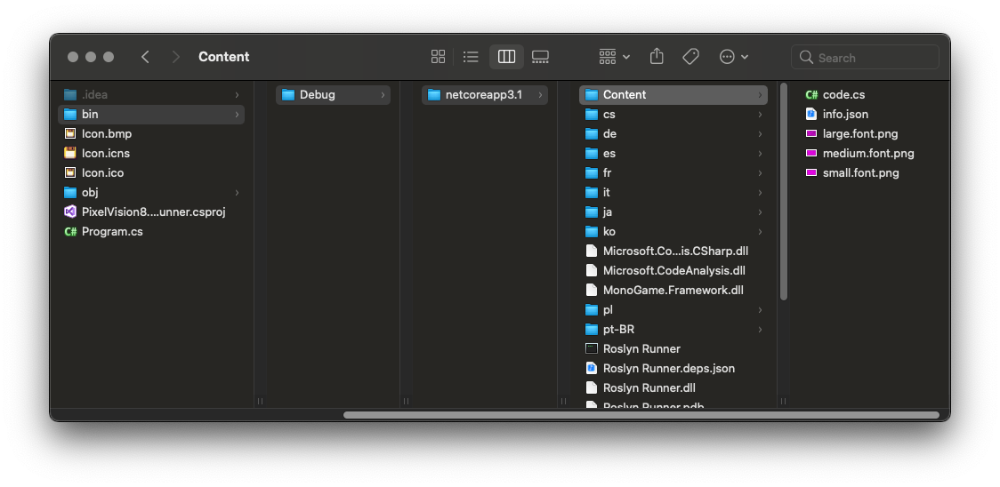

Any chances you make here will be overwritten if you recompile in Visual Studio, so be sure to copy these back over to your project's Contents folder.

Finally, it’s important to point out that each of the runners has dependencies on MonoGame, which is automatically downloaded from NuGet. and the Lua Runner requires a reference to [MoonSharp](https://www.nuget.org/packages/MoonSharp) which is the Lua Interpritore Pixel Vision 8 uses.

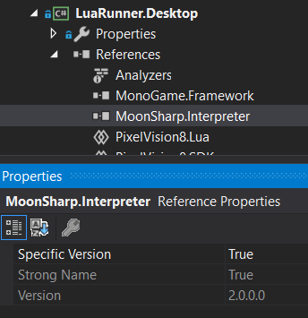

These NuGet projects are not included in the git repo so you may need to force the project to reimport them or install them by hand. This is automtically done if you run the build script.

## Compiling Pixel Vision 8

If you want to recompile Pixel Vision 8's IDE from the source code, you can do so by opening `Projects/PixelVision8/PixelVision8.CoreDesktop.csproj` in Visual Studio or Rider. 

Likewise, you can run the following on the command line to use the automated build script:

```	bash
> gulp run-pv8
```

This will compile the file Pixel Vision 8 IDE, and automatically mount the Pixel Vision OS and API Example disks.

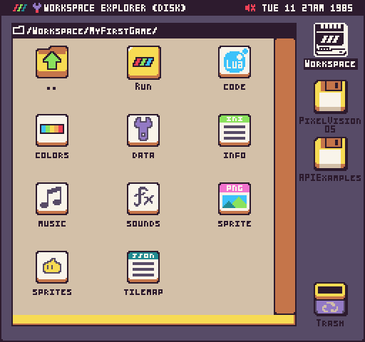

The Pixel Vision 8 project will automatically create a `Workspace` folder when it boots up. By default this will be created on your computer in one of these paths based on the OS you are running it on:

| Version | Path                                                      |
|---------|-----------------------------------------------------------|
| Windows | C:\\Users\\UserName\\Documents\\PixelVision8\\Workspace\\ |
| MacOS   | /Users/UserName/PixelVision8/PixelVision8/Workspace/      |
| Linux   | /Users/UserName/PixelVision8/PixelVision8/Workspace/      |

By default, Pixel Vision 8's IDE doesn't have an OS installed. Instead, the OS disk is passed in as a command line paramitor in the build script. You can change the default disks by openeing the `Build/Tasks/launch.js` file and replacing the `additionalArgs` in the `build-pv8` task.

```javascript
gulp.task('build-pv8', ()=>{
  return gulp.src(process.env.PROJECT, {read: false})
      .pipe(run({
        additionalArgs: [process.env.DISKS + 'PixelVisionOS/', process.env.DISKS + 'APIExamples/'], //process.env.DISKS + 'TinyCard/'], // APIExamples ['-d', 'Disks/PixelVisionOS/', '-disk', 'Disks/APIExamples/']
        echo: true
    }));
});
```

If you want to use the OS and all of the tools, simply change the second disk path to your own game. Or, you can just have PV8 boot directly into your game by passing in a single disk path. Finally, if you are using Pixel Vision OS, you can drop any `.pv8` disk, or game folder onto the Runner’s window and it will attempt to load it up. 

The biggest difference here is that the Pixel Vision 8 Runner creates a mount point for the OS folder which you can access internally at `/PixelVisionOS/` and includes all of the logic needed to access the virtual filesystem (VFS) inside of the user's `Workspace` folder. You'll also have the ability to run both C# and Lua games. So, if your game needs access to a VFS, requires the `GameEditor`, or the ability to export and save files, you can customize the `PixelVision8.CoreDesktop.csproj` project for your own needs.

## Release Build

If you would like to create a release build of Pixel Vision 8, or see how the automated but script works, simply type the following in the command line:

``` bash
> gulp
```

This will run through all of the release tasks and create a new folder called `Releases` in the root of the project folder.

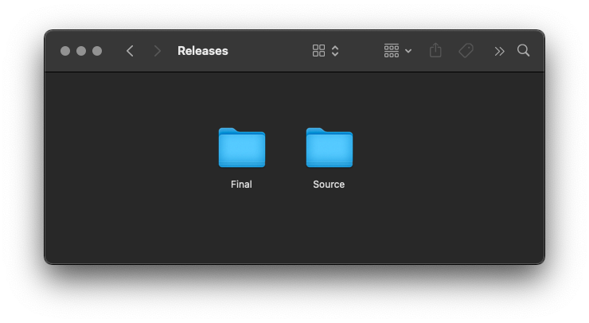

There will be two folders. The `Source` folder will contain all of the raw files for each platform that the build script needs to create an optimized final build of the Pixel Vision 8 IDE.

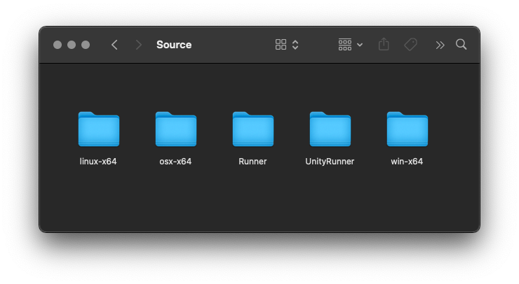

The `Final` folder contains the finished builds for each OS and some additional items such as disks, a Unity Runner, and other ideas that are automatically generated when a new release is created on GitHub.

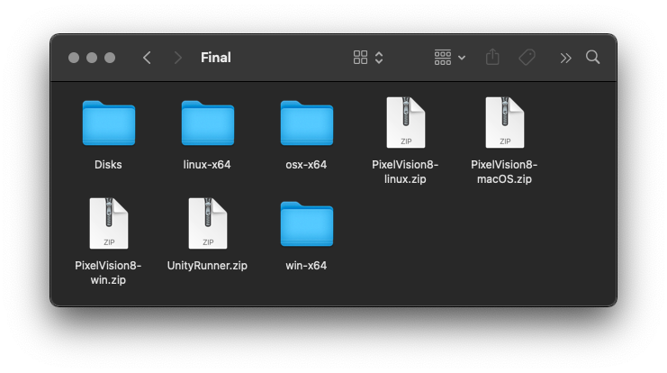

You can always get the lates version of Pixel Vision 8 on the [GitHub releases page](https://github.com/PixelVision8/PixelVision8/releases/latest).


## Compiling On Mac

On the latest version of Mac OS you may run into some security warnings when trying to load Pixel Vision 8 after compiling it for the first time.

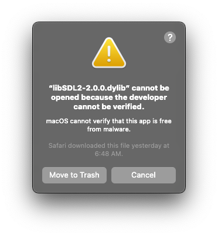

There are several libraries that Pixel Vision 8 relies on that you will need to approve in the security panel. You can do this by opening the Settings > Security & Privacy panel and pressing Allow Anyway.

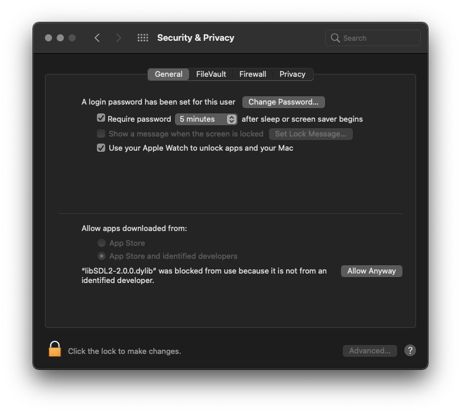

You may need to do this a few times before you can run PV8 from the source code without an issue.