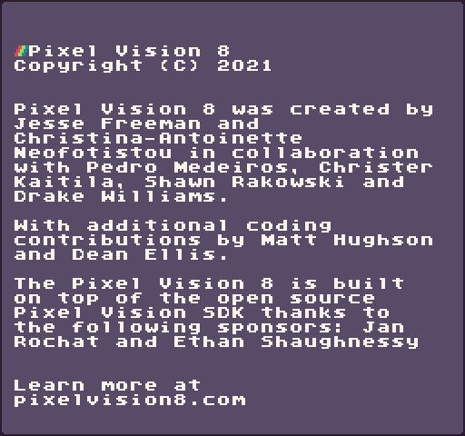

Pixel Vision 8 was created by Jesse Freeman ([@jessefreeman](http://twitter.com/jessefreeman)) and Christina Antoinette Neofotistou ([@CastPixel](https://twitter.com/@castpixel)) in collaboration with Pedro Medeiros ([@saint11](http://twitter.com/saint11)), Christer Kaitila ([@McFunkypants](http://twitter.com/McFunkypants)), and Shawn Rakowski ([@Shwany](https://twitter.com/Shwany)). With additional coding contributions by Matt Hughson, Dean Ellis, and the following sponsors: Jan Rochat and Ethan Shaughnessy.

