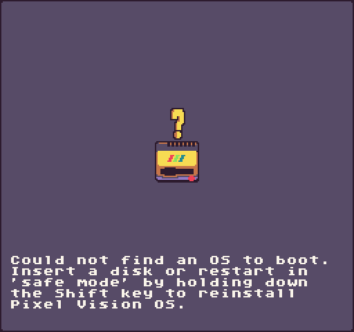
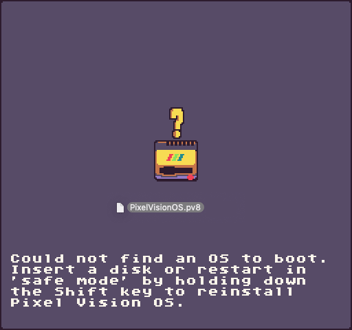
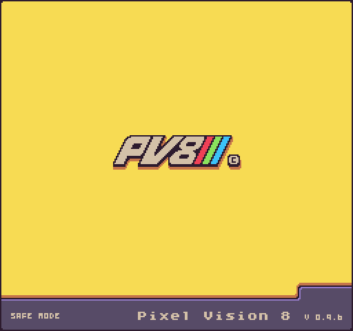

Disks files (`.pv8`) and Disk Folders (system folders containing a `info.json` file) are useful for sharing projects with other PV8 users.

### Creating

You can easily create empty PV8 disks on your computer’s file system. Simply create a new folder on your computer called `EmptyDisk`. Inside of the `EmptyDisk` folder, add an `info.json` file. For now, this file can be empty. Pixel Vision 8 simply looks for this file to validate it can mount the disk and save special metadata.

## Booting From Disks

The incremental builds of Pixel Vision 8, found on GitHub, do not have Pixel Vision OS installed. That means you will most likely see this error when PV8 boots up.

You can boot into Pixel Vision OS directly by downloading a copy from [the Github repo](https://github.com/PixelVision8/PixelVisionOS/releases) and dragging the OS disk (which ends in .pv8) onto the PV8 window.

You can run Pixel Vision OS from the disk or install it. Just keep in mind that you can only have 2 disks open at any given time. To install the OS, open the disk and click on the Installer icon.

Likewise, you can also boot into Safe Mode by holding down the Shift Key when Pixel Vision 8 loads up.

This will ignore the user’s bios settings and boot directly into the OS installer. From here, you can drag a disk onto Pixel Vision 8’s window and it will boot from that disk, assuming it is bootable, the next time you restart PV8.

