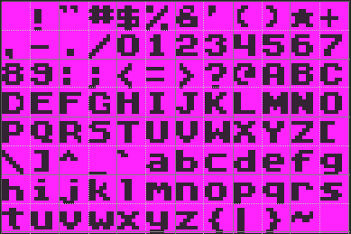

Pixel Vision 8 also supports loading sprite fonts into memory. Each font should be saved with a `.font.png` extension. PV8 fonts are similar to the` sprites.png` but you can actually have multiple fonts in a single game project. Each font character is 8 x 8 pixels and goes into any of the `FontChip`'s free memory slots. By default, there is room for 512 unique sprite characters in the `FontChip`’s memory.

## Font Template

While you can arrange your `.font.png` character sprites in any grid-based layout, the order of the characters is important. To allow the FontChip to correctly map each character to it’s ASCII equivalent, it is best practice to follow this template:

While the default template only supports the standard English character set, special characters can also be added. They will be parsed and assigned an ASCII ID exactly like the main set of characters.

Finally, the importer will optimize the fonts by skipping empty characters or matching characters previously imported. This allows you to ignore characters you don't need, such as lowercase, if you want to save memory. Simply leave those characters empty in the font file and the parser will skip over them.

## Font Characters

Each font character in the `.font.png` file should match up to their ASCII values. The parser starts cutting out characters from the upper left-hand corner of the png so the first sprite will map to ASCII 32, which represents empty space. Each character after that goes up in value. Here is a chart showing the breakdown of the default supported characters:

| DEC | Symbol | Description              |   | DEC | Symbol | Description               |
|-----|--------|--------------------------|---|-----|--------|---------------------------|
| 32  |        | Space                    |   | 80  | P      | Uppercase P               |
| 33  | \!     | Exclamation mark         |   | 81  | Q      | Uppercase Q               |
| 34  | "      | Double quotes            |   | 82  | R      | Uppercase R               |
| 35  | \#     | Number                   |   | 83  | S      | Uppercase S               |
| 36  | $      | Dollar                   |   | 84  | T      | Uppercase T               |
| 37  | %      | Percent                  |   | 85  | U      | Uppercase U               |
| 38  | &      | Ampersand                |   | 86  | V      | Uppercase V               |
| 39  | '      | Single quote             |   | 87  | W      | Uppercase W               |
| 40  | \(     | Open parenthesis         |   | 88  | X      | Uppercase X               |
| 41  | \)     | Close parenthesis        |   | 89  | Y      | Uppercase Y               |
| 42  | \*     | Asterisk                 |   | 90  | Z      | Uppercase Z               |
| 43  | \+     | Plus                     |   | 91  | \[     | Opening bracket           |
| 44  | ,      | Comma                    |   | 92  | \\     | Backslash                 |
| 45  | \-     | Hyphen                   |   | 93  | \]     | Closing bracket           |
| 46  | \.     | Period, dot or full stop |   | 94  | ^      | Caret \- circumflex       |
| 47  | /      | Slash or divide          |   | 95  | \_     | Underscore                |
| 48  | 0      | Zero                     |   | 96  | \`     | Grave accent              |
| 49  | 1      | One                      |   | 97  | a      | Lowercase a               |
| 50  | 2      | Two                      |   | 98  | b      | Lowercase b               |
| 51  | 3      | Three                    |   | 99  | c      | Lowercase c               |
| 52  | 4      | Four                     |   | 100 | d      | Lowercase d               |
| 53  | 5      | Five                     |   | 101 | e      | Lowercase e               |
| 54  | 6      | Six                      |   | 102 | f      | Lowercase f               |
| 55  | 7      | Seven                    |   | 103 | g      | Lowercase g               |
| 56  | 8      | Eight                    |   | 104 | h      | Lowercase h               |
| 57  | 9      | Nine                     |   | 105 | i      | Lowercase i               |
| 58  | :      | Colon                    |   | 106 | j      | Lowercase j               |
| 59  | ;      | Semicolon                |   | 107 | k      | Lowercase k               |
| 60  | <      | Less than                |   | 108 | l      | Lowercase l               |
| 61  | =      | Equals                   |   | 109 | m      | Lowercase m               |
| 62  | >      | Greater than             |   | 110 | n      | Lowercase n               |
| 63  | ?      | Question mark            |   | 111 | o      | Lowercase o               |
| 64  | @      | At symbol                |   | 112 | p      | Lowercase p               |
| 65  | A      | Uppercase A              |   | 113 | q      | Lowercase q               |
| 66  | B      | Uppercase B              |   | 114 | r      | Lowercase r               |
| 67  | C      | Uppercase C              |   | 115 | s      | Lowercase s               |
| 68  | D      | Uppercase D              |   | 116 | t      | Lowercase t               |
| 69  | E      | Uppercase E              |   | 117 | u      | Lowercase u               |
| 70  | F      | Uppercase F              |   | 118 | v      | Lowercase v               |
| 71  | G      | Uppercase G              |   | 119 | w      | Lowercase w               |
| 72  | H      | Uppercase H              |   | 120 | x      | Lowercase x               |
| 73  | I      | Uppercase I              |   | 121 | y      | Lowercase y               |
| 74  | J      | Uppercase J              |   | 122 | z      | Lowercase z               |
| 75  | K      | Uppercase K              |   | 123 | \{     | Opening brace             |
| 76  | L      | Uppercase L              |   | 124 | \|     | Vertical bar              |
| 77  | M      | Uppercase M              |   | 125 | \}     | Closing brace             |
| 78  | N      | Uppercase N              |   | 126 | ~      | Equivalency sign \- tilde |
| 79  | O      | Uppercase O              |   |     |        |                           |

In addition to the base 128 ASCII characters, PV8's `FontChip` will continue to map characters to their equivalent ASCII value up to 256. This means that you can create a font that also supports the following additional characters.

| DEC  | Symbol | Description              |      | DEC  | Symbol | Description               |
| ---- | ------ | ------------------------ | ---- | ---- | ------ | ------------------------- |
| 161 | ¡ | INVERTED EXCLAMATION MARK                  | | 209 | Ñ | LATIN CAPITAL LETTER N WITH TILDE
| 162 | ¢ | CENT SIGN                                  | | 210 | Ò | LATIN CAPITAL LETTER O WITH GRAVE
| 163 | £ | POUND SIGN                                 | | 211 | Ó | LATIN CAPITAL LETTER O WITH ACUTE
| 164 | ¤ | CURRENCY SIGN                              | | 212 | Ô | LATIN CAPITAL LETTER O WITH CIRCUMFLEX
| 165 | ¥ | YEN SIGN                                   | | 213 | Õ | LATIN CAPITAL LETTER O WITH TILDE
| 166 | ¦ | BROKEN BAR                                 | | 214 | Ö | LATIN CAPITAL LETTER O WITH DIAERESIS
| 167 | § | SECTION SIGN                               | | 215 | × | MULTIPLICATION SIGN
| 168 | ¨ | DIAERESIS                                  | | 216 | Ø | LATIN CAPITAL LETTER O WITH STROKE
| 169 | © | COPYRIGHT SIGN                             | | 217 | Ù | LATIN CAPITAL LETTER U WITH GRAVE
| 170 | ª | FEMININE ORDINAL INDICATOR                 | | 218 | Ú | LATIN CAPITAL LETTER U WITH ACUTE
| 171 | « | LEFT-POINTING DOUBLE ANGLE QUOTATION MARK  | | 219 | Û | LATIN CAPITAL LETTER U WITH CIRCUMFLEX
| 172 | ¬ | NOT SIGN                                   | | 220 | Ü | LATIN CAPITAL LETTER U WITH DIAERESIS
| 174 | ® | REGISTERED SIGN                            | | 221 | Ý | LATIN CAPITAL LETTER Y WITH ACUTE
| 175 | ¯ | MACRON                                     | | 222 | Þ | LATIN CAPITAL LETTER THORN
| 176 | ° | DEGREE SIGN                                | | 223 | ß | LATIN SMALL LETTER SHARP S
| 177 | ± | PLUS-MINUS SIGN                            | | 224 | à | LATIN SMALL LETTER A WITH GRAVE
| 178 | ² | SUPERSCRIPT TWO                            | | 225 | á | LATIN SMALL LETTER A WITH ACUTE
| 179 | ³ | SUPERSCRIPT THREE                          | | 226 | â | LATIN SMALL LETTER A WITH CIRCUMFLEX
| 180 | ´ | ACUTE ACCENT                               | | 227 | ã | LATIN SMALL LETTER A WITH TILDE
| 181 | µ | MICRO SIGN                                 | | 228 | ä | LATIN SMALL LETTER A WITH DIAERESIS
| 182 | ¶ | PILCROW SIGN                               | | 229 | å | LATIN SMALL LETTER A WITH RING ABOVE
| 183 | · | MIDDLE DOT                                 | | 230 | æ | LATIN SMALL LETTER AE
| 184 | ¸ | CEDILLA                                    | | 231 | ç | LATIN SMALL LETTER C WITH CEDILLA
| 185 | ¹ | SUPERSCRIPT ONE                            | | 232 | è | LATIN SMALL LETTER E WITH GRAVE
| 186 | º | MASCULINE ORDINAL INDICATOR                | | 233 | é | LATIN SMALL LETTER E WITH ACUTE
| 187 | » | RIGHT-POINTING DOUBLE ANGLE QUOTATION MARK | | 234 | ê | LATIN SMALL LETTER E WITH CIRCUMFLEX
| 188 | ¼ | VULGAR FRACTION ONE QUARTER                | | 235 | ë | LATIN SMALL LETTER E WITH DIAERESIS
| 189 | ½ | VULGAR FRACTION ONE HALF                   | | 236 | ì | LATIN SMALL LETTER I WITH GRAVE
| 190 | ¾ | VULGAR FRACTION THREE QUARTERS             | | 237 | í | LATIN SMALL LETTER I WITH ACUTE
| 191 | ¿ | INVERTED QUESTION MARK                     | | 238 | î | LATIN SMALL LETTER I WITH CIRCUMFLEX
| 192 | À | LATIN CAPITAL LETTER A WITH GRAVE          | | 239 | ï | LATIN SMALL LETTER I WITH DIAERESIS
| 193 | Á | LATIN CAPITAL LETTER A WITH ACUTE          | | 240 | ð | LATIN SMALL LETTER ETH
| 194 | Â | LATIN CAPITAL LETTER A WITH CIRCUMFLEX     | | 241 | ñ | LATIN SMALL LETTER N WITH TILDE
| 195 | Ã | LATIN CAPITAL LETTER A WITH TILDE          | | 242 | ò | LATIN SMALL LETTER O WITH GRAVE
| 196 | Ä | LATIN CAPITAL LETTER A WITH DIAERESIS      | | 243 | ó | LATIN SMALL LETTER O WITH ACUTE
| 197 | Å | LATIN CAPITAL LETTER A WITH RING ABOVE     | | 244 | ô | LATIN SMALL LETTER O WITH CIRCUMFLEX
| 198 | Æ | LATIN CAPITAL LETTER AE                    | | 245 | õ | LATIN SMALL LETTER O WITH TILDE
| 199 | Ç | LATIN CAPITAL LETTER C WITH CEDILLA        | | 246 | ö | LATIN SMALL LETTER O WITH DIAERESIS
| 200 | È | LATIN CAPITAL LETTER E WITH GRAVE          | | 247 | ÷ | DIVISION SIGN
| 201 | É | LATIN CAPITAL LETTER E WITH ACUTE          | | 248 | ø | LATIN SMALL LETTER O WITH STROKE
| 202 | Ê | LATIN CAPITAL LETTER E WITH CIRCUMFLEX     | | 249 | ù | LATIN SMALL LETTER U WITH GRAVE
| 203 | Ë | LATIN CAPITAL LETTER E WITH DIAERESIS      | | 250 | ú | LATIN SMALL LETTER U WITH ACUTE
| 204 | Ì | LATIN CAPITAL LETTER I WITH GRAVE          | | 251 | û | LATIN SMALL LETTER U WITH CIRCUMFLEX
| 205 | Í | LATIN CAPITAL LETTER I WITH ACUTE          | | 252 | ü | LATIN SMALL LETTER U WITH DIAERESIS
| 206 | Î | LATIN CAPITAL LETTER I WITH CIRCUMFLEX     | | 253 | ý | LATIN SMALL LETTER Y WITH ACUTE
| 207 | Ï | LATIN CAPITAL LETTER I WITH DIAERESIS      | | 254 | þ | LATIN SMALL LETTER THORN
| 208 | Ð | LATIN CAPITAL LETTER ETH                   | | 255 | ÿ | LATIN SMALL LETTER Y WITH DIAERESIS

One thing to note is that the `FontChip` will ignore special ASCII codes that do not map over to characters that can be displayed. You'll see that some DEC values are ignored completely. The font parser will simply go through every sprite in the font and map it to the next available supported ASCII character. Here is a template that would support all characters up to ASCII DEC value 255.

|      | F    | O    | N    | T    |      | C    | H    | A    | R    |      | M    | A    | P    |      |      |
| ---- | ---- | ---- | ---- | ---- | ---- | ---- | ---- | ---- | ---- | ---- | ---- | ---- | ---- | ---- | ---- |
|   | ! | " | # | $ | % | & | ' | ( | ) | * | + | , | - | . | / |
| 0 | 1 | 2 | 3 | 4 | 5 | 6 | 7 | 8 | 9 | : | ; | < | = | > | ? |
| @ | A | B | C | D | E | F | G | H | I | J | K | L | M | N | O |
| P | Q | R | S | T | U | V | W | X | Y | Z | [ | \ | ] | ^ | _ |
| ` | a | b | c | d | e | f | g | h | i | j | k | l | m | n | o |
| p | q | r | s | t | u | v | w | x | y | z | { | \| | } | ~ |¡|
| ¢ | £ | ¤ | ¥ | ¦ | § | ¨ | © | ª | « | ¬ | ® | ¯ | ° | ± | ² |
| ³ | ´ | µ | ¶ | · | ¸ | ¹ | º | » | ¼ | ½ | ¾ | ¿ | À | Á | Â |
| Ã | Ä | Å | Æ | Ç | È | É | Ê | Ë | Ì | Í | Î | Ï | Ð | Ñ | Ò |
| Ó | Ô | Õ | Ö | × | Ø | Ù | Ú | Û | Ü | Ý | Þ | ß | à | á | â |
| ã | ä | å | æ | ç | è | é | ê | ë | ì | í | î | ï | ð | ñ | ò |
| ó | ô | õ | ö | ÷ | ø | ù | ú | û | ü | ý | þ | ÿ ||||

You  don't have to stop at DEC 255. The font parser will calculate the total number of sprites and keep doing, mapping each one to an ASCII char that can be displayed.
