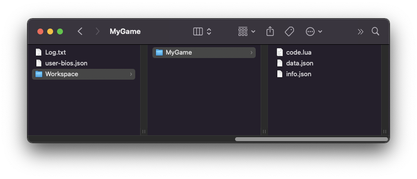
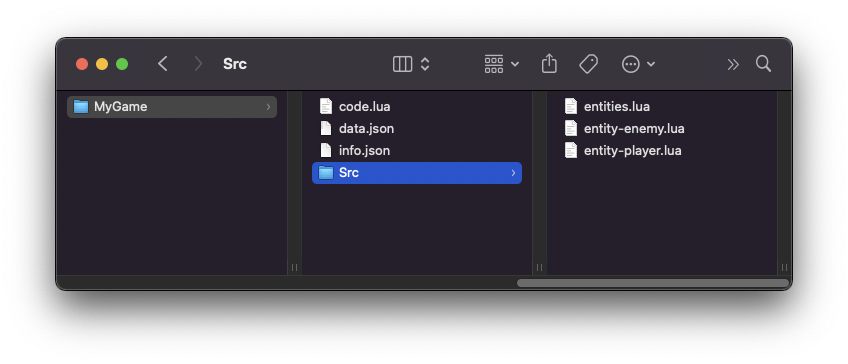

A game is simply a collection of files that Pixel Vision 8 loads into its memory. Each of these files has a specific purpose in the project. These are the types of files that can go inside of a game project:

* `.png` - used to store colors, sprites, and even tilemaps.

* `.font.png` - this custom extension is used to store fonts.

* `.json` - used to store system data, tilemaps, sounds, music, and metadata.

PV8 will ignore any additional files in a project that it doesn’t know how to load or edit.

## Game Projects

At a bare minimum, a Pixel Vision 8 game requires a `code.lua`, `data.json`, and `info.json` file inside of a folder. Technically, the folder could be anywhere on your computer but it's best to keep it in your 'Workspace'.



Here is an example of a simple `code.lua` file for a game:

``` lua
--[[
  This this is an empty game, we will the following text. We combined two sets
  of fonts into the default.font.png. Use uppercase for larger characters and
  lowercase for a smaller one.
]]--
local message = "EMPTY LUA GAME\n\n\nThis is an empty game template.\n\n\nVisit 'www.pixelvision8.com' to learn more about creating games from scratch."

--[[
  The Init() method is part of the game's lifecycle and called a game starts.
  We are going to use this method to configure background color,
  ScreenBufferChip and draw a text box.
]]--
function Init()

  local display = Display()

  -- We are going to render the message in a box as tiles. To do this, we
  -- need to wrap the text, then split it into lines and draw each line.
  local wrap = WordWrap(message, (display.x / 8) - 2)
  local lines = SplitLines(wrap)
  local total = #lines
  local startY = ((display.y / 8) - 1) - total

  -- We want to render the text from the bottom of the screen so we offset
  -- it and loop backwards.
  for i = total, 1, - 1 do
    DrawText(lines[i], 1, startY + (i - 1), DrawMode.Tile, "large", 15)
  end

end

--[[
  The Update() method is part of the game's life cycle. The engine calls
  Update() on every frame before the Draw() method. It accepts one argument,
  timeDelta, which is the difference in milliseconds since the last frame.
]]--
function Update(timeDelta)

  -- TODO add your own update logic here

end

--[[
  The Draw() method is part of the game's life cycle. It is called after
  Update() and is where all of our draw calls should go. We'll be using this
  to render sprites to the display.
]]--
function Draw()

  -- We can use the RedrawDisplay() method to clear the screen and redraw
  -- the tilemap in a single call.
  RedrawDisplay()

  -- TODO add your own draw logic here.

end
```

Pixel Vision 8 also supports writing games in C#. Just add a `code.cs` file in your game folder insted of the `code.lua` and include the following code:

```c#
/*
 For C# games, we need to put our main class inside of the 
 `PixelVision8.Player` namespace.
*/
namespace PixelVision8.Player
{
	
	/*
		Our main class also need to extend the `GameChip` class. This is how
		the C# engine knows which class to use as the main game class.
	*/
	public class CustomGameChip : GameChip
	{

		/*
			The Init() method is part of the game's lifecycle and called a game
			starts. We are going to use this method to configure background
			color, ScreenBufferChip and draw a text box.
		*/
		public override void Init()
		{
			
			/*
				We combined two sets of fonts into the default.font.png. Use
				uppercase for larger characters and lowercase for a smaller one.
			*/
			var message = "EMPTY C# GAME\n\n\nThis is an empty game template.\n\n\nVisit 'www.pixelvision8.com' to learn more about creating games from scratch.";

			var display = Display();
			
			/*
				We are going to render the message in a box as tiles. To do
				this, we need to wrap the text, then split it into lines and
				draw each line.
			*/
			var wrap = WordWrap(message, (display.X / 8) - 2);
			var lines = SplitLines(wrap);
			var total = lines.Length;
			var startY = ((display.Y / 8) - 1) - total;

			/*
				We want to render the text from the bottom of the screen so we
				offset it and loop backwards.
			*/
			for (var i = total - 1; i >= 0; i--)
				DrawText(lines[i], 1, startY + (i - 1), DrawMode.Tile, "large", 15);

		}
		
		/*
			The Update() method is part of the game's life cycle. The engine 
			calls Update() on every frame before the Draw() method. It accepts 
			one argument, timeDelta, which is the difference in milliseconds 
			since the last frame.
		*/
		public override void Update(int timeDelta)
		{

			// TODO add your own update logic here

		}

		/* 
			The Draw() method is part of the game's life cycle. It is called 
			after Update() and is where all of our draw calls should go. We'll 
			be using this to render sprites to the display.
		*/
		public override void Draw()
		{

			/* 
				We can use the RedrawDisplay() method to clear the screen and 
				redraw the tilemap in a single call.
			*/
			RedrawDisplay();
			
			// TODO add your own draw logic here.

		}
	}
}
```

You can also store additonal code in your `Game/Src` directory. This is helpful if you want to split up your code's logic into multiple files.



> For C# games, all the referenced classes will automatically be imported when the `code.cs` game is loaded into memory. For Lua games, you'll need to manually reference additonal files via Lua's `require` statement or calling the `LoadScript()` API. 

## Loading Order

When Pixel Vision 8 runs a game, each file is loaded in a specific order. Knowing this order is important to understand how a game’s data is parsed by the engine. 

Here are the steps that Pixel Vision 8 performs when loading a game’s files:

| Order | Type          | File Name                     | Description                                                                                                                                                                                                                                             |
|-------|---------------|-------------------------------|---------------------------------------------------------------------------------------------------------------------------------------------------------------------------------------------------------------------------------------------------------|
| 1     | System Data   | data\.json                    | This file overrides any default chip settings before anything else is parsed\.                                                                                                                                                                          |
| 2     | System Colors | colors\.png                   | All of the colors in this file will replace the default system colors\.                                                                                                                                                                                 |
| 3     | Color Map     | color\-map\.png               | This is stored in a temporary ColorChip and used instead of the system colors for parsing sprites, font, and tilemap PNG files\.                                                                                                                        |
| 4     | Sprites       | sprites\.png                  | This PNG file is cut up into 8x8 sprites based on the system colors or color map that was previously loaded\.                                                                                                                                           |
| 5     | Tile Map      | tilemap\.png or tilemap\.json | This file can be a PNG or JSON\. If both are present, the json file will be the one that is loaded\. When parsing a PNG, you can set a flag that will add any tiles that are not found in the SpriteChip’s memory\.                                     |
| 6     | Fonts         | \*\.font\.png                 | Each font PNG is cut up into 8x8 sprites and added to the SpriteChip’s memory if there is space\. After each font is parsed, references to each character sprite are saved in the FontChip under the font file’s name minus the \.font\.png extension\. |
| 7     | Sounds        | sound\.json                   | Each sound effect is parsed and stored in the sound chip\.                                                                                                                                                                                              |
| 8     | Music         | music\.json                   | The music file contains songs and patterns\. Patterns are collections of sound effects the tracker plays in a specific order and frequency while the songs are collections of patterns\.                                                                |
| 9     | Metadata      | info\.json                    | This contains additional information about the game that is not used to configure any of the other parsers\.                                                                                                                                            |

Once these files are loaded into memory, changes made to them will not be reflected in the game at run-time. 

If your project has a `code.*` file, it will automatically be loaded as the main game script after the `data.json` file has been parsed. By default, PV8 will look for a `code.cs` file to run. If a `code.lua` file exists instead, PV8 will load that and switch over to Lua mode. You can put additional code files in the root of the project or in a special `Src` folder. This allows you to break your game’s logic up over multiple files. See the section on using Shared Libraries to learn more about how this works.

## System Data

Pixel Vision 8 is the only fantasy console that allows you to configure each game’s limitations to match your own needs. While there are hard limits that the `PixelVisionEngine` will enforce, you’ll find that PV8 can be adapted to be easier to work with for new developers or locked down to create a challenge closer to the real limitations found on the original 8-bit consoles. Since each game has its own `data.json` file, these limitations are specific to that game and simply instruct Pixel Vision 8 how to run.

It’s important to understand that Pixel Vision 8’s limitations are rule-based, meaning they are more like guidelines on how the core engine should work. The `data.json` defines how the actual engine and the rest of the files are loaded into memory. This file is responsible for everything that makes your game’s system specs unique. Here is a sample of what a typical `data.json` file looks like:

```json
{
    "ColorChip":
    {
        "total":16,
        "maxColors":128,
        "backgroundColor":0,
        "maskColor":"#FF00FF",
        "unique":false,
        "debug":false,
        
    },
    "DisplayChip":
    {
        "width":264,
        "height":248,
        "overscanX":1,
        "overscanY":1,
        "layers":6
        
    },
    "FontChip":
    {
    },
    "GameChip":
    {
        "lockSpecs":false,
        "maxSize":512,
        "saveSlots":8
    },
    "MusicChip":
    {
        "totalSongs":32,
        "notesPerTrack":127,
        "totalPatterns":24,
        "totalLoop":24
    },
    "SoundChip":
    {
        "totalChannels":5,
        "totalSounds":32,
        "channelTypes":[-1,-1,-1,-1,-1]
    },
    
    "SpriteChip":{
        "maxSpriteCount":0,
        "unique":false,
        "spriteWidth":8,
        "spriteHeight":8,
        "pages":8,
        "cps":8
    },
    "TilemapChip":
    {
        "columns":256,
        "rows":256,
        "totalFlags":16,
        "autoImport":false,
        
    }
}
```

Each block of data in the `.json` file defines a chip for the engine to initialize and its settings. Let’s take a look at the `SpriteChip `and how it gets serialized. The first line of the JSON object is the chip’s name: 

```json
"SpriteChip": {
```

When this file is parsed by the engine, the `ChipManager `automatically looks for an instance of a specific chip by name. Next, are properties that can be configured on the chip. Only a handful of properties can be defined in the `.json` file. Here are the four main properties of the `SpriteChip`:  

```json
"maxSpriteCount":0,
"unique":false,
"spriteWidth":8,
"spriteHeight":8,
"pages":8,
"cps":8
```

After the chip’s properties are deserialized, they are passed to a special method built into Pixel Vision 8’s importer that goes through the values for each property and sets them. In this chip, you can change the size of sprites system-wide, as well as the memory size where sprites are stored. By default, sprite RAM can store 16 columns and 16 rows of sprites for a total of 256 sprites per page.

While you can manually change values in this file, it’s best not to do so unless you know exactly what you are doing. The underlying engine that runs PV8 is incredibly flexible and tries to account for all kinds of customizations but it’s best to use caution when modifying this file.

## Chip Properties

Each chip, that is defined in the `data.json` file, has its own properties that you can modify in order to change the look and feel of your game. You can edit this file by hand or use the Chip Editor which is included in the Pro Tools and has built-in system templates to make changing things easier. Since a game has at least 8 chips, it’s easier to look at system specs as three main categories: graphics, storage, and sound. 

While there is a bit of overlap between which chips are part of the GPU and storage group, each one focuses on a specific aspect of the engine and how it will perform.

### Graphics

The first group contains the storage properties. These are responsible for the visuals of PV8 games. This group is comprised of the following properties:

| Property        | Chip        | Description                                                        |
|-----------------|-------------|--------------------------------------------------------------------|
| width           | DisplayChip | The width of the resolution in pixels\.                            |
| height          | DisplayChip | The height of the resolution in pixels\.                           |
| overscanX       | DisplayChip | The number of right side columns to subtract from the resolution\. |
| overscanY       | DisplayChip | The number of bottom rows to subtract from the resolution\.        |
| maxSpriteCount  | SpriteChip  | The total number of sprites that can be displayed at one time\.    |
| maxColors       | ColorChip   | The total number of system colors\.                                |
| cps             | SpriteChip  | The total colors per sprite\.                                      |
### Storage

The second group makes up the storage properties. These properties are responsible for how much data can be stored in a PV8 game. This group is comprised of the following properties:

| Property  | Chip        | Description                                                                                                 |
|-----------|-------------|-------------------------------------------------------------------------------------------------------------|
| columns   | TilemapChip | The total number of columns that the tilemap is made up of\.                                                |
| rows      | TilemapChip | The total number of rows that the tilemap is made up of\.                                                   |
| pages     | SpriteChip  | The total number of sprite memory pages\. Each page contains 256 sprites\.                                  |
| maxSize   | GameChip    | The maximum size of the game cartridge\. This is only enforced when building Lua games in Pixel Vision OS\. |
| saveSlots | GameChip    | The number of save slots the game contains\.                                                                |
### Audio

The last group makes up the audio properties. These properties define how sound effects and music work in a PV8 game. This group is comprised of the following properties:

| Property      | Chip        | Description                                                                                                                                        |
|---------------|-------------|----------------------------------------------------------------------------------------------------------------------------------------------------|
| totalSounds   | SoundChip   | The total number of sound effects the sound chip can load into memory\.                                                                            |
| totalChannels | SoundChip   | The total channels that are avalible for playing back sound effects\. This also represents the total number of tracks available to song patterns\. |
| channelTypes  | SoundChip   | An array representing the waveform ID each channel uses\. Setting this to \-1 will allow any waveform to be played on the channel\.                |
| totalSongs    | MusicChip   | The total number of songs the MusicChip can store in memory\.                                                                                      |
| totalPatterns | MusicChip   | The total number of patterns the MusicChip can store in memory\.                                                                                   |
### Extra Properties

Finally, there are additional properties that are useful for more advanced users. You should only edit these if you know what you are doing.

| Property        | Chip        | Description                                                                                                                                                                   |
|-----------------|-------------|-------------------------------------------------------------------------------------------------------------------------------------------------------------------------------|
| backgroundColor | ColorChip   | Sets the default background color for clearing the game’s screen\.                                                                                                            |
| maskColor       | ColorChip   | This will change the default mask color, which is used to determine what color represents transparency when importing images and drawing them to the display\.                |
| debug           | ColorChip   | Forces the engine to use the mask color when a color ID is out of range instead of defaulting to the background color\.                                                       |
| layers          | DisplayChip | The number of layers you can use when drawing pixel data to the display\.                                                                                                     |
| unique          | SpriteChip  | This will automatically optimize sprites as they are loaded making sure there are no duplicated sprites\. This may affect the IDs of sprites in memory when you set to true\. |
| autoImport      | TilemapChip | When load a tilemap\.png file, any tiles not found in the SpriteChip’s memory will be added to ensure the tilemap has all the tiles it needs to render correctly\.            |
