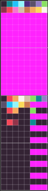

Pixel Vision 8 doesn’t have a built-in palette mode. Instead, there is an ability to shift the color ID of a sprite by an offset value before it is drawn to the display. 

## Using Color Offset

You can use the color offset value to simulate palette swapping in your own game based on how you organize the system colors. This means you will need to calculate the color offset by hand and supply it when drawing sprites to the screen. Let’s take a look at how this actually works in code. We’ll start with a grey-scale sprite that uses a color-map.png file to map the default system colors.


All of the DrawAPIs have an optional color offset argument. By default, this value is set to 0. If we were to draw this sprite to the display, it would map directly to the system colors in the order of each grey value in the color-map.png file.


If you change the color offset value, it will be added to all of the color IDs that make up a sprite’s pixel data. For example, if you have a sprite that uses the first color, it’s pixel data will be 0. If you pass in 5 for the color offset, all of the sprite’s color IDs will shift over to 5. Once you understand the basics, there are a few advanced ways you can use this.


When it comes to palettes, the Color Tool will split the color memory in half. The first 128 colors will be reserved for system colors and the other 128 colors are for palettes. When this is used with a color-map.png file, the sprite’s colors are matched up with the color-map.png instead of the system colors instead of how to direct color mode works. It’s important to note that the color-map.png file contains 16 colors starting a 0 and ending at 15. If you do not change the color offset of your sprites, they will display the first 16 system colors.

If you want to remap the sprites to the first palette, you can pass in 127 as the color offset. Keep in mind that color IDs are zero-based so 127 is where the palette colors begin. To help you calculate the palette color offsets, you can use the `PaletteOffset()` API to find the right offset for you. For example, if you want to set the sprites to the first palette, you can do the following:

```lua
DrawSprite (0, 0, 0, false, false, DrawMode.Sprite, PaletteOffset(0))
```

In this example, a palette has been set up to re-color the flower. Supplying the first palette offset value will shift all of the colors over to the intended values.


If you wanted to use the second palette, just change the value to 1:

```lua
DrawSprite (0, 0, 0, false, false, DrawMode.Sprite, PaletteOffset(1))
```

Shifting the colors to the second palette will recolor the stem since that palette has a new color where the green was in the previous palette.


You can also use the `PaletteOffset()` API to find a specific color ID inside of a palette. Let’s say you want to change the 2nd color of the first palette, you can calculate it’s ID by doing the following:

```lua
var colorID = PaletteOffset(0, 1)
```

Again, remember that all colors are zero-based so you’ll want to account for that when referencing color IDs or shifting color offsets. Once you understand how palette mode and color offset work together, you’ll be able to do more advanced techniques common to an 8-bit system such as palette swapping, color cycling, and replacing colors at runtime.

Here is an example of how the color.png file was set up to achieve this color swapping effect.



You can see all of the palette colors at the bottom half of the color.png file. While you can set these up by hand, it’s best to use Pixel Vision 8’s Color Tool in Palette Mode.

