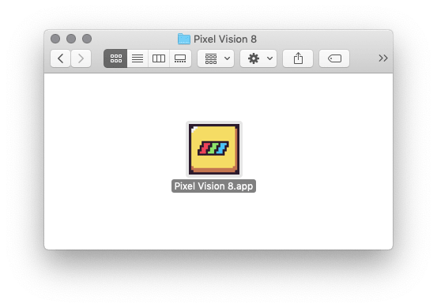
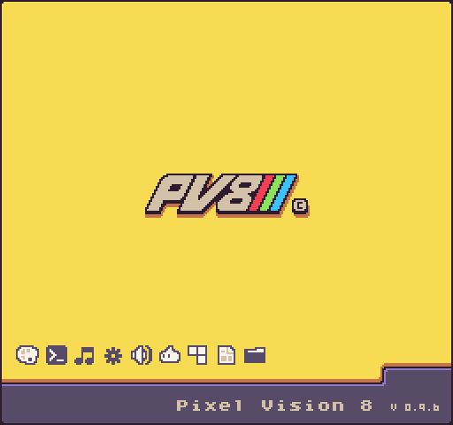
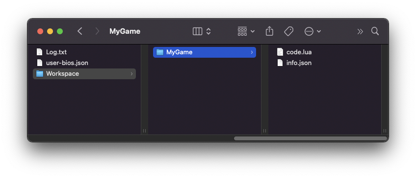
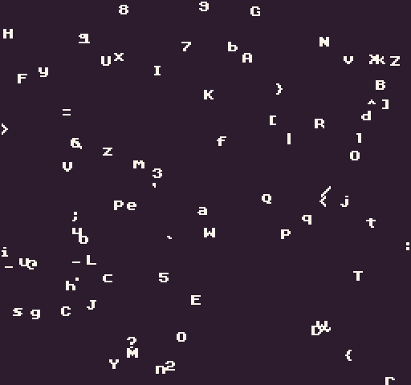
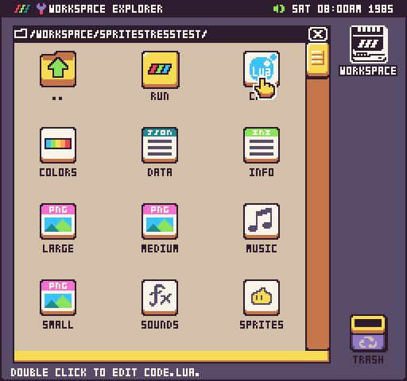
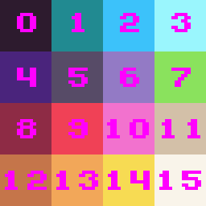
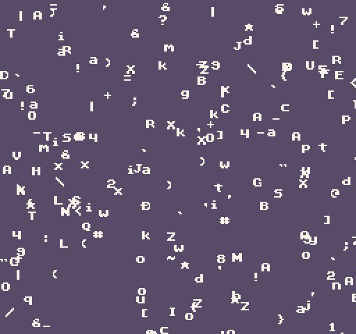
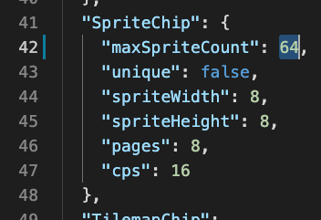
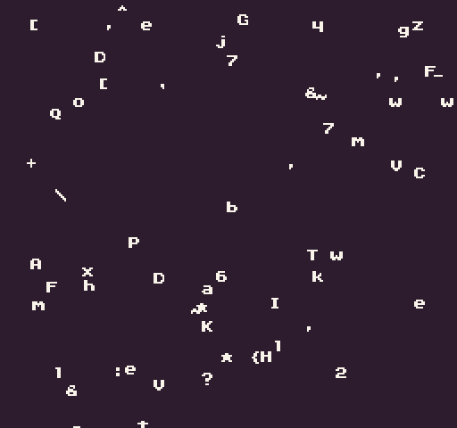

This quick start guide is designed to get you up and running with Pixel Vision 8. It covers everything you need to know about launching Pixel Vision 8. Once you've had a chance to review the information presented here, you'll be ready to start making your own Pixel Vision 8 games.


## Running Pixel Vision 8

Pixel Vision 8 works on Mac, PC, and Linux. Simply run the installer or copy it to where you keep Applications on your computer. Once installed, run the executable to boot up the Fantasy Console.



By default, Pixel Vision 8 runs in window mode. You can change the scale of Pixel Vision 8 while it's loading by holding down the 1 - 4 keys or press F to toggle between fullscreen and windowed mode. Your changes will be saved between sessions.



Pixel Vision 8 will boot up and attempt to run any installed OS. If the OS isn’t found, you will see the following error.


## New Projects

If you are using [Pixel Vision OS](https://github.com/PixelVision8/OS), it allows you easily create new projects in the `Workspace` folder. If you are building a game from scratch or by using one of the incremental builds on Github, you will have to do this by hand. To help you out, there is an [Empty Disk included in GitHub repo](https://github.com/PixelVision8/PixelVision8/Build/Templates/EmptyDisk) which you can find here. You can also do without a template by creating a folder on your computer, putting an empty `info.json` and `code.lua` file inside, and then drag it onto the Pixel Vision 8 window.



## Example Game

Let’s take a look at building a very simple game. We’ll be rebuilding the `Sprite Stress Test Demo` which highlights the sprite rendering limitation of Pixel Vision 8. 



By default, the Display Chip can only handle displaying a set number of sprites at the same time based on the system template you choose. We'll create a loop that attempts to render more sprites than the system can handle. The outcome is that additional draw calls are ignored and the engine maintains its optimal performance.

Here is the full Lua script:

``` lua
local delay = 0
local delayTime = 2000
local totalSprites = 200
local char = nil
local x = 0
local y = 0
local width = 0
local height = 0

function Init()
  local displaySize = Display() 
  width = displaySize.x
  height = displaySize.y
end

function Update(timeDelta)
  delay = delay + timeDelta
  if(delay > delayTime) then
    BackgroundColor(math.random(0, 14))
    delay = 0
  end
end

function Draw()
  Clear()
  for i=0,totalSprites,1 do
    char = string.char(math.random(33, 126))
    x = math.random(0, width)
    y = math.random(0, height)
    DrawText(char, x, y, DrawMode.Sprite, "large", 15)
  end
end
```

Let’s walk through the code to see how it uses Pixel Vision 8’s sprite drawing APIs. First, create a new project and call it SpriteStressTest



Next, open up the `code.lua` file, select all of the code by pressing `Ctrl + A`, and then delete it. Now we can start coding from scratch. These are some variables we'll use for performing the stress test.

```lua
local delay = 0
local delayTime = 2
local totalSprites = 200
local char = nil
local x = 0
local y = 0
local width = 0
local height = 0
```

The `Init()` method is part of the game's lifecycle and called a game starts. We are going to use this method to configure background color and get a reference to the display’s dimensions.

```lua
function Init()
```

It's best to define this outside of the for loop since we only need to set the value once.

```lua
local displaySize = Display()
width = displaySize.x
height = displaySize.y
```

Now we just need to end the `Init()` function.

```lua
end
```

The `Update()` method is part of the game's life cycle. The engine calls `Update()` on every frame before the `Draw()` method. It accepts one argument, `timeDelta`, which is the difference in milliseconds since the last frame. We are going to use this `timeDelta `value to keep track of the time before changing the background color.

```lua
function Update(timeDelta)
```

We start by adding the `timeDelta` to the `delay`.

```lua
delay = delay + timeDelta
```

Next, we will need to test if the `delay` value is greater than the `delayTime `variable we set up at the beginning of our class.

```lua
if(delay > delayTime) then
```

After the appropriate delay, we can change the background color to a random value. We'll cap this between `0` and `14`. 

```lua
BackgroundColor(math.random(0, 14))
```

There are 16 colors in Pixel Vision 8’s palette starting at 0 and well save the last color to use for our sprites later on.



We need to reset the `delay `so we can start tracking it again in the next frame.

```lua
delay = 0
```

Now we just need to close the condition and the function.

```lua
	end

end
```

The `Draw()` method is part of the game's life cycle. It is called after `Update()` and is where all of our draw calls should go. We'll be using this to render sprites to the display.

```lua
function Draw()
```

Clearing the display on each frame is important. Since we are not using a tilemap, we can directly clear the display by calling the `Clear()` method.

```lua
Clear()
```

The following loop will create a random `x` and `y` value based on the display's dimension, then we’ll draw a sprite to the screen. It will also pick a random character by converting an ASCII value to its corresponding string value.

```lua
for i=0,totalSprites,1 do
	char = string.char(math.random(33, 126))
	x = math.random(0, width)
	y = math.random(0, height)
	DrawText(char, x, y, DrawMode.Sprite, "large", 15)
end
```

As you can see, we are drawing individual characters to the screen. We’ll be using the `large.font.png` file for each sprite. It’s important to note even though the Font Chip and Sprite Chip store their sprites in separate memory blocks, any sprite draw call will be limited by the maximum draw calls per frame which we’ll talk about in a little bit.

Now, the only thing left is to can close the draw function call.

```lua
end
```

At this point, if you run the game by pressing `Ctrl + R`, it will display all 200 sprites. 



The default Pixel Vision 8 game template doesn’t have a cap on the number of sprites it can draw to the screen. Let’s open up the `data.json` file and make one modification. Go to the `SpriteChip` and change the `maxSpriteCount` from `0` to `64`



Now if you rerun the game after saving and closing the data.json file, you’ll see that PV8 will only draw 64 sprites at any one time. 



You can continue to play around with this number to see how it affects drawing sprites to the display. At this point, you should have a basic understanding of a game’s lifecycle, as well as how Pixel Vision 8’s most common APIs work.
