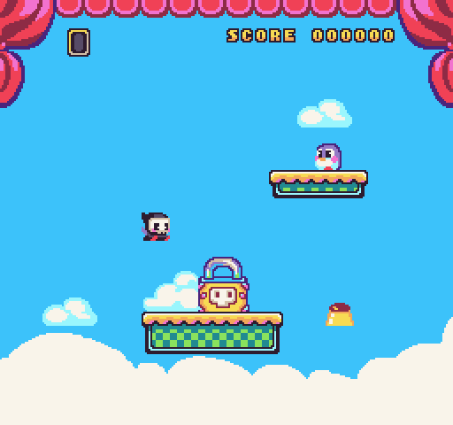
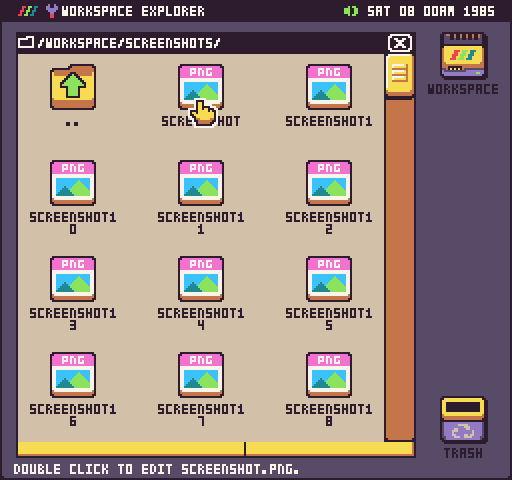
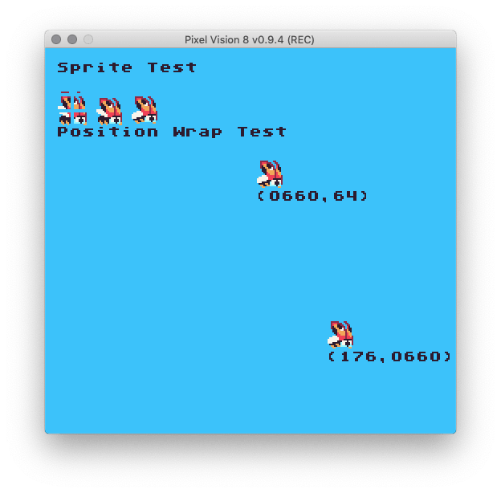
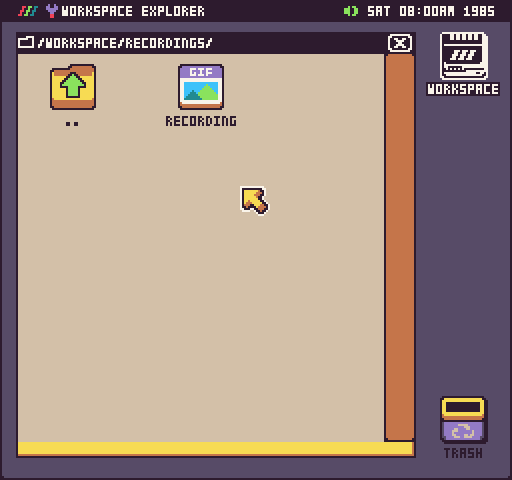

Pixel Vision 8 has two ways to capture the screen and save it to your computer. You can take a static screenshot or an animated gif.

## Screenshot

You can take a screenshot of anything on the screen by pressing `Ctrl + 2`. Here is a screenshot from Reaper Boy.

Screenshots are saved to the Workspace. You can access them from inside of Pixel Vision OS or on your computer’s file system.

Pixel Vision 8 screenshots are saved at the native visible resolution of the display. In the case of Reaper Boy, the screenshot is 256 x 240 even though the resolution for the game is set to 264 x 248 including the overscan which is automatically cropped out. This ensures that when you take a screenshot, you do not accidentally capture any graphics or glitches that appear offscreen past the display’s visible border.

## Recording

Pixel Vision 8 is also capable of taking animated gif recordings of any game or tool you are in (coming soon). To activate gif recording, press `Ctrl+3` and you’ll see "REC" appear on the menu bar of the Pixel Vision 8 window.

To stop recording, press `Ctrl+3` and you’ll see REC disappear. If you leave a game or tool, the recording will automatically be stopped. Gif recordings appear in the Recording folder when they are ready. 

It may take several minutes to create the recording. The progress is done in the background.

Gif recording is still experimental and not optimized. Try to limit your recordings to a few seconds. Since recordings are captured at the native resolution of the game, you may need to use an image editor to scale and optimized the final animated gif.
