When games load, the engine looks for a `sprite.png` to process. The `sprite.png` can be used to load sprite data into memory and is made available as an option for those using external image editors to work on their graphics. The PNG file is cut up into 8x8 chunks of pixel data, which represent individual sprites in memory. Since sprites are simply collections of pixel data that reference a color, the system attempts to match those colors to IDs that exist in the system’s `ColorChip`. It’s critical that the colors in your `sprite.png` match up to the same colors found in the `color.png` for the importer to work. Once the importer is done converting a sprite's pixel data; the `SpriteChip` stores the compressed data in a memory slot which becomes its ID.

## Importing Sprites

Pixel Vision 8 supports importing 8 x 8 pixel sprites from a `sprites.png` file. The importer moves through the `sprites.png` file starting in the upper left-hand corner, converting each 8 x 8 pixel block of pixel data into a format the `SpriteChip` can store. By default, all sprites are added to the `SpriteChip` memory, until space runs out. The `SpriteChip` can store up to 2,048 unique sprites in memory.

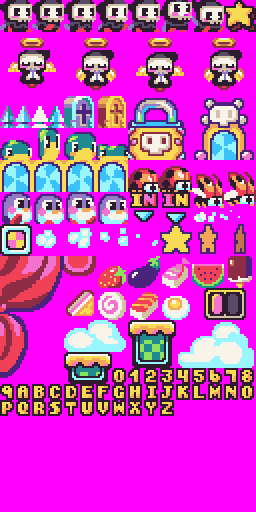

It’s important to note that transparent pixel data is ignored and converted to the system’s default mask color which is magenta (`#FF00FF`). PV8 does not store transparent colors. Colors that are not available to the system, including one that contains any transparency, are simply ignored. You can still use transparent colors when importing sprites from PNGs and the importer will automatically convert it to the default mask color.

## Sprite Colors

When the `SpriteChip` imports each sprite, it analyzes the total number of colors and compares this to what the chip can display. An 8 x 8 pixel sprite can have a maximum of 64 unique colors, but older 8-bit systems are unable to display that many colors at once. To simulate this, the `SpriteChip` has a property that represents the total colors per sprite, or CPS for short. While this value can be increased or decreased based on your needs, the reduced number of sprite colors is a hallmark of classic 8-bit systems and their memory limitations which impacted how they draw sprites to the display. 

While processing sprites, the importer calculates if each one contains more colors that are allowed. When this happens, additional colors are converted to the default mask color in order to force the sprite to adhere to the CPS limitation. Here is an example of how this works with the four sprites that make up the Reaper Boy character:

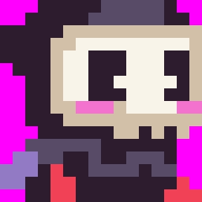

If we reduce the CPS to 3, you begin losing pixel data:

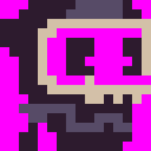

Understanding how CPS works is critical to sprites into your PV8 game.

## Sprite Memory Pages

Keep in mind that the Pixel Vision 8 also places limits on the number of sprites it can store in memory. While technically the engine can support any PNG file that is horizontally and vertically divisible by eight, it helps to optimize your art based on sprite pages, which is how the internal system stores and calculates the total sprites available.

A single sprite page is 128x128 pixels, which contains 256 sprites. When you are configuring the system, you can define how many pages of memory the `SpriteChip` supports. The maximum number of pages is eight for a potential total of 2,048 sprites. Here is a breakdown of how many sprites are available as you increase the number of pages:

| Pages | Total Sprites |
|-------|---------------|
| 1     | 256           |
| 2     | 512           |
| 3     | 768           |
| 4     | 1,024         |
| 5     | 1,280         |
| 6     | 1,536         |
| 7     | 1,792         |
| 8     | 2,048         |

One way to help optimize your sprites is to store them in page blocks before importing. Let's look back at the earlier example of the Reaper Boy sprites. If we were to export the sprites from the Sprite Chip, we would end up with a 256 x 768 image: 

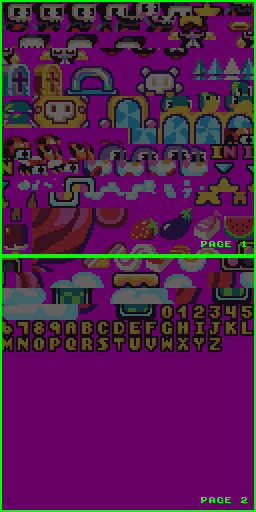

Here you can see how each page of sprites is organized. Since the importer reads from the top left of the `sprite.png` to the right as it traverses each row of pixels, organizing your PNG file like this will help speed-up loading sprites at run-time.

## Sprite Limits

Original 8-bit consoles had hard limits on the number of sprites they could display during a single frame. The total number of draw calls allows you to not only create a more authentic-looking 8-bit game, but it also limits the amount of pixel data pushed to the renderer in each pass. 

For example, the original NES was only able to render 64 sprites at one time. This can be achieved by editing the `data.json` and modifying the `SpriteChip`’s `maxSpriteCount` property. 

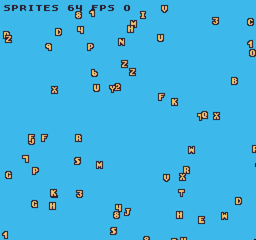

When your game has a sprite limitation, any additional draw calls will be ignored if the counter has reached its maximum value. In this example, there are 200 `DrawSprite()` requests happening during the `Draw()` loop, but only 64 of those are executed.

You can check the total sprite draw requests at any time via the `MaxSpriteCount()` API. This limitation is very powerful. First, it can help boost performance by putting a cap on the number of draw calls that can happen in a single frame. The maximum you can set this value to `512`.


## Drawing Sprites

You can draw a single sprite to the display via the `DrawSprite()` API. This API requires a sprite `ID` as well as an `x` and `y` position for where to place the sprite on the screen. By default, the display wraps sprites so if you draw a sprite to an `x` or `y` position past the display’s dimensions, it part of it will appear on the opposite side of the screen. 

For example, let’s draw a sprite to the display with the following code.

```lua
DrawSprite(376, 8, 8)
```

Here is what you’d see on the screen.

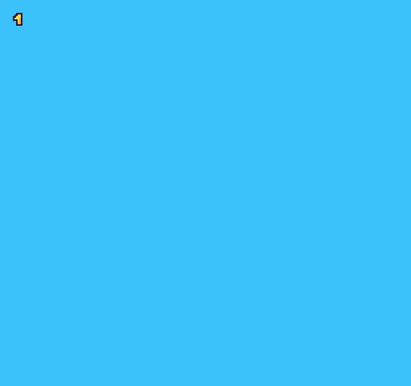

We can flip the sprite by passing in a boolean for the `flipH `and `flipV `arguments.

```lua
DrawSprite(376, 8, 8, true, true)
```

This will flip the sprite like so.

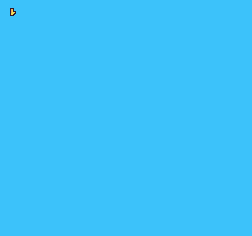

We can also define which layer the sprite renders to via the draw mode argument. This accepts a DrawMode enum. By default, all sprites are drawn to the sprite layer. But, you can also draw sprites to the background behind the tilemap like so.

```lua
DrawSprite(376, 8, 8, true, true, DrawMode.SpriteBelow)
```

In this example, we’ll use some clouds to illustrate some tiles on the tilemap layer and how the sprite will now render behind it.


It’s important to keep in mind that games will have a limit to the number of sprites they can draw in a single frame. While you can combine sprites to make larger graphics on the screen, each draw call to the `Sprite `or `SpriteBelow `later will reduce the number of sprites on the display during this render cycle.

## Large Sprites

Even though Pixel Vision 8 can only support 8x8 sprites, you can still use larger sprites in your game. To do this, you will need to combine those sprites at run-time. Let's take a look at a simple platform made up from a couple of 8x8 sprites:

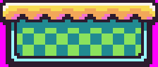

In this example, there is a 7 x 3 grid with a total of 21 sprites: 

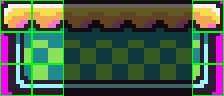

Some of these sprites repeat, which helps cut down on the total number of sprites that are stored in memory. You will see that we have 9 unique sprites, but we still need 21 sprites to render. We can reduce this even more by mirroring the right side and get the total unique sprites down to 6.

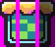

Just keep in mind that some system templates have a limit on the number of sprites that can be drawn to the display in a single frame. So the larger your sprites, the less you may have to display other elements of your scene. Don’t forget that you can also leverage the tilemap to render larger areas of static sprites that don’t need to move on the screen.

## Meta Sprites

To make it easier to work with larger sprites, Pixel Vision 8 supports something called a Meta Sprite. This is a collection of sprites that can be drawn to the display with a single API call. Let's take a look at the following example. Here is a character made up of 6 sprites; 2 across and 3 down.


While you can create Meta Sprites at run-time, it's easier to put your Meta Sprite png files into a `Sprites` folder inside of your game project. Here you can see we have each characters animation as a separate meta sprite.

)

When PV8 loads images from a game project's sprite folder, each png file is converted into a Meta Sprite automatically when the game runs. You can access a Meta Sprite by its file name like so.

```lua
DrawMetaSprite("ladybug-fly-1", 8, 8)
```

And if you run the code, you'll see the meta sprite in the upper left hand corner at the 8,8 position of the display.

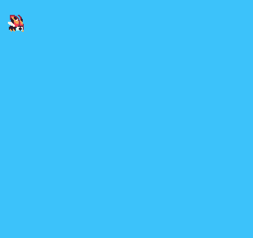

You can also flip these sprites by passing in a value for `flipH` and `flipV`.

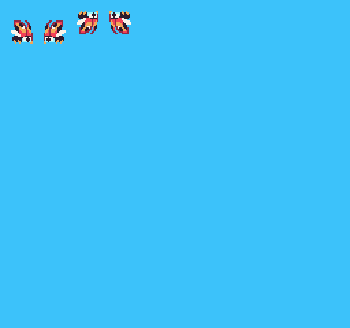

While the `DrawMetaSprite()` APIs does not limit the number of sprites you can use, each one will still count against the maximum number of sprites you can draw per frame.
