There are two ways to import tilemaps into your game. The easiest way is to provide a `tilemap.png` file that works similar to the `sprite.png`. Since tilemaps are simply compressed data structures representing sprite IDs in a grid, the tilemap PNG file is cut up into 8 x 8 sprites and that pixel data is compared to existing sprites in memory. 

By default, Pixel Vision 8 as a resolution of 256 x 240 pixels, which equates to 32 sprites horizontally and 30 sprites vertically. This means you can display a total of 960 sprites on the screen at one time. Here is an example `tilemap.png`:

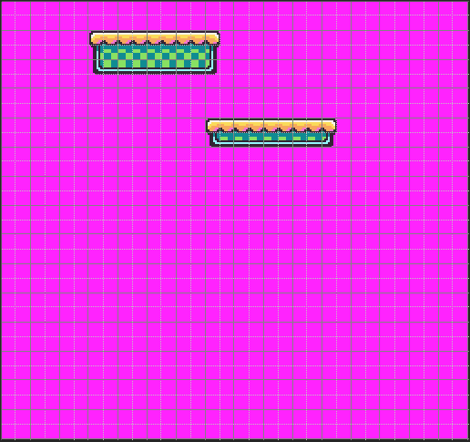

The tilemap can actually be larger than the visible screen. However, there are limits on the number of columns and rows some games can store in memory. These limitations are stored in the `TilemapChip`. Make sure to pay attention to those dimensions when creating new games. Tilemaps can be any size within those boundaries. Tilemap data can also be set at run-time to allow you to display larger maps than memory can store.

When a `tilemap.png` is loaded up into memory, it is cut up into 8 x 8 pixel sprites just like the `sprites.png`. The first position 0,0 is located at the upper left-hand corner of the map. The tilemap does not support negative tile ID positions. Each tile is analyzed and, when a matching sprite is found, the sprite ID is stored in the tile’s position. This allows you to create large maps that easily compress based on the number of repeating tiles used. 

Finally, the `TilemapChip` has a setting that allows your game to automatically import missing sprites. If a tile’s sprite is not defined in sprite memory, it will be added to the next available empty sprite ID, assuming there is still room to store it. This allows you to separate artwork between the `sprites.png` and `tilemap.png` if that makes organizing assets easier. Since they are all combined into sprite memory in the end, the game won’t know the difference.

## Loading Tilemaps

The easiest way to work with tilemaps in Pixel Vision 8 is by creating `png` files and using the `LoadTilemap()` API to import the specific one you want.

The `tilemap.png` file allows you to load an image of the tilemap which is useful if you are importing it from another program. When Pixel Vision 8 loads up the tilemap.png file, it will cut up the png into 8 x 8 tiles and look for matching sprites as it populates the `TilemapChip` with data. The `TilemapChip` simply stores tile data as sprite IDs in columns and rows. If a tilemap parser doesn’t find a matching chip, it will be ignored.

There is a special flag on the `TilemapChip` you can set to force the tilemap parser to add any missing tile to the `SpriteChip` while loading. You can find this value in the data.json file:

```json
"TilemapChip": 
{
	"columns": 36,
	"rows": 32,
	"totalFlags": 16,
	"autoImport": false,
}
```

Simply change the `autoImport `flag to true and every tile found in the `tilemap.png` will be added to the `SpriteChip` as long as there is space.

> You can have as many tilemaps as you want in your game folder but you can only load one at a time. There is also a performance penalty for large tilemap png files so try to break your maps up into smaller sections and load them as needed between screen transitions.

## Rendering

By default, calling the `Clear()` API will only redraw the background fill color. If you want to render the tilemap to the display, you will need to call `DrawTilemap()`. You can clear the display and draw the tilemap with a single API call by using `RedrawDisplay()`. While this is the easiest way to redraw the tilemap between frames, there are some advantages to manually clearing the display and drawing the tilemap.

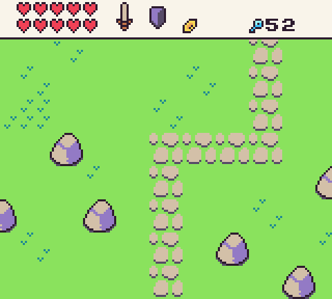

There are several components that make up the tilemap. When you render the tilemap to the display, you are actually telling Pixel Vision 8’s renderer to copy a cached image to the display buffer. To understand how the tilemap renders, let’s take a quick look at how we convert the raw tilemap chip data into pixel data.

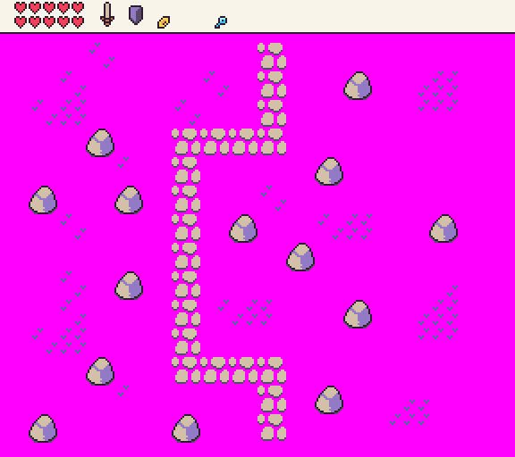

A tilemap is simply a collection of sprites IDs arranged in columns and rows. When the `TilemapChip` loads up, it attempts to pre-render the entire tilemap into memory to help speed up rendering. This layer is called the Tilemap Cache. Whenever you call `DrawTilemap()`, it samples the pixel data from the tilemap cache layer and copies it to the display. This means that you can copy an entire screen’s worth of tilemap pixel data to the display, or sample just the area you need to render.

By manually calling `DrawTilemap()` you can provide an optional `Width `and `Height `values as well as an `X` and `Y` position where it should be rendered on the screen. This allows you to not only control exactly where and how much of the tilemap is displayed on the screen during each frame, but you can use multiple `DrawTilemap()` calls to independently to layer different parts of the tilemap on top of each other. This is useful for rendering static UI or HUDs while the background is moving. Each `DrawTilemap()` call also supports adjusting the scroll offset without affecting the global `ScrollPos` value. 

For example, if the tilemap contains both the HUD and the background tiles, we could use two `DrawTilemap()` calls to display each part independently. First, to render the HUD, we would just draw part of the tilemap to the top of the screen like this:

```lua
DrawTilemap(0, 0, 20, 3, 0, 0)
```

This would display the top of the tilemap, `20 `tiles wide by `3 `tiles high, and lock the scroll position to `0`, `0`. Since the tilemap `X `and `Y `positions are set to `0`, it would start drawing from the upper left-hand corner of the screen.


To render the background as it scrolls, we simply call `DrawTilemap()` and offset it by the HUD and pass in the ScrollPos value so it’s in sync with any scrolling going on in the game’s `Update()` loop.

`DrawTilemap(0, 16, 20, 16, ScrollPosition().x, hudHeight)`

Here are the two independent `DrawTilemap()` calls used together.

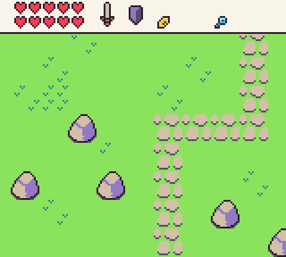

The last thing to keep in mind is that while the `TilemapChip `will attempt to cache the tile pixel data, you can still make changes at any point to the tilemap or the actual sprite’s it references. The `TilemapChip `handles invalidating tiles that change and are cached on the game’s next `Draw()` call. There may be a performance penalty for changing large tilemaps so try to avoid invalidating the tilemap cache when possible.

## Layers

The `DisplayChip `has a special `layers `property which helps define the rendering priority of each draw call. You can find this by editing the `data.json` file directly. By default, Pixel Vision 8 games will have six layers.

| ID | Name         | Description                                                                                                                                                                                                                 |
|----|--------------|-----------------------------------------------------------------------------------------------------------------------------------------------------------------------------------------------------------------------------|
| 1  | Background   | This is the default background color which is used to clear the screen\. It can not be directly drawn to\.                                                                                                                  |
| 2  | Sprite Below | Sprites drawn to this layer will appear behind the tilemap \(if there is transparency in the tile sprite\)\.                                                                                                                |
| 3  | Tile         | All tiles in the tilemap are rendered to a special layer called the Tilemap Cache to help with rendering performance\. You can also draw directly to the Tilemap Cache, which shows up above any existing tile pixel data\. |
| 4  | Sprite       | This is the default sprite layer and is drawn on top of the tilemap\.                                                                                                                                                       |
| 5  | UI           | This is a special layer that sits above the sprites letting you draw UI on top of the other layers\.                                                                                                                        |
| 6  | SpriteAbove  | This final layer sits on top of the UI layer and is designed for special sprite calls that must be on top of all the other layers such as mouse cursors or special effects like borders\.                                   |

You can limit the number of layers to better match other console rendering limitations. For example, the original Nintendo only supported the first four layers. On the other hand, the original Game Boy could support the first five layers since it had a special Window layer which you can emulate by using the UI layer.

By changing the number of layers, you will limit the maximum `DrawMode `value. That means changing the layers property to 4 will ignore any `DrawMode.UI` or `DrawMode.SpriteAbove` requests. You should only change this value if you really want to strictly enforce the layer rendering for a given game. It’s best to just ignore the `DrawModes `you don’t want to use.

## Scrolling

The `TilemapChip` allows you to cache an entire tilemap in memory which helps optimize rendering larger maps. The advantage here is that only the data visible to the screen is copied over to the display when calling `DrawTilemap()`. Changing the scroll value allows you to move the background which was a popular technique seen in side-scrolling games. To scroll the tilemap, you can use the `ScrollPosition()` method and supply an `x` and `y` offset value.

For example. If the game’s resolution is 160 x 144 and our tilemap is `288` x `144`, we can scroll horizontally by setting the scroll position’s X value to 72.

```lua
ScrollPosition(72)
```

As the map’s scroll position changes, only the visible area is rendered to the display. Here you can see what will be drawn to the screen out of the entire tilemap.

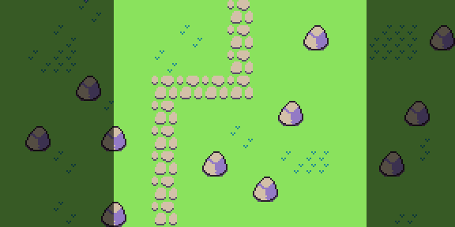

Tilemaps will repeat as you scroll horizontally or vertically. So if the viewpoint goes past the edge of the tilemap, it will sample tilemap pixel data from the opposite side. In this example, we set the same tilemap scroll position to `184` the tilemap will sample from the right edge and left edge of the tilemap.

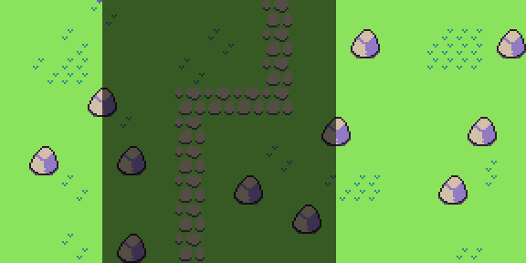

In the game, you’ll see the following tilemap.

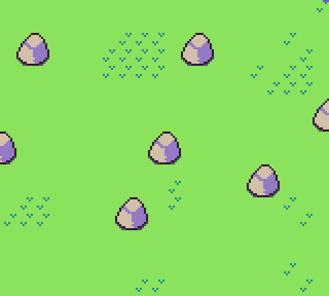

You can use this to your advantage by designing tilemaps that can wrap or you’ll need to manually limit the scroll position before it hits the edge of the tilemap. This the above example, we’d want to make sure that the scroll position `X` value is greater than `0` and less than `128` so it doesn’t go bast the left or right boundaries.

Sprites, on the other hand, are not affected by the scroll position value. Sprites will always render based on their position on the screen. That means that their `X` and `Y` position is locked to the screens coordinate system where `0`, `0` is the upper left-hand corner. Since sprites wrap around the screen when they go out of bounds, this can create a scenario where sprites appear to be moving independently from the tilemap as it scrolls.

If you are using any of the more advanced draw calls, such as `DrawSpriteBlock()`, they will automatically account for this and help you draw sprites in sync with the scroll position. Let’s say you want to draw a chest on top of the tilemap at `80`, `16` like so:

```lua
DrawSpriteBlock(40, 80, 16, 2, 2)
```

It will only draw the sprites they are within the viewport’s scroll position.

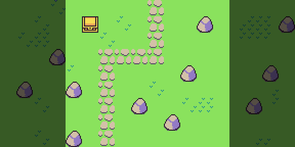

Let’s say for some reason you want the chest to not scroll with the tilemap. If you have a player, for example, you would not want them to move with the tilemap but instead stay fixed on the screen. You can change the `DrawSpriteBlock()`’s `onScreen` and `useScrollPos` arguments. The first flag, `onScreen` will only render the sprite when it is within the viewport. If you set this to false, it will render even when off-screen meaning it will wrap around the screen as the scroll position changes.

Take a look at the following code which represents the full Dr`awSpriteBlock()` API calls with values up to the `onScreen` flag argument:

```lua
DrawSpriteBlock(40, 80, 16, 2, 2, false, false, DrawMode.Sprite, 0, false)
```

As you can see, we are changing the `onScreen` flag to `false` and change the scroll position `X` value to `90`, the treasure chest will now wrap around the screen.

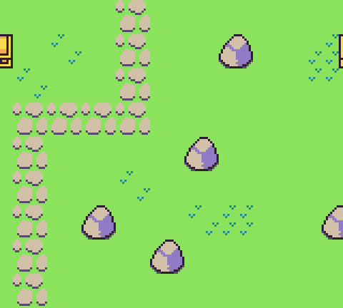

If we change the value of the `onScreen` argument back to `true`, the chest would stop rendering when its sprites are offscreen like so.

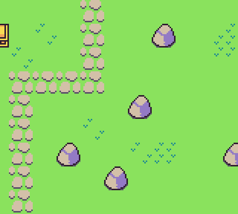

The `useScrollPosition` argument defines if the sprites will use the scroll position or not. By default, the scroll position `X` and `Y` values will be added to each of the sprites as they are rendered to the display. If we set this to false, we can manually move the sprite in defiantly of the scrolling background like so.

```lua
DrawSpriteBlock(40, 80, 16, 2, 2, false, false, DrawMode.Sprite, 0, true, false)
```

This will use the screen’s coordinate space to render the sprite. Now it is no longer to the left of the path and sits towards the middle of the screen, in essence, over the entire tilemap regardless of what the scroll position offset is.

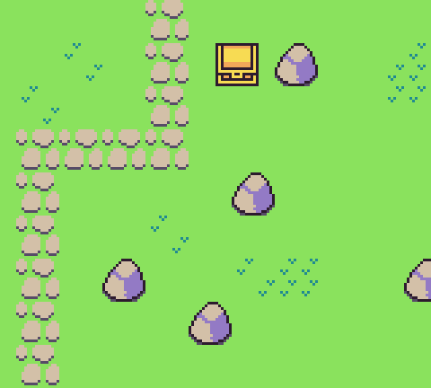

In this example, we are setting the `onScreen` value to true. If we moved the chest’s `X` position to `155`, it would render half off the screen.

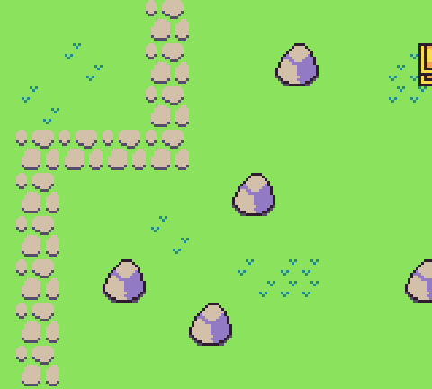

Finally, if we set the `onScreen` and `useScrollPosition` to false, the chest will wrap around the screen.

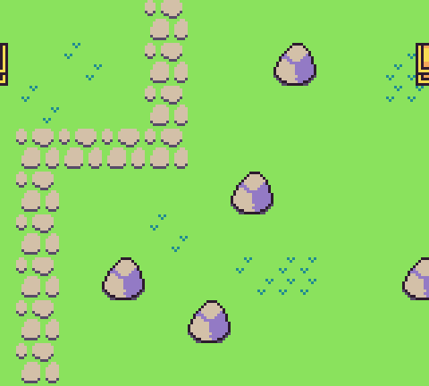

These advanced concepts may not be clear at first but image you want to make a side-scrolling platformer. You will want to render the player on the screen independent of the scrolling so you’d set the useScrollPosition to false. If you have enemies on the map, you want them to move with the map as it scrolls but only renders when they are inside of the viewport. So they will have onScreen set to true and useScrollPosition set to true, which are the default values. Now as the player moves forward or backward, they stay centered on the screen, you change the scroll position accordingly and then enemies show up only when they are visible.

## Tilemap Cache

The tilemap cache layer has some additional advantages than just optimizing rendering the tilemap to the screen. You can also use the tilemap cache layer as an additional canvas in your game. Let’s take a look at how this works.

One way to take advantage of the tilemap cache layer is to draw text on top of the tilemap. You may not want to display each text character as a single sprite, especially if the text is dynamic meaning you wouldn’t want it set as tiles. To get around this, you can use any Draw API that accepts a DrawMode to render text on top of the tilemap cache layer. Once drawn, the pixel data will not change unless you update any tiles underneath it or rebuild the entire tilemap cache.

To illustrate how this works, if we render a HUD to the screen, by manually calling `DrawTilemap()` it will become the background of the display as it renders.


Now if we want to display a score or some other text value that doesn’t change frequently, we can render it on top of the tilemap cache. To draw pixel data to the tilemap cache, you simply supply `DrawMode.TilemapCache` to any of the supported Draw APIs. In this case, we’ll use `DrawText()`:

```lua
DrawText(ReadFPS(), 128, 8, DrawMode.TilemapCache, "large")
```

One thing you should pay attention to is pixel data with transparency when drawing to the tilemap cache. Any transparent pixel data will show whatever pixel data exists under it. So in this case, the font is going to draw on top of itself every time we draw to the tilemap cache. If this value changes from frame to frame, you’ll start seeing it become unreadable.

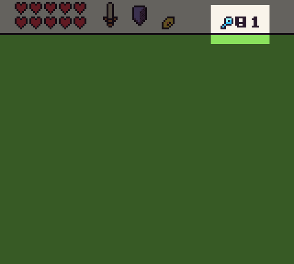

There are two ways to clear the pixel data on the tilemap cache. You can update the tiles below the text which will force the tilemap chip to recache their pixel data or you can use the `DrawRect()` API to paint a solid color on top before rendering the text again in the next frame. Here is an example of updating the tiles in code:

```lua
UpdateTiles(16, 1, 2, {36, 36})
```

Now on each frame, the tiles will redraw to the tilemap cache, then we draw the text on top of the tiles to get the following:

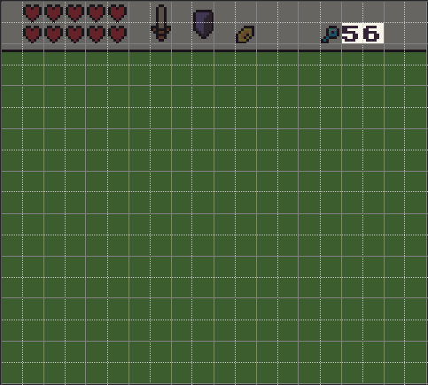

You draw anything into the tilemap cache, not just text. Sprites work great and since `DrawMode.TilemapCache` works on an X, Y coordinate system verses the `Tile()` API’s column, row position, you can position the pixel data anywhere you want. Just keep in mind that there is a performance penalty to drawing to the tilemap cache. While you can use it to overcome the draw call limitation, it will incur additional overhead as the pixel data still needs to be manually copied from memory to the tilemap cache layer. Also, any changes to the tilemap will force it to redraw so you can lose any pixel data you have drawn in a previous frame. Finally, you can clear the entire tilemap cache layer and revert it back to the default tilemap by calling `RebuildTilemap()`. 

## Collision Flags

The Tilemap Tool can also help you add collision flags to your tilemap. These special flags start at 0 and go up to 15. Tiles without collision flags are automatically set to `-1`. You can check a tile’s flag during runtime by calling the `Flag()` API. It requires a column and row ID. You can also pass in a 3rd parameter which allows you to change the value when a game is running. This is useful for a collectible such as a coin. You may set the flag id in the tilemap editor and when the player collects it, clear the value so it can’t be collected a second time.

Collision flags should only be used for fixed objects that are part of the tilemap and do not move. You wouldn’t want to use them for enemies for example. While you can change collision flags at runtime, they do not provide the most accurate way of checking collision between two objects such as a player and an enemy. They are however useful for anything solid or that can affect the physics of entities in your game.

Each tile can have its own unique collision flag so keep that in mind. There is no performance penalty for changing a collision flag at runtime since it doesn’t force the tilemap cache to update. In situations where you need to use tiles for objects in your game, such as coins, be sure to call the Tile() API and pass in a new sprite ID when changing the collision flag so it updates on the tilemap cache correctly and disappears.

## Custom Collision Flags

Coming soon!