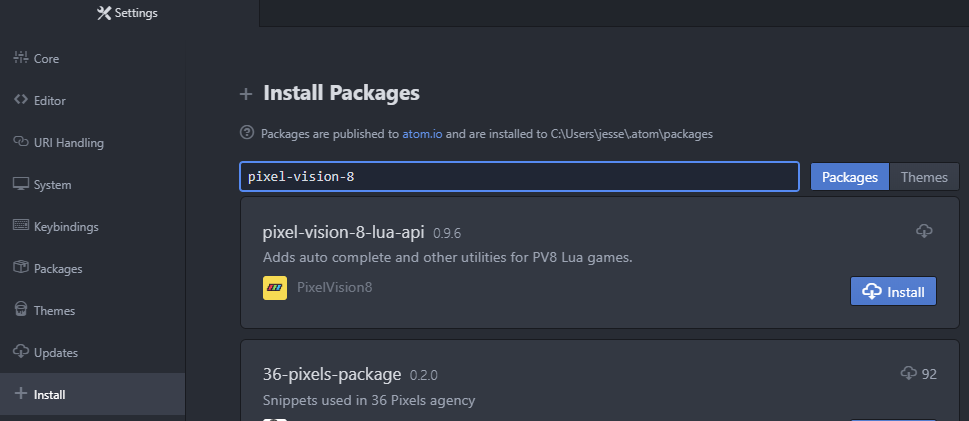
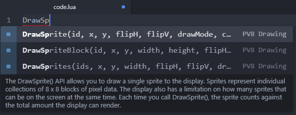
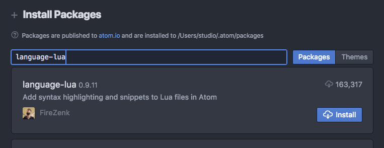
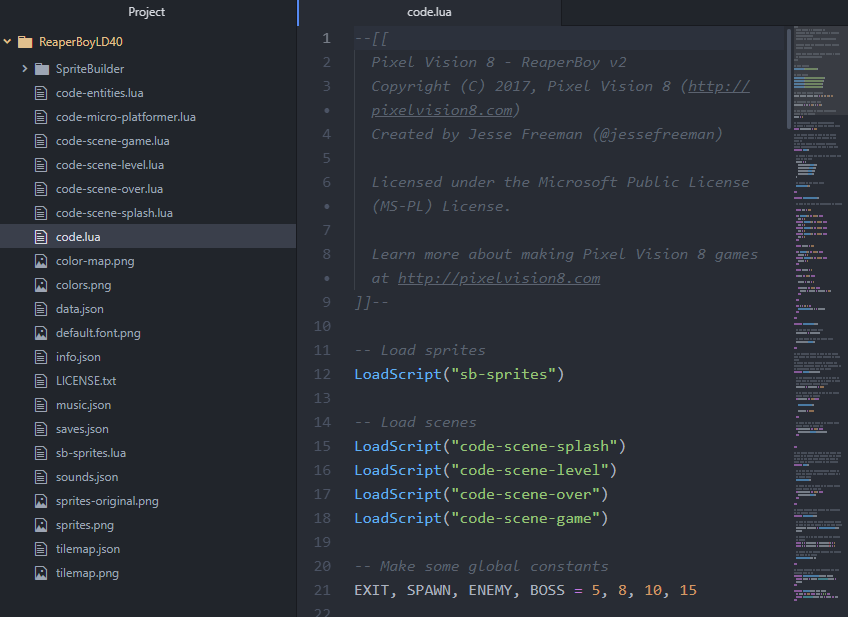

# Coding With Atom

While Pixel Vision OS’s built-in text editor is good for simple coding, the ideal way to make PV8 games is with an external code editor. Atom ([https://atom.io](https://atom.io)) is a great, lightweight code editor that works perfectly with Pixel Vision 8 external tool workflow. Before you open your game’s Lua files in Atom, you will want to add a few packages. 

The first package to install is Pixel Vision 8’s own API autocomplete. You do this by going to Atom’s settings, then select the install tab. From there type in `pixel-vision-8` and search for the package.

Once installed, you will be able to get PV8 code completion in any `.lua` file you work on in the editor.

Just start typing out the first few letters of an API and the autocomplete drop-down will give you the options to choose from. Each listing has a detailed description of what the API does and offers an autocomplete template allowing you to tab through each of the parameters once you add the code snippet to your project.

Another advantage of installing the PV8 Atom package is that you can keep it up to date with each release. This allows you to have the latest API autocomplete definitions without having to dig through the documentation to see the latest changes.

You will also want to install a good Lua package if you have not done so already. I use `language-lua` by FireZenk.

Once you have everything set up, you can open any PV8 disk or project folder with Atom. You’ll see the entire file structure of the project and can begin making changes to any of the Lua or JSON files.

When you make changes to your code in Atom, simply press `CTRL + 4` in Pixel Vision 8 to reload the game.

